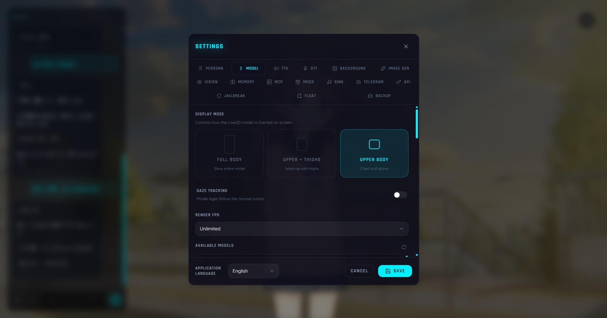

<div align="center">
  <a href="README.md">简体中文</a> | <a href="README_EN.md">English</a> | <a href="README_JA.md">日本語</a> | <a href="README_KO.md">한국어</a> | <a href="README_RU.md">Русский</a>
</div>

<p align="center">
  <h1 align="center">Kokoro Engine</h1>
  <p align="center">
    クロスプラットフォーム仮想キャラクター没入型インタラクションエンジン<br/>
    <em>High freedom · Modular · Offline-first · Creator-friendly</em>
  </p>
</p>

---

> [!CAUTION]
> **⚠️ 早期アクセス通知 (Early Access Notice)**
>
> **Kokoro Engine** は現在 **Alpha 開発段階** にあります。
>
> これは、限られたリソース（主な開発機は RTX 4060 ノートPC 1台のみ）を持つ個人の開発者によって構築されたオープンソースプロジェクトです。
>
> - **🚧 すぐに使えるわけではありません**: 機能は頻繁に更新されており、設定には一定の技術的背景が必要になる場合があります。
> - **💸 資金とテストの制限**: 作者の資金が限られているため、**LLM 大規模モデルインターフェースを除き、他のオンラインサービスの API 機能はまだ完全にはテストされていません**。コードは実装されていますが、すべての商用 API が完璧に動作する保証はありません。
> - **🤝 サポートのお願い**: このプロジェクトが面白い、または役に立つと思った場合は、ぜひ **Star** ⭐️ をお願いします！もしあなたが API デバッグ資金やハードウェアのアップグレードを支援したい「慈善家」であれば、スポンサー方法をご確認ください（TODO）。

---

## ✨ プロジェクト紹介

**Kokoro Engine** は、誰もがデスクトップ上に「心」を持った仮想パートナーを持てるようにすることを目的とした、クロスプラットフォームの仮想キャラクター没入型インタラクションエンジンです（Neuro-sama に触発されました）。
Live2D、LLM、TTS、STT などの技術を統合し、高度にモジュール化され、カスタマイズ可能なインタラクションシステムを構築しています。

## 📸 スクリーンショット (Screenshots)

<div align="center">
  
  <p><em>ホーム画面プレビュー</em></p>
  
  <p><em>設定画面プレビュー</em></p>
</div>


## ✅ 実装済み機能 (Features)

現在、主にローカル環境（RTX 4060 Laptop）で検証済みの機能：

### 🎭 コアインタラクション
- **Live2D モデル**: Live2D Cubism SDK を完全サポートし、視線追跡、モーションリガーに対応。
- **モデルのホットスイッチ**: アプリ内での異なる Live2D モデルのリアルタイムインポートと切り替え、視点変更をサポート。
- **多言語インターフェース**: 完全な国際化 (I18n) サポート。現在、**簡体字中国語**、**英語**、**日本語**、**韓国語** をサポートしています。

### 🧠 AI ブレイン
- **マルチモーダル会話**: **Ollama** (ローカル) および **OpenAI 互換インターフェース** (クラウド) を会話のコアとしてサポート。
- **マルチモーダル能力**: Vision モデルを統合可能。**スクリーンショット** や **画像アップロード** をサポートし、キャラクターは内容をリアルタイムで「見て」説明できます。
- **テキストからの画像生成 (Text-to-Image)**: Stable Diffusion WebUI またはオンライン API インターフェースを統合可能。会話による画像生成や、会話の文맥に基づいたリアルタイムの背景画像生成をサポート。
- **基礎記憶システム**: 基礎的な記憶抽出および想起システムを搭載。会話から重要な事実を自動的に抽出して長期保存 (SQLite) し、意味検索 (RAG) に基づくリアルタイムな文脈回想と感情の永続化をサポート。

### 🗣️ 音声インタラクション
- **音声合成 (TTS)**:
    - **GPT-SoVITS**: 優れた感情表現、カスタムキャラクターボイス、豊富なエコシステム。
    - **Browser TTS**: ブラウザネイティブの軽量 TTS。
- **ボイスチェンジャー (RVC)**: RVC (Retrieval-based Voice Conversion) インターフェースをサポートし、キャラクターの歌唱などを実現。
- **音声認識 (STT)**: Whisper/faster-whisper/whisper.cpp モデルの初期サポート。

### 🔌 拡張能力
- **MOD システム**: 内蔵のモジュール式 MOD フレームワークにより、チャットパネルや設定パネルなどのコア UI コンポーネントを HTML/CSS/JS でカスタム置換可能。カスタムテーマと QuickJS スクリプトサンドボックスをサポート。
- **MCP プロトコルサポート**: **Model Context Protocol (MCP)** クライアントを実装。
    - 任意の MCP Server に接続可能（stdio インタラクション経由）。
    - キャラクターは MCP Server が提供するツール（ファイルシステム、ウェブ検索、データベースなど）を使用して能力を拡張できます。
    - UI を介して MCP Server を管理可能。

### 🎮 公式デモ MOD：原神スタイル UI

プロジェクトには、原神のビジュアルスタイルでチャットと設定インターフェースを再デザインした完全な公式デモ MOD（`mods/genshin-theme`）が含まれています：

- チャットパネルと設定パネルを完全に置換し、ネイティブ機能と完全に同等
- キャラクター管理、LLM/TTS/STT/Vision/ImageGen 設定、MCP 管理、背景設定、記憶管理など、すべての設定項目を含む
- コミュニティ開発者がカスタム UI MOD を作成するための参考テンプレートとして利用可能

## 📝 TODO / 開発中

以下の機能は計画中、開発中、または **デバイスや資金の制限により未テスト/未検証** の状態です：

- [ ] **オンラインサービスの詳細テスト**: LLM 以外の多くの商用 API（Azure TTS、Google STT など）の検証。
- [ ] **モバイルサポート**: iOS / Android クライアントアプリ。
- [ ] **高度な記憶システム**: ベクトルデータベース (Vector DB) と RAG に基づく長期記憶の検索。
- [ ] **より強力なプラグインシステム**: コミュニティ開発者が MOD モジュールを作成して機能を拡張できるようにする。
- [ ] **キャラクターマーケット/ワークショップ**: キャラクタープリセットの共有とダウンロードを容易にする。
- [ ] **Live2D モデルインタラクション**: Live2D モデルとのリアルタイムな相互作用フィードバック機能。

## 🛠️ 技術スタック

| レイヤー | 技術 |
|---|---|
| **フロントエンド** | React + TypeScript + Tailwind CSS + shadcn/ui |
| **バックエンド** | Rust (Tauri v2) |
| **レンダリング** | PixiJS + Live2D Cubism SDK |
| **データ** | SQLite (ローカルストレージ) |

> **🚀 なぜ Rust なのか？**
>
> Rust 言語の驚異的なパフォーマンスのおかげで、Kokoro Engine は **極めて低いメモリ使用量** と **極めて高い実行効率** を実現しています。
> バックグラウンドで 24 時間 365 日実行してもシステムを遅くすることはなく、真に「軽量」なパートナーを実現します。

## 🚀 クイックスタート

### 前提条件

- [Node.js](https://nodejs.org/) (v18+)
- [Rust](https://www.rust-lang.org/tools/install) (stable)

### インストールと実行

```bash
# リポジトリをクローン
git clone https://github.com/chyinan/kokoro-engine.git
cd kokoro-engine

# 依存関係をインストール
npm install

# 開発サーバーを起動 (フロントエンド + Tauri)
npm run tauri dev
```

### 配布用ビルド

```bash
npm run tauri build
```

## 🤝 貢献 (Contributing)

**Kokoro Engine** はコミュニティからの貢献を大歓迎します！
作者のエネルギーとリソースが限られているため、プロジェクトの発展には開発者の皆様のサポートが不可欠です。このプロジェクトに興味がある方は、以下のような貢献を歓迎します：

1. **Pull Requests**: バグ修正や新機能の追加コードを直接送信してください。
2. **Issues**: 見つけた問題を報告したり、改善案を提案してください。
3. **Discussions**: ディスカッションエリアでアイデアを共有してください。
4. **ロゴデザイン**: デザインが得意な方は、Kokoro Engine のロゴをデザインしてみませんか！現在のロゴは一時的なものです。

どんな貢献（誤字の修正だけでも）も Kokoro Engine をより良くします！一緒に最高のデスクトップ仮想パートナーを作りましょう。

## 📄 ライセンス (License)

このプロジェクトのコアコードは **MIT ライセンス** の下でオープンソース化されています。

### ⚠️ Live2D Cubism SDK 免責事項

このプロジェクトは、Live2D Inc. が所有する **Live2D Cubism SDK** を使用しています。
このプロジェクトを使用（コンパイル、配布、変更を含む）する場合、Live2D のライセンス契約に同意する必要があります：

- **Live2D Proprietary Software License Agreement**: [https://www.live2d.com/eula/live2d-proprietary-software-license-agreement_en.html](https://www.live2d.com/eula/live2d-proprietary-software-license-agreement_en.html)
- **Live2D Open Software License Agreement**: [https://www.live2d.com/eula/live2d-open-software-license-agreement_en.html](https://www.live2d.com/eula/live2d-open-software-license-agreement_en.html)

> 本オープンソースプロジェクトは、非営利または小規模使用のための「個人/小規模事業者」のカテゴリーに該当します。
> 年間売上高が 1,000 万円を超える中大規模事業者の場合、本プロジェクトの使用には Live2D Inc. との別途商用ライセンス契約が必要になる場合があります。

---

**Kokoro Engine** is an open-source project.
The specific Live2D libraries and models included or downloaded are subject to the **Live2D Proprietary Software License Agreement**.
Live2D is a registered trademark of Live2D Inc.
