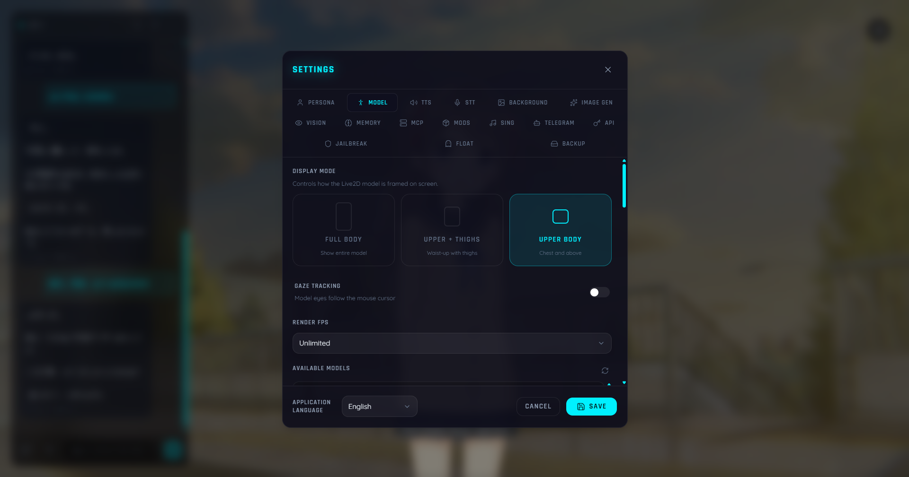

<div align="center">
  <a href="README.md">简体中文</a> | <a href="README_EN.md">English</a> | <a href="README_JA.md">日本語</a> | <a href="README_KO.md">한국어</a> | <a href="README_RU.md">Русский</a>
</div>

<p align="center">
  <h1 align="center">Kokoro Engine</h1>
  <p align="center">
    Кроссплатформенный движок для иммерсивного взаимодействия с виртуальными персонажами<br/>
    <em>High freedom · Modular · Offline-first · Creator-friendly</em>
  </p>
</p>

---

## ✨ Введение

**Kokoro Engine** — это кроссплатформенный движок для иммерсивного взаимодействия с виртуальными персонажами, призванный дать каждому возможность иметь «живого» виртуального партнера на рабочем столе (вдохновлено Neuro-sama).
Он объединяет такие технологии, как Live2D, LLM, TTS и STT, создавая высокомодульную и настраиваемую систему взаимодействия.

## 📸 Скриншоты (Screenshots)

<div align="center">
  
  <p><em>Предпросмотр главного интерфейса</em></p>
  
  <p><em>Предпросмотр интерфейса настроек</em></p>
</div>


## ✅ Реализованные функции (Features)

Функции, проверенные в настоящее время в основном в локальной среде (ноутбук с RTX 4060):

### 🎭 Основное взаимодействие
- **Модели Live2D**: Полная поддержка Live2D Cubism SDK, отслеживание взгляда, триггеры движений.
- **Горячее переключение моделей**: Поддержка импорта и переключения различных моделей Live2D и углов обзора в реальном времени внутри приложения.
- **Многоязычный интерфейс**: Полная поддержка интернационализации (I18n), в настоящее время поддерживаются **упрощенный китайский**, **английский**, **японский** и **корейский**.
- **Режим плавающего окна на рабочем столе**: Отображение модели Live2D в виде прозрачного плавающего окна на рабочем столе — всегда поверх других окон, без рамки, полностью прозрачное.
  - Перетаскивание правой кнопкой мыши для перемещения окна; меню правой кнопки для входа в режим изменения размера с перетаскиванием краёв.
  - Ctrl + колесо мыши для точной настройки масштаба модели.
  - Глобальный горячий клавиши (настраивается через запись нажатий) для вызова поля ввода чата; ответы ИИ отображаются в отдельном пузыре над моделью.
  - Положение, размер окна и масштаб модели автоматически восстанавливаются после перезапуска.

### 🧠 ИИ-мозг
- **Мультимодальный диалог**: Поддержка **Ollama** (локально) и **OpenAI-совместимых интерфейсов** (облако) в качестве ядра диалога.
- **Мультимодальные возможности**: Можно интегрировать модели Vision, поддерживая **скриншоты**, **загрузку изображений** или **видение через веб-камеру в реальном времени**, позволяя персонажу «видеть» и описывать содержимое. Видение через веб-камеру поддерживает выбор устройства и живой предпросмотр, а последний кадр с камеры автоматически прикрепляется к каждому сообщению в чате.
- **Текст в изображение**: Можно интегрировать Stable Diffusion WebUI или онлайн-интерфейсы API, поддерживая генерацию изображений через диалог или создание фоновых изображений в реальном времени на основе контекста разговора.
- **Многоуровневая система памяти**: Трёхуровневая архитектура памяти — многоуровневая память (ключевые факты хранятся вечно, временные воспоминания естественно затухают), гибридный семантический + ключевой поиск (косинусное сходство эмбеддингов + FTS5 BM25 с RRF-слиянием рангов) и автоматическая консолидация памяти на основе LLM (кластеризация и объединение похожих фрагментарных воспоминаний). Автоматически извлекает ключевые факты из разговоров для долговременного хранения (SQLite), с восстановлением контекста в реальном времени и сохранением эмоций.

### 🗣️ Голосовое взаимодействие
- **Синтез речи (TTS)**:
    - **GPT-SoVITS**: Отличная эмоциональная выразительность, пользовательские голоса персонажей и более богатая экосистема.
    - **VITS**: Совместимость с локальными серверами вывода VITS, такими как vits-simple-api.
    - **OpenAI TTS**: Поддержка облачных API синтеза речи, совместимых с OpenAI.
    - **Azure TTS**: Синтез речи Microsoft Azure Cognitive Services.
    - **ElevenLabs**: Высококачественный AI-синтез речи с поддержкой клонирования голоса.
    - **Browser TTS**: Легкий нативный TTS браузера.
- **Преобразование голоса (RVC)**: Поддержка интерфейса RVC (Retrieval-based Voice Conversion) для реализации пения персонажа.
- **Распознавание речи (STT)**: Поддержка нескольких движков — OpenAI Whisper/faster-whisper/whisper.cpp/SenseVoice, со встроенным обнаружением ключевого слова и автоматической остановкой по VAD.

### 🔌 Расширенные возможности
- **Система MOD**: Встроенный модульный фреймворк MOD, позволяющий заменять основные компоненты UI (панель чата, панель настроек и т.д.) пользовательскими HTML/CSS/JS. Поддержка пользовательских тем и песочницы скриптов QuickJS.
- **Поддержка протокола MCP**: Реализован клиент **Model Context Protocol (MCP)**.
    - Поддержка подключения к любому серверу MCP (через взаимодействие stdio).
    - Персонажи могут использовать инструменты, предоставляемые серверами MCP (например, файловая система, веб-поиск, базы данных и т. д.) для расширения возможностей.
    - Поддержка управления серверами MCP через пользовательский интерфейс.
- **Удалённое взаимодействие через Telegram Bot**: Встроенный сервис Telegram Bot для общения с персонажем со смартфона — публичный IP не требуется.
    - Поддержка текстовых, голосовых и фото сообщений с мостом к полному конвейеру LLM/TTS/STT/ImageGen.
    - Контроль доступа по белому списку Chat ID, команды сессии (`/new`, `/continue`, `/status`).
    - Синхронизация сообщений Telegram в чат на рабочем столе в реальном времени.

### 🎮 Официальный демо-MOD: UI в стиле Genshin Impact

Проект включает полноценный официальный демо-MOD (`mods/genshin-theme`), который переосмысливает интерфейсы чата и настроек в визуальном стиле Genshin Impact:

- Полностью заменяет панели чата и настроек с полным паритетом функций
- Включает управление персонажами, настройку LLM/TTS/STT/Vision/ImageGen, управление MCP, настройки фона, управление памятью и все остальные параметры
- Служит справочным шаблоном для разработчиков сообщества, создающих пользовательские UI MOD

## 📝 Список задач / В разработке (TODO)

Следующие функции находятся в планах, в разработке или **еще не протестированы/проверены из-за ограничений оборудования или финансирования**:

- [ ] **Поддержка Linux и macOS**: В настоящее время тщательно протестировано только на Windows. Требуется полная проверка функциональности и оптимизация на Linux и macOS.
- [ ] **Глубокое тестирование онлайн-сервисов**: Проверка большего количества коммерческих API, кроме LLM (например, Azure TTS, Google STT и т. д.).
- [ ] **Мобильная поддержка**: Клиентские приложения для iOS / Android.
- [x] **Многоуровневая система памяти**: Многоуровневая память (core/ephemeral), гибридный поиск (семантический + BM25 RRF-слияние), консолидация памяти на основе LLM.
- [x] **Система плагинов MOD**: Позволить сообществу разработчиков писать модули MOD для расширения функциональности (HTML/CSS/JS + песочница скриптов QuickJS).
- [x] **Взаимодействие с моделями Live2D**: Обратная связь взаимодействия с моделями Live2D в реальном времени (отслеживание взгляда, триггеры движений, синхронизация выражений).
- [ ] **Рынок/Мастерская персонажей**: Упрощение обмена и загрузки пресетов персонажей.

## 🛠️ Технологический стек

| Уровень | Технология |
|---|---|
| **Фронтенд** | React + TypeScript + Tailwind CSS + shadcn/ui |
| **Бэкенд** | Rust (Tauri v2) |
| **Рендеринг** | PixiJS + Live2D Cubism SDK |
| **Данные** | SQLite (Локальное хранилище) |

> **🚀 Почему Rust?**
>
> Благодаря потрясающей производительности языка Rust, Kokoro Engine имеет **чрезвычайно низкое потребление памяти** и **чрезвычайно высокую эффективность выполнения**.
> Даже работая в фоновом режиме 24/7, он не замедлит вашу систему, действительно будучи «легковесным» компаньоном.

## 🚀 Быстрый старт

### Способ 1: Загрузить предварительно собранный релиз (рекомендуется)

Посетите [страницу Releases](https://github.com/chyinan/Kokoro-Engine/releases), загрузите установщик для вашей платформы и запустите его.

### Способ 2: Сборка из исходного кода

#### Предварительные требования

- [Node.js](https://nodejs.org/) (v18+)
- [Rust](https://www.rust-lang.org/tools/install) (stable)

#### Установка и запуск

```bash
# Клонирование репозитория
git clone https://github.com/chyinan/kokoro-engine.git
cd kokoro-engine

# Установка зависимостей
npm install

# Запуск сервера разработки (Фронтенд + Tauri)
npm run tauri dev
```

#### Сборка для дистрибуции

```bash
npm run tauri build
```

## 🤝 Вклад (Contributing)

**Kokoro Engine** очень приветствует вклад сообщества!
Из-за ограниченных сил и ресурсов автора развитие проекта невозможно без поддержки разработчиков. Если вам интересен этот проект, мы приветствуем:

1. **Pull Requests**: Отправляйте код с исправлениями ошибок или новыми функциями напрямую.
2. **Issues**: Сообщайте о найденных проблемах или предлагайте улучшения.
3. **Discussions**: Делитесь своими идеями в разделе обсуждений.
4. **Дизайн логотипа**: Если вы хорошо разбираетесь в дизайне, попробуйте создать логотип для Kokoro Engine! Текущий логотип — временный.

Любой вклад (даже исправление опечатки) делает Kokoro Engine лучше! Давайте вместе создадим лучшего виртуального партнера для рабочего стола.

## 💬 Сообщество

Присоединяйтесь к официальной группе обсуждения в Telegram, чтобы общаться с другими пользователями и следить за новостями:

👉 [**Официальная группа обсуждения Kokoro Engine**](https://t.me/+U39dgiUspCo2NDNh)

## ❤️ Спонсорство

Если вы считаете Kokoro Engine полезным, рассмотрите возможность спонсорства для поддержки дальнейшей разработки проекта.

👉 [**Способы спонсорства**](SPONSOR.md)

## 📄 Лицензия (License)

Основной код этого проекта является открытым под лицензией **MIT License**.

### ⚠️ Отказ от ответственности Live2D Cubism SDK

В этом проекте используется **Live2D Cubism SDK**, который принадлежит Live2D Inc.
При использовании этого проекта (включая компиляцию, распространение или модификацию) вы должны согласиться с лицензионным соглашением Live2D:

- **Live2D Proprietary Software License Agreement**: [https://www.live2d.com/eula/live2d-proprietary-software-license-agreement_en.html](https://www.live2d.com/eula/live2d-proprietary-software-license-agreement_en.html)
- **Live2D Open Software License Agreement**: [https://www.live2d.com/eula/live2d-open-software-license-agreement_en.html](https://www.live2d.com/eula/live2d-open-software-license-agreement_en.html)

> Этот проект с открытым исходным кодом подпадает под категорию «Индивидуальное/Малое предприятие» для некоммерческого или мелкомасштабного использования.
> Если вы являетесь средним или крупным предприятием с годовым оборотом более 10 миллионов иен, для использования этого проекта может потребоваться отдельное коммерческое лицензионное соглашение с Live2D Inc.

---

**Kokoro Engine** is an open-source project.
The specific Live2D libraries and models included or downloaded are subject to the **Live2D Proprietary Software License Agreement**.
Live2D is a registered trademark of Live2D Inc.
