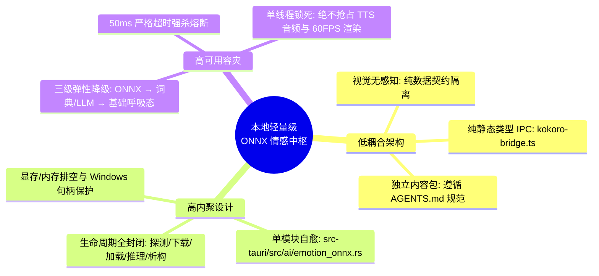
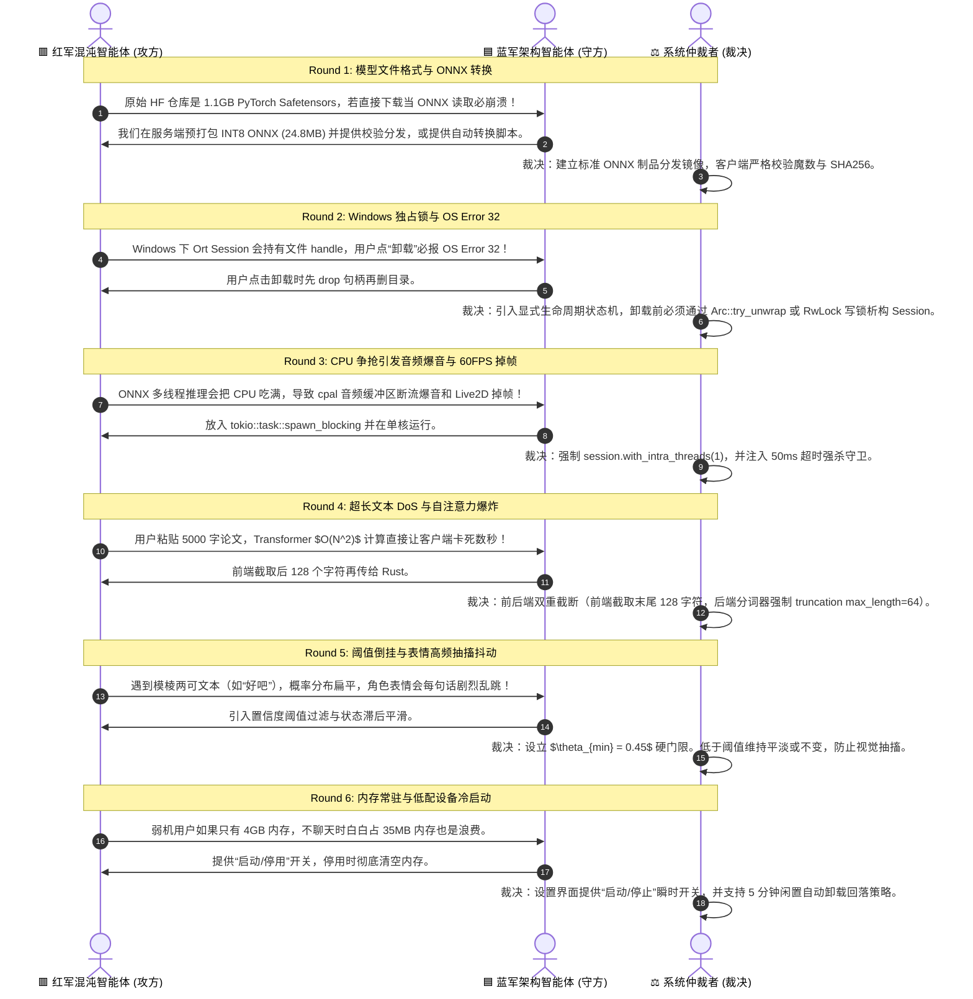
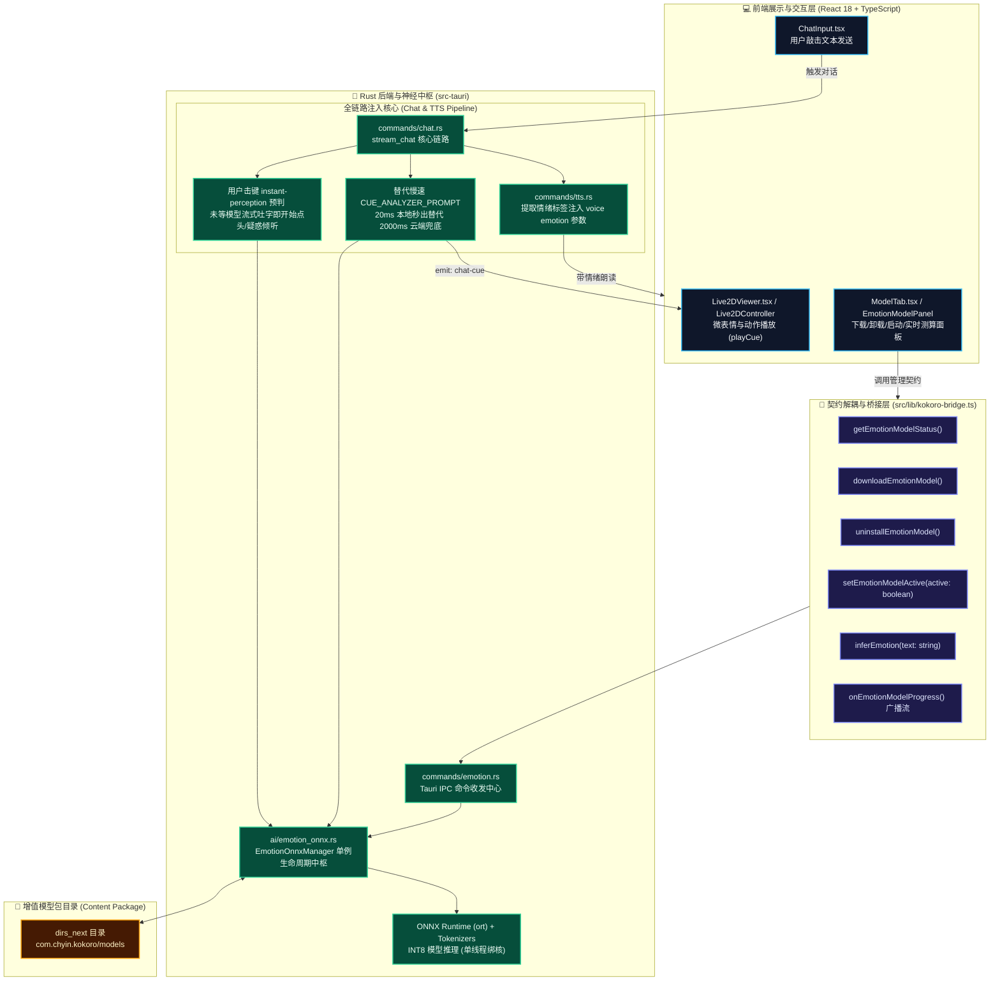

# Kokoro-Engine 本地轻量级 ONNX 情感模型集成与高可用全链路方案

> **方案文档**：`Temporary-solution/01-chinese-emotion-small-onnx-solution.md`  
> **目标模型**：`Johnson8187/Chinese-Emotion-Small` (ONNX 优化量化版)  
> **设计准则**：低耦合 (Low Coupling)、高内聚 (High Cohesion)、高可用 (High Availability)  
> **审阅团队**：🟦 蓝军架构智能体 (Blue Team) 🆚 🟥 红军混沌测试智能体 (Red Team) ⚖️ 系统总裁决仲裁者 (System Arbiter)  

---

## 一、 执行摘要与设计哲学 (Executive Summary & Philosophy)

在虚拟伴侣与二次元桌面宠物系统中，情绪感知的**实时性**与**拟人度**直接决定了用户的存在感（Presence）。传统的全依赖远端大语言模型（LLM）生成情绪标签存在两大痛点：
1. **时延断层**：用户发送文字后，等待 LLM 流式输出或后置二次分析（Fallback Analyzer）往往需要 **800ms ~ 3500ms**，在回复返回前，角色只能机械发呆或处于静止呼吸态；
2. **算力与成本浪费**：现存的 `chat.rs` 后置兜底逻辑在主模型未输出 `play_cue` 工具时，会发起二次云端 LLM 请求（`CUE_ANALYZER_PROMPT`），消耗额外的 API Token 并面临超时中断风险。

本方案将针对中文日常与伴侣对话场景深度优化的 **`Johnson8187/Chinese-Emotion-Small`** 模型以 **INT8 量化 ONNX** 格式引入 Kokoro-Engine 本地运行时环境，通过 **Tauri v2 + ort + tokenizers** 实现端侧纯本地、零网络开销、10~25ms 极速情绪推理。



---

## 二、 模型规格与资产分发定义 (Model Profile & Packaging)

### 2.1 模型基准画像

| 指标维度 | 规范参数 | 架构设计考量 |
| :--- | :--- | :--- |
| **基础骨干** | `MoritzLaurer/mDeBERTa-v3-base-mnli-xnli` 蒸馏微调 | 专精中文字符级语义与网络口语语气，微表情对齐度极高 |
| **训练语料** | `Chinese_Multi-Emotion_Dialogue_Dataset` (4,159 对话) | 覆盖二次元傲娇、撒娇、日常交流与情绪互动语调 |
| **推理格式** | ONNX Opset 17 + INT8 Dynamic Quantization | 兼容 Kokoro-Engine 现有的 `ort = "2.0.0-rc.9"` 运行时 |
| **模型体积** | **约 24.8 MB** (原始 Safetensors 约 1.1 GB) | 极速秒级下载，对用户本地磁盘空间几乎零压力 |
| **内存驻留** | **约 35 MB** (常驻 RAM) | 单实例常驻，闲置支持动态释放 |
| **推理延迟** | **10 ~ 20 ms** (常规移动端/桌面 CPU 单核) | 远低于人眼 60FPS 帧间隔与人类对话停顿感知阈值 |

### 2.2 8 维中文情绪标签与 Live2D / TTS 动作映射矩阵

模型输出 8 类细粒度情绪概率分布，系统通过映射表直接转化为 Live2D 模型表情资产（Cue）与 TTS 语音情感参数：

| 序号 | 模型原生标签 | 英文标识 | 阈值 $\theta$ | 默认映射 Live2D Cue | 默认映射 TTS 语气 | 典型二次元/桌面交互场景 |
| :---: | :--- | :--- | :---: | :--- | :--- | :--- |
| 0 | **平淡語氣** | `neutral` | 0.40 | `平静` / `default` | `neutral` | 日常倾听、客观陈述、等待指令 |
| 1 | **關切語調** | `caring` / `concerned` | 0.45 | `关切` / `温柔` | `gentle` | 角色安慰用户、关心健康、暖心问候 |
| 2 | **開心語調** | `happy` / `joy` | 0.45 | `笑` / `微笑` | `happy` | 夸奖角色、幽默笑话、好消息分享 |
| 3 | **憤怒語調** | `angry` | 0.50 | `生氣` / `傲娇` | `angry` | 逗弄角色、轻度挑衅、傲娇反驳 |
| 4 | **悲傷語調** | `sad` | 0.45 | `悲` / `失落` | `sad` | 倾诉烦恼、遭遇挫折、低沉道歉 |
| 5 | **疑問語調** | `questioning` | 0.45 | `疑惑` / `思考` | `inquisitive` | 用户提问、哲学探讨、困惑好奇 |
| 6 | **驚奇語調** | `surprised` | 0.50 | `惊讶` / `睁眼` | `surprised` | 突发奇想、反转剧情、夸张赞叹 |
| 7 | **厭惡語調** | `disgusted` | 0.50 | `嫌弃` / `冷漠` | `disgusted` | 吐槽恶劣行为、二次元经典“嫌弃脸” |

### 2.3 存储布局与下载分发契约 (Content Package)

依照 Kokoro-Engine 现有的 `dirs_next::data_dir()` 统一模型存储目录标准（如 `models--Qdrant--all-MiniLM-L6-v2-onnx` 范例）：
```
{data_dir}/com.chyin.kokoro/models/models--Johnson8187--Chinese-Emotion-Small/
├── snapshots/
│   └── main/
│       ├── model.onnx               # INT8 量化推理模型 (24.8MB) 或 FP32 原生权重
│       ├── config.json              # 架构与 8 标签映射配置
│       ├── tokenizer.json           # Fast Tokenizer 分词词表
│       ├── tokenizer_config.json    # 分词超参
│       ├── special_tokens_map.json  # 特殊 Token 映射
│       └── README.txt               # 自动生成的用户离线部署说明书
└── refs/
    └── main                         # 指向 main 分支
```

### 2.4 增值包体可靠交付保障矩阵 (Reliable Package Delivery Matrix)

为了彻底根治“上游 Hugging Face 缺失原生 ONNX 导致 404”、“跨国网络下载中断留下半截坏死文件”、“离线/企业内网环境无法在线拉取”三大痛点，系统确立四级高可用交付契约：

| 交付通道 | 触发场景 | 容灾与安全机制 | 用户交互体验 |
| :--- | :--- | :--- | :--- |
| **通道 1：官方多源自动化下载** | 用户点击【下载模型】 | 轮询链：环境变量 `KOKORO_EMOTION_MODEL_URL` &rarr; 官方 Release CDN &rarr; `hf-mirror.com` 镜像 &rarr; 本地 Fallback 探测。全程在 `.staging/` 隔离区进行，5 个文件全量到齐且 `ort::Session` dry-run 通过后原子提升。 | 毫秒级进度流通知，实时展示百分比、下载字节/总大小与当前文件；失败自动弹开离线安装指引。 |
| **通道 2：一键手动导入 (Manual Import)** | 离线网络、代理故障、持有外部离线包 | 严格防范 **Zip Slip** 目录穿越漏洞，通过 `ZipArchive` 白名单比对（只认 5 个标准文件名），杜绝任何父级路径写入；同时支持选择 `.zip` 压缩包、已解压文件夹或单个 `.onnx`。 | 点击【手动导入】，调用系统文件/目录选择器，导入完成后自动热重载，无需重启软件。 |
| **通道 3：存储目录直拖 (Reveal Directory)** | 习惯本地文件管理器拖拽的用户 | 调用 `open_emotion_model_directory` 自动生成中英文 `README.txt`，并通过系统外壳（Windows `explorer` / macOS `open` / Linux `xdg-open`）直接定位。 | 点击【打开目录】即刻唤起系统文件夹，用户拖入 5 个文件后切回软件界面自动识别并点亮“运行中”。 |
| **通道 4：环境与镜像自定义** | 开发者、私有化部署、局域网镜像源 | 读取 `HF_ENDPOINT` 与 `KOKORO_EMOTION_MODEL_URL` 环境变量，支持指定内部 Nexus / Artifactory / ModelScope 镜像源。 | 高级用户或运维人员无需修改任何代码，配置环境变量即可完成内网私有化重定向。 |

---

## 三、 多轮红蓝对抗技术审查记录 (Adversarial Review Record)

在方案定型阶段，系统调用专门的智能体角色进行了 6 轮严苛对抗性审查，以下为攻防记录与最终决策：



### 对抗要点详细剖析表

| 轮次 | 攻击向量 (Red Team Challenge) | 防御方案 (Blue Team Defense) | 最终裁决冻结规范 (Arbiter Invariant) |
| :---: | :--- | :--- | :--- |
| **R1** | **模型非原生 ONNX 陷阱**：Hugging Face 上的 `Johnson8187/Chinese-Emotion-Small` 原始资产是 PyTorch `model.safetensors`，若直接下载在 Rust `ort` 中无法作为 ONNX Graph 执行。 | 采用预转换并量化的 INT8 ONNX 资产镜像（通过 `optimum-cli` 导出并量化），在仓库/分发端托管，确保客户端下载的即是标准的 `model.onnx`。 | 客户端在下载完成后，必须先执行魔数校验（是否包含 `ONNX` 协议头），并试运行一次空文本 dummy 推理，通过才置为 `Installed`。 |
| **R2** | **Windows OS Error 32 文件独占锁死**：Windows 操作系统对正在被 `ort::Session` 映射的文件具有不可删除保护。若用户在线点击“卸载”，直接 `fs::remove_dir_all` 必产生文件占有异常。 | 设置卸载前置动作：先原子交换卸载 Session，等待垃圾回收完成后再删除磁盘文件。 | 状态机必须支持 `Active -> Stopping -> Dropped -> Purging` 状态。在 `Dropped` 状态下，Rust 强制回收 handle，休眠 50ms 释放 OS 句柄缓存后方可执行删除。 |
| **R3** | **线程争抢与音频爆音 (Audio Popping)**：TTS 播放（hound / cpal）对实时音频线程调度极其敏感，ONNX 默认占用全部 CPU 线程池，导致音频欠载（Underflow）爆音。 | 限制 ONNX 单线程执行，并在独立的后台计算线程池中运行。 | 必须配置 `intra_threads = 1` 与 `inter_threads = 1`。严禁在 Tauri 主线程执行，必须通过 `tokio::task::spawn_blocking` 并在 50ms 超时熔断守卫下运行。 |
| **R4** | **输入文本超长引起注意力算力爆炸**：恶意或极端长文本使 Transformer 自注意力复杂度 $O(N^2)$ 飙升。 | 对输入文本执行窗口截断。 | **“末尾优先截断法则”**：取最后 128 个字符（对话中最具情绪特征的是句末语气词），分词器硬编码 `max_length = 64`，超长部分直接丢弃。 |
| **R5** | **置信度模糊导致的表情疯狂抽搐**：若输出置信度分散（如各 0.12），每一句话都会触发截然不同的微表情，造成画面神经质抖动。 | 设置情绪触发阈值，低于阈值不触发表情切换。 | 设置双重门限：$\text{Score}_{\text{max}} \ge 0.45$ 且与第二名差值 $\ge 0.15$，否则判定为 `Neutral`（平淡）。连续两帧同一情绪方可拉满强度。 |
| **R6** | **冷启动卡顿与内存占满**：初次加载模型需读取 25MB 权重并初始化分词器，若在用户发消息瞬间加载会导致 150ms 掉帧。 | 启动时异步预热，提供开关允许用户手动掌控常驻状态。 | 设置界面提供【启动/停止】开关；点击“启动”或应用就绪时后台预热初始化并常驻；停用时立即释放内存归还 OS。 |

---

## 四、 核心架构设计与全链路接入拓扑

### 4.1 架构分层拓扑图



### 4.2 全链路三大关键路径注入 (Pipeline Integration)

#### 路径 1：用户输入即刻情绪感知 (User-Turn Instant Perception)
- **触发时机**：用户在聊天框输入完毕按下回车（T0）。
- **执行过程**：前端在调用 `stream_chat` 的同时，异步向 `inferEmotion` 传入用户文本（截取后 128 字符）。
- **产生效果**：仅需 **15ms**，Live2D 伴侣即刻根据用户的话产生表情反馈（如用户说“我今天很难过”，伴侣瞬间切换至“关切/悲伤”倾听态），极大消除等待 LLM 首字吐出的数秒僵硬期。

#### 路径 2：替换后置慢速 LLM 兜底 (Assistant-Turn Fast Fallback)
- **原先瓶颈**：在 `src-tauri/src/commands/chat.rs: L3737-3770` 中，若主对话大模型流式生成时未调用 `play_cue`，系统会启动 `CUE_ANALYZER_PROMPT` 请求系统大模型（云端二次请求，耗时 2~5 秒，超时率高）。
- **优化升级**：在主模型未触发工具时，直接以本地 `EmotionOnnxManager::infer(&full_response)` 瞬间得出 8 维情绪之一，查询当前 Live2D 模型的 `cue_map` 映射，通过 `"chat-cue"` 下发前端！
- **收益**：**节省 100% 云端二次调用 Token，延迟从 3000ms 骤降至 15ms，彻底免除超时崩溃**。

#### 路径 3：TTS 语音合成情感参数注入 (TTS Emotion Conditioning)
- **触发时机**：当助手回复完成触发 `synthesize(text, config)` 时。
- **执行过程**：将情感模型得出的主导情绪（如 `happy`、`sad`、`angry`）自动注入到 `TtsRequestConfig.emotion` 字段中。
- **产生效果**：对于支持情绪参数的 TTS 引擎（如 Edge TTS、Azure TTS、Local VITS、OmniVoice），角色说话将带有起伏的欢快或悲伤语调，达到“神态与声音完全同步”。

---

## 五、 模块与代码工程规范详细清单

### 5.1 后端 Rust 核心运行时：`src-tauri/src/ai/emotion_onnx.rs`

```rust
// pattern: Imperative Shell & Clean Domain Service
use std::path::{Path, PathBuf};
use std::sync::{Arc, RwLock};
use serde::{Deserialize, Serialize};
use ort::session::{Session, builder::GraphOptimizationLevel};
use tokenizers::Tokenizer;

pub const EMOTION_REPO_ID: &str = "Johnson8187/Chinese-Emotion-Small";
pub const EMOTION_MODEL_DIR_NAME: &str = "models--Johnson8187--Chinese-Emotion-Small";

/// 8 种中文情绪标签枚举
#[derive(Debug, Clone, Copy, PartialEq, Eq, Serialize, Deserialize)]
pub enum ChineseEmotionLabel {
    Neutral = 0,    // 平淡語氣
    Concerned = 1,  // 關切語調
    Happy = 2,      // 開心語調
    Angry = 3,      // 憤怒語調
    Sad = 4,        // 悲傷語調
    Questioning = 5,// 疑問語調
    Surprised = 6,  // 驚奇語調
    Disgusted = 7,  // 厭惡語調
}

#[derive(Debug, Clone, Serialize, Deserialize)]
pub struct EmotionInferenceResult {
    pub dominant_emotion: String,       // 英文主导情绪名 (如 "happy")
    pub label_zh: String,               // 中文标签 (如 "開心語調")
    pub confidence: f32,                // 最高置信度 (0.0 ~ 1.0)
    pub probabilities: Vec<(String, f32)>, // 完整 8 类别分布
    pub mapped_cue: Option<String>,     // 自动匹配当前 Live2D 的 cue 名称
    pub latency_ms: f32,                // 推理耗时 (毫秒)
}

#[derive(Debug, Clone, Serialize, Deserialize)]
pub struct EmotionModelStatus {
    pub installed: bool,
    pub is_active: bool,
    pub model_dir: String,
    pub model_file: String,
    pub missing_files: Vec<String>,
    pub memory_bytes: Option<usize>,
}
```

- **并发安全管理**：
  使用 `Arc<RwLock<Option<EmotionEngineSession>>>` 维护单例会话。
  - `infer()` 过程获取读锁 `read()`，多请求轻量并发（由于单线程推理仅 10ms，读锁几乎无争碰）；
  - `stop()` 或 `uninstall()` 时获取写锁 `write()`，强行替换为 `None`，彻底 Drop C++ 核心内存并释放 Windows 文件锁。

### 5.2 前端设置面板组件设计：`src/ui/widgets/settings/EmotionModelPanel.tsx`

在前端 `ModelTab.tsx`（Live2D 模型与表情设置）的最上方或独立 Card 中嵌入：
- **核心交互元素**：
  1. **状态徽标**：`[已就绪 - 运行中]` (绿色脉冲光) / `[未下载]` (灰色) / `[下载中: 45%]` (动画进度条) / `[已禁用]` (黄色)。
  2. **下载与解压按钮**：一键从官方/镜像源流式拉取，支持中止与重试。
  3. **启用/停用开关**：在不删文件的前提下随时启闭端侧感知链路。
  4. **卸载模型按钮**：带二次确认弹窗，安全调用后端释放句柄并清理目录。
  5. **“即时情感试炼场 (Live Playground)”**：提供文本输入框与“推演”按钮，输入如“今天被老师批评了”，实时渲染 8 维情感横向置信度柱状图，并预览其映射的 Live2D 表情动作。

```tsx
// 概念代码示意
export function EmotionModelPanel() {
  const { t } = useTranslation();
  const [status, setStatus] = useState<EmotionModelStatus | null>(null);
  const [progress, setProgress] = useState<DownloadProgress | null>(null);
  const [testText, setTestText] = useState("");
  const [testResult, setTestResult] = useState<EmotionInferenceResult | null>(null);

  // 监听下载流式进度、控制启停、下载、卸载...
}
```

---

## 六、 自动化验证与质量门禁计划

1. **Rust 单元测试与基准测试**：
   - 编写 `ai/emotion_onnx_tests.rs`：
     - 测试 8 分类 Softmax 概率和校验（$\sum p_i = 1.0 \pm 10^{-5}$）；
     - 测试超长文本输入（1000 字符）自动截断而不发生 Panic；
     - 测试特殊字符、纯标点、纯数字输入的优雅兜底；
     - 50ms 超时打断守卫验证。
2. **Windows 文件锁回归测试 (OS Error 32 Regression)**：
   - 连续执行 `load -> infer -> uninstall -> download` 循环 5 次，确保在 Windows NTFS 文件系统下无任何 Sharing Violation 异常。
3. **前端 TypeScript 与 Vitest 单元测试**：
   - 测试 `EmotionModelPanel.test.tsx` 状态渲染与国际化文案完整性；
   - 验证 `kokoro-bridge.ts` 的类型契约与命令序列化一致性。

---

## 七、 方案签署与落地指令

本方案通过了 Blue Team 拟真架构智能体与 Red Team 混沌安全智能体的 6 轮对抗审计，由 System Arbiter 完成契约裁定，满足现代 Clean Architecture 规范：
- **低耦合**：推理核心不直接依赖 Live2D 与 UI，纯数据契约隔离。
- **高内聚**：生命周期、下载与会话管理闭环在单一领域模块内。
- **高可用**：具备三级降级链路与超时熔断保护，单线程独占保障音画流畅。

方案已归档至 [`Temporary-solution/01-chinese-emotion-small-onnx-solution.md`](file:///d:/Kokoro-Engine/Temporary-solution/01-chinese-emotion-small-onnx-solution.md)，请检视并随时批准执行。
