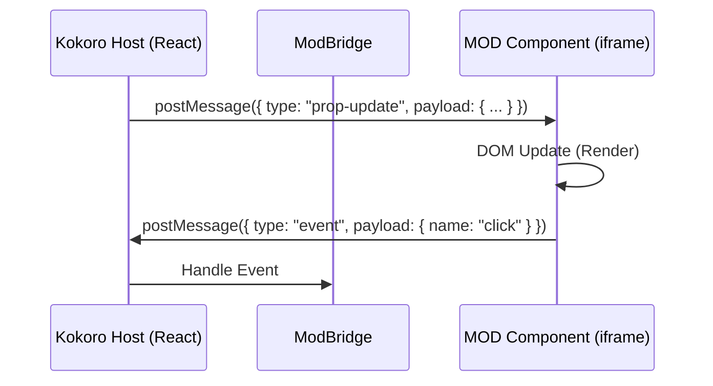

# Kokoro Engine — MOD System Design

> **Version:** 1.0 (Draft)  
> **Target:** Kokoro Engine v0.2+  
> **Status:** Proposal

---

## 1. Core Philosophy

**"A MOD is a World Bundle."**

A MOD in Kokoro Engine is not just a tweak; it is a self-contained package that can redefine the entire user experience. To achieve "Full Decoupling" and allow completely different art styles (e.g., Pixel Art, Sci-Fi, Genshin-style), the system must separate **Data (Configuration)**, **Presentation (UI)**, and **Logic (Script)**.

### Key Principles

1.  **Declarative over Imperative**: Define "what I want" (layout, theme) in JSON, rather than "how to do it" in code.
2.  **Visual Isolation**: UI components run in Sandboxed IFrames to ensure zero CSS pollution and valid style encapsulation.
3.  **Secure Communication**: All MOD interactions happen via a strictly typed `postMessage` bridge.
4.  **Composition**: Users can mix-and-match (e.g., Character from Mod A + Theme from Mod B + Logic from Mod C), though a single MOD can bundle all three.

---

## 2. Architecture Overview

The MOD system is built on three decoupled layers:

```
┌──────────────────────────────────────────────────┐
│              Layer 1: Configuration                 │
│   mod.json / theme.json / layout.json             │
│   "Definition" — Pure data, no logic                │
├──────────────────────────────────────────────────┤
│              Layer 2: Presentation                  │
│   HTML/CSS/JS Components (Web Standards)          │
│   "View" — Isolated rendering, Message-driven       │
├──────────────────────────────────────────────────┤
│              Layer 3: Behavior                      │
│   QuickJS Scripts (Sandboxed ES2020)              │
│   "Controller" — Logic, State, Engine API calls     │
└──────────────────────────────────────────────────┘
```

---

## 3. File Structure

A typical MOD (e.g., `workspace/mods/neon-cyber/`) looks like this:

```
neon-cyber/
├── mod.json              # Main Manifesto
├── theme.json            # Theme Definition (Colors, Assets)
├── layout.json           # UI Layout Definition
├── assets/               # Local Assets
│   ├── background.webp
│   └── fonts/
├── components/           # Custom UI Components
│   ├── ChatBubble.html   # Replaces standard chat bubble
│   └── StatusBar.html    # A new status bar component
└── scripts/              # Logic Scripts
    └── main.js           # Entry point
```

### 3.1 `mod.json` Manifesto

```jsonc
{
  "id": "neon-cyber",
  "name": "Neon Cyberpunk",
  "version": "1.0.0",
  "description": "A futuristic sci-fi overhaul.",
  "engine_version": "^0.2.0",
  
  // 📐 Layout Override (Optional)
  "layout": "layout.json",

  // 🎨 Theme Override (Optional)
  "theme": "theme.json",
  
  // 🧩 Component Registration
  "components": {
    // "Slot Name" : "File Path"
    "ChatPanel": "components/ChatPanel.html",
    "SystemMonitor": "components/Monitor.html"
  },
  
  // ⚡ Logic Entry Point (Optional)
  "scripts": ["scripts/main.js"],
  
  // 🔒 Requested Permissions
  "permissions": ["tts", "system.info"]
}
```

---

## 4. Subsystems Detail

### 4.1 UI Component System (The "iframe" Approach)

To allow complete visual freedom, MOD UI components are **standard HTML files** served via the `mod://` protocol and rendered inside sandboxed `<iframe>` elements.

**Why iframes?**
-   **Style Isolation**: A MOD's global CSS resets (e.g., Tailwind) won't break the engine UI.
-   **Tech Agnostic**: A MOD component can use Vue, Svelte, Vanilla JS, or jQuery without the host caring.
-   **Security**: `sandbox="allow-scripts"` prevents top-level navigation access.

**Data Flow:**



**SDK for Components (`mod-sdk.js` injected automatically):**

```javascript
// Inside MOD Component HTML
Kokoro.on("update", (props) => {
  document.getElementById("text").innerText = props.text;
});

Kokoro.emit("action", { target: "jump" });
```

### 4.2 Layout System Extension

The `LayoutRenderer` will be updated to support a new node type `mod-component`.

**layout.json:**
```jsonc
{
  "root": {
    "type": "layer",
    "children": [
      // Standard Engine Component
      { "type": "component", "component": "Live2DStage" },
      
      // MOD-provided Component (registered in mod.json)
      { 
        "type": "component", 
        "component": "SystemMonitor", 
        "style": { "bottom": "20px", "right": "20px", "position": "absolute" } 
      }
    ]
  }
}
```

### 4.3 Scripting System (QuickJS)

Scripts run in a separate thread (Rust-side QuickJS runtime). They handle logic that doesn't need UI.

**Capabilities:**
-   Listen to engine events (`chat`, `interaction`)
-   Control engine state (`expression`, `tts`)
-   Send data to UI components

**Example Script:**
```javascript
// scripts/main.js
console.log("Neon Cyber loaded");

// Listen for chat messages
Kokoro.on("chat", (msg) => {
  if (msg.text.includes("hack")) {
    Kokoro.ui.send("SystemMonitor", { status: "HACKING_DETECTED", color: "red" });
    Kokoro.character.setExpression("smug");
  }
});
```

---

## 5. Implementation Roadmap

### Phase 1: Foundation (v0.2.0)
-   [ ] **ModBundle Loader**: Update `ModManager` to parse the new `mod.json` structure.
-   [ ] **Theme/Layout Injection**: Allow `ModManager` to override the global `activeTheme` and `layoutConfig`.
-   [ ] **Static Assets**: Ensure `mod://` protocol correctly serves assets from subdirectories.

### Phase 2: UI Isolation (v0.3.0)
-   [ ] **ModComponent Wrapper**: Create a React component `<ModFrame src="..." />`.
-   [ ] **Message Bridge**: Implement `postMessage` protocol between Host and Iframe.
-   [ ] **Component Registry Update**: Allow registering `iframe` sources as valid components.

### Phase 3: Scripting Bridge (v0.4.0)
-   [ ] **Game Loop**: Allow QuickJS scripts to emit events to specific UI components.
-   [ ] **Event Bus**: Connect Rust backend events -> QuickJS -> Frontend Iframe.

---

## 6. Security Considerations

1.  **File Access**: MODs can only read files within their own directory.
2.  **Network**:
    -   **Scripts**: No `fetch` access by default. Requires explicit permission.
    -   **UI**: Standard CSP (Content Security Policy) applied to iframes.
3.  **Isolation**:
    -   Scripts run in QuickJS (no DOM access).
    -   UI runs in Iframe (no Node/Tauri access).
