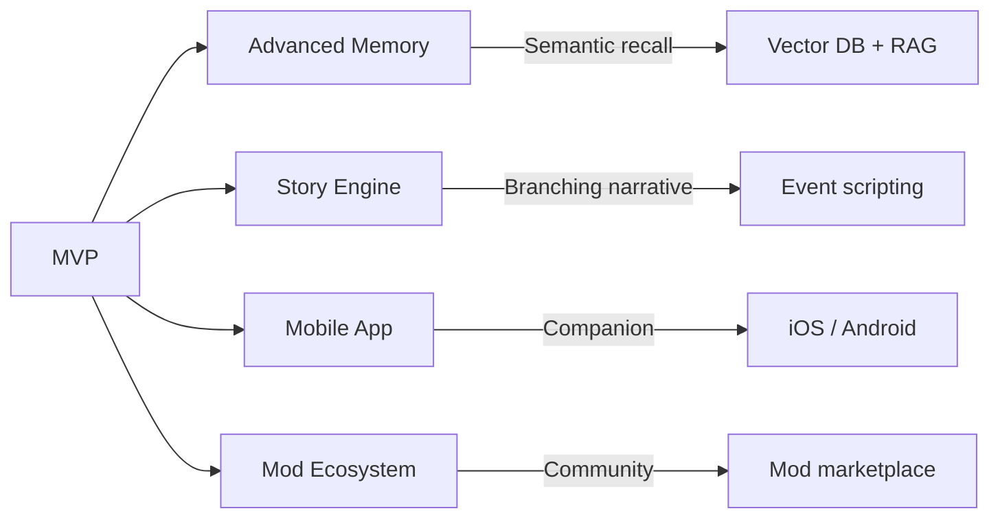

# Kokoro Engine — Product Requirements Document

> **Version:** 1.0  
> **Last Updated:** 2026-02-11  
> **Status:** Draft

---

## 1. Product Goal

**Kokoro Engine** is a cross-platform virtual character interaction engine that allows users to:

- **Load Live2D models** as interactive avatars
- **Chat with AI-powered characters** through customizable LLM APIs
- **Use pluggable TTS systems** (local models, cloud APIs, or text-only mode)
- **Fully mod UI/UX and character behavior** to fit different worlds and art styles

### Core Philosophy

> High freedom · Modular · Offline-first where possible · Creator-friendly

---

## 2. Core Use Cases

### Primary

| Use Case | Description |
|---|---|
| Virtual Companion | VTuber-style interactive character on desktop |
| Roleplay & Storytelling | AI-driven narrative interactions with rich personality |
| Character Simulation | AI characters with personality presets and emotional states |

### Secondary

| Use Case | Description |
|---|---|
| Narrative Experiences | Game-like branching story interactions |
| Stream Overlays | Desktop characters or stream companions *(future)* |

---

## 3. Key Design Principles

1. **Modular architecture** — LLM, TTS, UI, and memory are replaceable modules
2. **Cross-platform** — Windows, macOS, Linux first; mobile later
3. **Offline-first startup** — No network required to launch
4. **Creator extensibility** — Mods, themes, custom characters
5. **Clean separation** — Frontend UI and backend AI logic are decoupled

---

## 4. MVP Scope (Phase 1–2)

### Must Have

- [ ] Live2D model viewer with interaction (gaze, expressions, hit areas)
- [ ] Chat system (text input / output)
- [ ] Pluggable LLM API adapter (OpenAI-compatible)
- [ ] Pluggable TTS system (local / cloud / fallback)
- [ ] Context manager (conversation history, prompt assembly)
- [ ] Basic character state (mood, expression)

### Explicitly Out of Scope for MVP

- ~~Vector memory / RAG systems~~
- ~~Embedding models~~
- ~~Cloud sync~~
- ~~Social features~~

---

## 5. AI Interaction Model

### Prompt Layers

```
┌─────────────────────────────────────┐
│  1. System Persona                  │  ← Character personality card
├─────────────────────────────────────┤
│  2. Lorebook / World Context        │  ← Optional world-building data
├─────────────────────────────────────┤
│  3. Conversation History            │  ← Rolling window
├─────────────────────────────────────┤
│  4. Dynamic State                   │  ← Mood, events, triggers
└─────────────────────────────────────┘
```

### Optimizations

- **Partial refresh** instead of full prompt repetition
- **Token-efficient** context management

---

## 6. Customization & Modding

### UI Modding

| Capability | Description |
|---|---|
| Themeable Layouts | Swap entire UI layouts |
| Replaceable Components | Override individual UI components |
| Custom Skins/Styles | CSS-level style customization |

### Character Modding

| Capability | Description |
|---|---|
| Personality Presets | Define character personality cards |
| Expression Mapping | Map emotions → Live2D expressions |
| Event Triggers | Customize reactions to user actions |

### Engine Plugins *(future)*

- Custom LLM adapters
- Custom TTS engines
- Gameplay logic modules

---

## 7. Technical Stack

| Layer | Technology |
|---|---|
| **Frontend** | React + TypeScript + Tailwind + shadcn/ui |
| **Backend** | Rust (Tauri) |
| **IPC** | Typed command bridge |
| **Rendering** | PixiJS + Live2D Cubism SDK |
| **Storage** | Local SQLite |

---

## 8. Long-Term Vision (Post-MVP)



| Feature | Description |
|---|---|
| Advanced Memory | Semantic recall via vector DB and RAG |
| Story / Narrative Engine | Branching storylines with event scripting |
| Mobile Companion App | iOS and Android native clients |
| Community Mod Ecosystem | Sharing characters, themes, and plugins |
