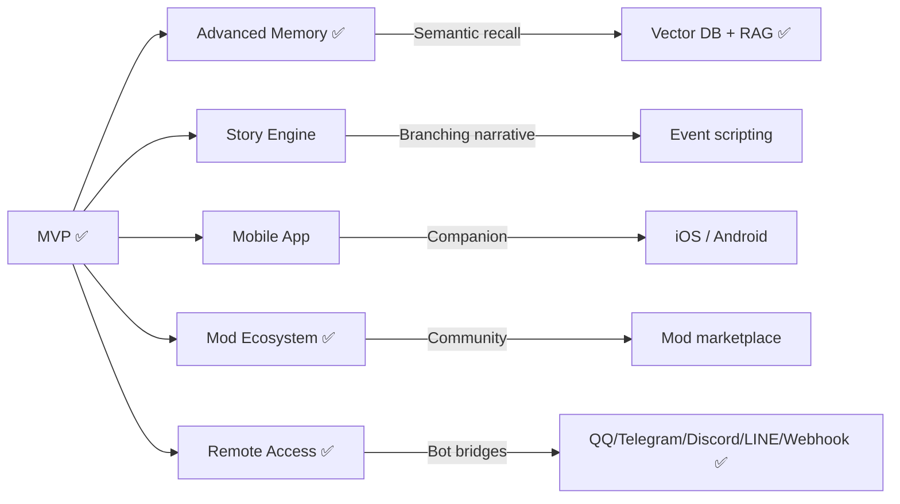

# Kokoro Engine — Product Requirements Document

> **Version:** 1.4
> **Last Updated:** 2026-09-13
> **Status:** Active Development

---

## 1. Product Goal

**Kokoro Engine** is a cross-platform virtual character interaction engine that allows users to:

- **Load Live2D models** as interactive avatars
- **Chat with AI-powered characters** through customizable LLM APIs
- **Use pluggable TTS systems** (local models, cloud APIs, or text-only mode)
- **Fully mod UI/UX and character behavior** to fit different worlds and art styles

### Core Philosophy

> High freedom · Modular · Offline-first where possible · Creator-friendly

### Character product model

Kokoro remains one desktop application and one installer. It doesn't split into companion, developer, or VTuber editions.

- A **character template** is versioned, read-only source content shipped with the app or installed from the official registry.
- A **character instance** is the user's editable copy. Its conversations, memories, greeting state, and runtime overrides aren't overwritten by template or application updates.
- **Character activation** applies the instance prompt and safe presentation defaults as one coordinated operation. Vision, MCP, external bots, and other sensitive capabilities still require explicit consent.

See the [user activation and character ecosystem design](design-plans/2026-07-12-user-activation-character-ecosystem.md) for the staged implementation.

---

## 2. Core Use Cases

### Primary

| Use Case | Description |
|---|---|
| Virtual Companion | VTuber-style interactive character on desktop |
| Roleplay & Storytelling | AI-driven narrative interactions with rich personality |
| Character Simulation | AI characters with personality presets, persistent state, and cue-driven reactions |

### Secondary

| Use Case | Description |
|---|---|
| Narrative Experiences | Game-like branching story interactions |
| Stream Overlays | Desktop characters or stream companions *(future)* |

---

## 3. Key Design Principles

1. **Modular architecture** — LLM, TTS, UI, and memory are replaceable modules
2. **Cross-platform** — Windows, macOS, Linux first; mobile later
3. **Offline-first startup** — No network required to launch
4. **Creator extensibility** — Mods, themes, custom characters
5. **Clean separation** — Frontend UI and backend AI logic are decoupled

---

## 4. MVP Scope (Phase 1–2)

### Must Have (All Completed ✅)

- [x] Live2D model viewer with interaction (gaze, expressions, hit areas, drawable-level hit testing, cue-driven reactions)
- [x] Chat system (text input / output, streaming, message editing, continue-from)
- [x] Pluggable LLM API adapters (OpenAI-compatible Chat Completions and Responses, Anthropic, Ollama, llama.cpp, and experimental Codex Runtime; multi-provider presets)
- [x] Pluggable TTS system (GPT-SoVITS, VITS, OmniVoice, OpenAI, Azure, ElevenLabs, Edge TTS, Browser TTS)
- [x] Context manager (conversation history, prompt assembly, jailbreak prompts with {{char}}/{{user}} placeholders)
- [x] Character state and cue mapping (persistent state across restarts, semantic cue routing, expression/motion sync)

### Post-MVP (Completed ✅)

- [x] Vector memory / RAG systems (core and ephemeral persistence tiers plus consolidation/dreaming)
- [x] Embedding models (FastEmbed all-MiniLM-L6-v2, ONNX offline)
- [x] MOD system (HTML/CSS/JS UI override, QuickJS script sandbox, custom themes)
- [x] MCP protocol support (stdio + Streamable HTTP, auto tool registration)
- [x] Vision system (screen capture, VLM analysis, pixel diff detection)
- [x] Image generation (Stable Diffusion WebUI, DALL-E, Google Gemini)
- [x] STT (OpenAI Whisper, faster-whisper-compatible endpoints, whisper.cpp, SenseVoice cloud/local, native microphone, VAD, and wake word)
- [x] Autonomous behavior (curiosity, initiative, idle behaviors)
- [x] Remote interaction through QQ, Telegram, Discord, LINE, and an authenticated generic Webhook
- [x] Multi-provider LLM (unique Provider IDs, separate main/system LLM)
- [x] Character registry and template/instance lifecycle with source-bound trust and non-destructive package removal
- [x] Desktop pet and synchronized speech-bubble windows
- [x] i18n (6 locales: zh, zh-TW, en, ja, ko, ru)

### Explicitly Out of Scope (for now)

- ~~Cloud sync~~
- ~~Social features~~
- Mobile clients (iOS / Android)

---

## 5. AI Interaction Model

### Prompt Layers

```
┌─────────────────────────────────────┐
│  1. System Persona                  │  ← Character personality card
├─────────────────────────────────────┤
│  2. Retrieved Memory Context        │  ← Optional character-scoped recall
├─────────────────────────────────────┤
│  3. Conversation History            │  ← Rolling window
├─────────────────────────────────────┤
│  4. Runtime State                   │  ← Character state, events, cue triggers
└─────────────────────────────────────┘
```

### Optimizations

- **Bounded context assembly** with configurable window or summary strategy
- **Hybrid memory retrieval** with a keyword fallback when semantic embeddings are unavailable

---

## 6. Customization & Modding

### UI Modding

| Capability | Description |
|---|---|
| Themeable Layouts | Swap entire UI layouts |
| Replaceable Components | Override individual UI components |
| Custom Skins/Styles | CSS-level style customization |

### Character Modding

| Capability | Description |
|---|---|
| Personality Presets | Define character personality cards |
| Semantic Cue Mapping | Map semantic events → Live2D cues |
| Event Triggers | Customize reactions to user actions |

### Engine Plugins *(future)*

- Custom LLM adapters
- Custom TTS engines
- Gameplay logic modules

---

## 7. Technical Stack

| Layer | Technology |
|---|---|
| **Frontend** | React + TypeScript + Tailwind + shadcn/ui |
| **Backend** | Rust (Tauri) |
| **IPC** | Typed command bridge |
| **Rendering** | PixiJS + Live2D Cubism SDK |
| **Storage** | Local SQLite |

---

## 8. Long-Term Vision


```mermaid
graph LR
    A[MVP ✅] --> B[Advanced Memory ✅]
    A --> C[Story Engine]
    A --> D[Mobile App]
    A --> E[Mod Ecosystem ✅]
    A --> F[Remote Access ✅]

    B -->|Semantic recall| B1[Vector DB + RAG ✅]
    C -->|Branching narrative| C1[Event scripting]
    D -->|Companion| D1[iOS / Android]
    E -->|Community| E1[Mod marketplace]
    F -->|Bot bridges| F1[QQ/Telegram/Discord/LINE/Webhook ✅]
```

| Feature | Status | Description |
|---|---|---|
| Advanced Memory | ✅ Done | Character-scoped tiers, semantic + BM25/RRF retrieval, non-blocking embedding fallback, observability, and proposal-based dreaming |
| MOD Ecosystem | ✅ Done | HTML/CSS/JS UI override, QuickJS sandbox, custom themes, Genshin demo MOD |
| Remote Access | ✅ Done | QQ, Telegram, Discord, LINE, and authenticated Webhook bridges with character-scoped conversations and bounded media contracts |
| Story / Narrative Engine | 🔮 Planned | Branching storylines with event scripting |
| Mobile Companion App | 🔮 Planned | iOS and Android native clients |
| Character Marketplace | 🚧 In progress | Trusted official registry plus confirmed community/custom-source installation; broader workshop UX remains planned |
