# Kokoro Engine — Product Requirements Document

> **Version:** 1.1
> **Last Updated:** 2026-03-01
> **Status:** Active Development

---

## 1. Product Goal

**Kokoro Engine** is a cross-platform virtual character interaction engine that allows users to:

- **Load Live2D models** as interactive avatars
- **Chat with AI-powered characters** through customizable LLM APIs
- **Use pluggable TTS systems** (local models, cloud APIs, or text-only mode)
- **Fully mod UI/UX and character behavior** to fit different worlds and art styles

### Core Philosophy

> High freedom · Modular · Offline-first where possible · Creator-friendly

---

## 2. Core Use Cases

### Primary

| Use Case | Description |
|---|---|
| Virtual Companion | VTuber-style interactive character on desktop |
| Roleplay & Storytelling | AI-driven narrative interactions with rich personality |
| Character Simulation | AI characters with personality presets and emotional states |

### Secondary

| Use Case | Description |
|---|---|
| Narrative Experiences | Game-like branching story interactions |
| Stream Overlays | Desktop characters or stream companions *(future)* |

---

## 3. Key Design Principles

1. **Modular architecture** — LLM, TTS, UI, and memory are replaceable modules
2. **Cross-platform** — Windows, macOS, Linux first; mobile later
3. **Offline-first startup** — No network required to launch
4. **Creator extensibility** — Mods, themes, custom characters
5. **Clean separation** — Frontend UI and backend AI logic are decoupled

---

## 4. MVP Scope (Phase 1–2)

### Must Have (All Completed ✅)

- [x] Live2D model viewer with interaction (gaze, expressions, hit areas, drawable-level hit testing)
- [x] Chat system (text input / output, streaming, message editing, continue-from)
- [x] Pluggable LLM API adapter (OpenAI-compatible + Ollama, multi-provider with presets)
- [x] Pluggable TTS system (GPT-SoVITS, VITS, OpenAI, Azure, ElevenLabs, Browser TTS)
- [x] Context manager (conversation history, prompt assembly, jailbreak prompts with {{char}}/{{user}} placeholders)
- [x] Character state (emotion system with persistence across restarts, expression sync)

### Post-MVP (Completed ✅)

- [x] Vector memory / RAG systems (three-layer memory: core/ephemeral/consolidated)
- [x] Embedding models (FastEmbed all-MiniLM-L6-v2, ONNX offline)
- [x] MOD system (HTML/CSS/JS UI override, QuickJS script sandbox, custom themes)
- [x] MCP protocol support (stdio + Streamable HTTP, auto tool registration)
- [x] Vision system (screen capture, VLM analysis, pixel diff detection)
- [x] Image generation (Stable Diffusion WebUI, DALL-E, Google Gemini)
- [x] STT (Whisper, faster-whisper, whisper.cpp)
- [x] RVC voice conversion (singing)
- [x] Autonomous behavior (curiosity, initiative, idle behaviors)
- [x] Telegram Bot remote interaction (long polling, text/voice/photo, session commands)
- [x] Multi-provider LLM (unique Provider IDs, separate main/system LLM)
- [x] i18n (5 languages: zh, en, ja, ko, ru)

### Explicitly Out of Scope (for now)

- ~~Cloud sync~~
- ~~Social features~~
- Mobile clients (iOS / Android)

---

## 5. AI Interaction Model

### Prompt Layers

```
┌─────────────────────────────────────┐
│  1. System Persona                  │  ← Character personality card
├─────────────────────────────────────┤
│  2. Lorebook / World Context        │  ← Optional world-building data
├─────────────────────────────────────┤
│  3. Conversation History            │  ← Rolling window
├─────────────────────────────────────┤
│  4. Dynamic State                   │  ← Mood, events, triggers
└─────────────────────────────────────┘
```

### Optimizations

- **Partial refresh** instead of full prompt repetition
- **Token-efficient** context management

---

## 6. Customization & Modding

### UI Modding

| Capability | Description |
|---|---|
| Themeable Layouts | Swap entire UI layouts |
| Replaceable Components | Override individual UI components |
| Custom Skins/Styles | CSS-level style customization |

### Character Modding

| Capability | Description |
|---|---|
| Personality Presets | Define character personality cards |
| Expression Mapping | Map emotions → Live2D expressions |
| Event Triggers | Customize reactions to user actions |

### Engine Plugins *(future)*

- Custom LLM adapters
- Custom TTS engines
- Gameplay logic modules

---

## 7. Technical Stack

| Layer | Technology |
|---|---|
| **Frontend** | React + TypeScript + Tailwind + shadcn/ui |
| **Backend** | Rust (Tauri) |
| **IPC** | Typed command bridge |
| **Rendering** | PixiJS + Live2D Cubism SDK |
| **Storage** | Local SQLite |

---

## 8. Long-Term Vision

```mermaid
graph LR
    A[MVP ✅] --> B[Advanced Memory ✅]
    A --> C[Story Engine]
    A --> D[Mobile App]
    A --> E[Mod Ecosystem ✅]
    A --> F[Remote Access ✅]

    B -->|Semantic recall| B1[Vector DB + RAG ✅]
    C -->|Branching narrative| C1[Event scripting]
    D -->|Companion| D1[iOS / Android]
    E -->|Community| E1[Mod marketplace]
    F -->|Telegram Bot| F1[Text/Voice/Photo ✅]
```



| Feature | Status | Description |
|---|---|---|
| Advanced Memory | ✅ Done | Three-layer memory (core/ephemeral/consolidated), hybrid search (semantic + BM25 RRF), LLM-driven consolidation |
| MOD Ecosystem | ✅ Done | HTML/CSS/JS UI override, QuickJS sandbox, custom themes, Genshin demo MOD |
| Remote Access | ✅ Done | Telegram Bot with text/voice/photo, session commands, Chat ID whitelist |
| Story / Narrative Engine | 🔮 Planned | Branching storylines with event scripting |
| Mobile Companion App | 🔮 Planned | iOS and Android native clients |
| Character Marketplace | 🔮 Planned | Sharing characters, themes, and plugins |
