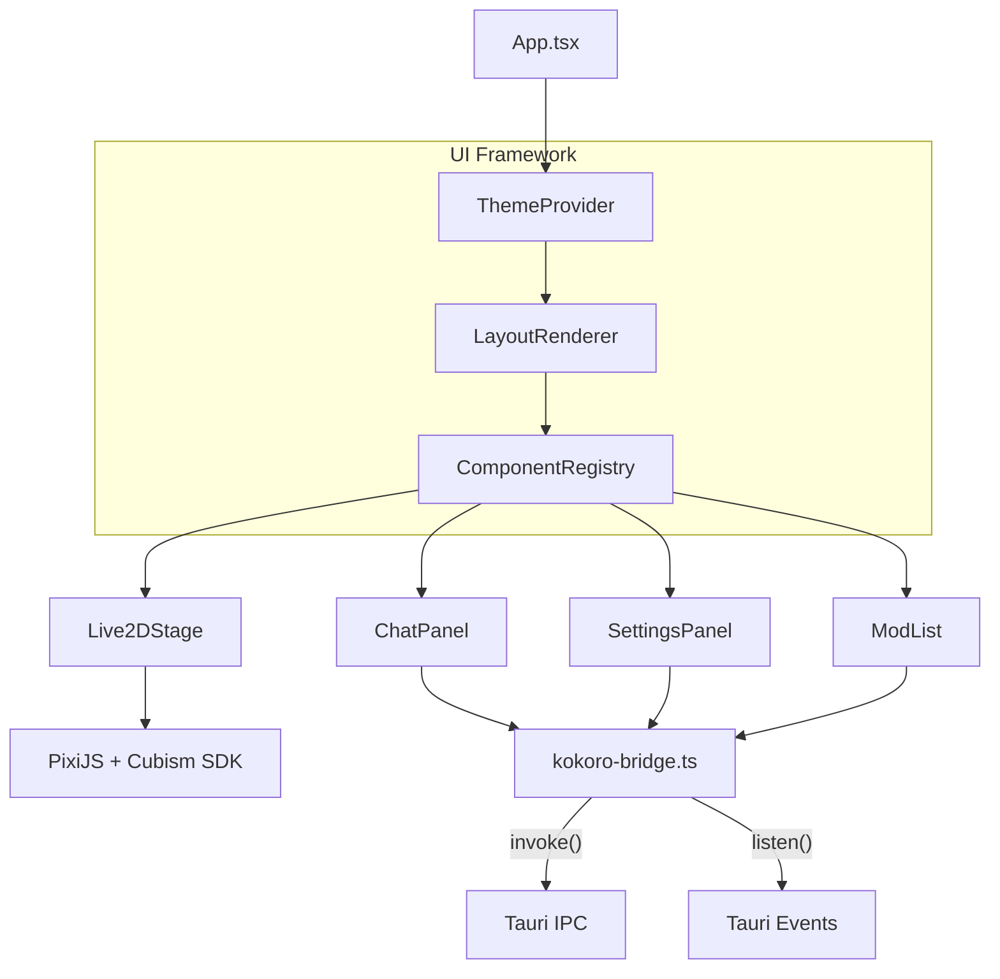
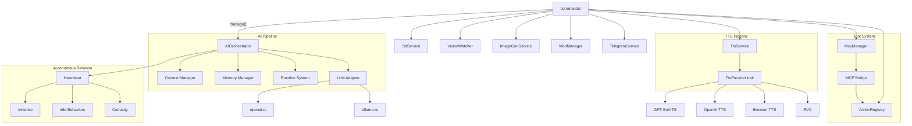
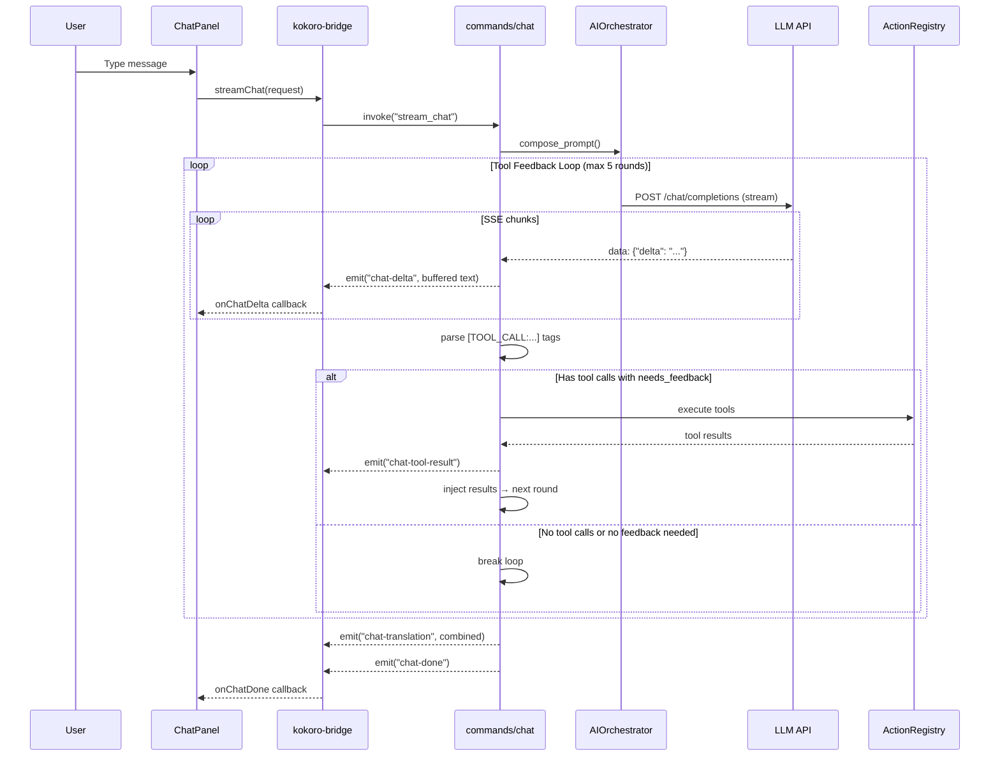
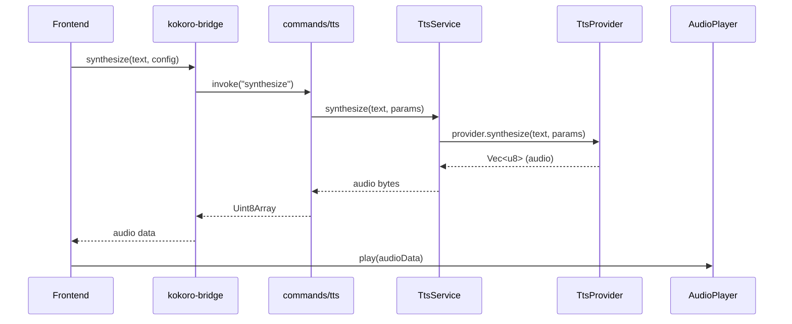

# Kokoro Engine — Architecture

> **Version:** 2.1
> **Last Updated:** 2026-03-01
> **Companion Document:** [PRD.md](PRD.md) · [API Specification](API%20specification.md) · [MOD System Design](MOD_system_design.md)

---

## 1. High-Level Overview

Kokoro Engine is a **Tauri v2 desktop application** with a dual-layer architecture: a React + TypeScript frontend and a Rust backend, communicating over a typed IPC bridge. It integrates Live2D rendering, LLM conversation, TTS/STT, Vision, Image Generation, MCP protocol, and a MOD system.

```
┌──────────────────────────────────────────────────────────────────────┐
│                           Tauri Window                               │
│  ┌────────────────────────────────────────────────────────────────┐  │
│  │                Frontend  (React + TypeScript)                  │  │
│  │                                                                │  │
│  │  ┌─────────┐ ┌────────┐ ┌──────┐ ┌───────┐ ┌──────────────┐  │  │
│  │  │ Live2D  │ │  Chat  │ │ Mods │ │ Theme │ │   Settings   │  │  │
│  │  │ Viewer  │ │ Panel  │ │ List │ │Engine │ │    Panel     │  │  │
│  │  └────┬────┘ └───┬────┘ └──┬───┘ └───────┘ └──────┬───────┘  │  │
│  │       │          │         │                       │          │  │
│  │  ─────┴──────────┴─────────┴───────────────────────┴────────  │  │
│  │                  kokoro-bridge.ts  (Typed IPC)                 │  │
│  └──────────────────────────┬────────────────────────────────────┘  │
│                              │  Tauri invoke / events                │
│  ┌──────────────────────────┴────────────────────────────────────┐  │
│  │                  Backend  (Rust / Tauri v2)                    │  │
│  │                                                                │  │
│  │  ┌────────┐ ┌─────┐ ┌─────┐ ┌─────┐ ┌───────┐ ┌──────────┐  │  │
│  │  │   AI   │ │ LLM │ │ TTS │ │ STT │ │Vision │ │ ImageGen │  │  │
│  │  │Orchstr.│ │Adapt│ │ Svc │ │ Svc │ │Watcher│ │   Svc    │  │  │
│  │  └────────┘ └─────┘ └─────┘ └─────┘ └───────┘ └──────────┘  │  │
│  │  ┌────────┐ ┌─────┐ ┌─────────┐ ┌──────────┐ ┌───────────┐  │  │
│  │  │Actions │ │ MCP │ │  Mods   │ │ Memory   │ │  SQLite   │  │  │
│  │  │Registry│ │Client│ │ Manager │ │ Manager  │ │ +FastEmbed│  │  │
│  │  └────────┘ └─────┘ └─────────┘ └──────────┘ └───────────┘  │  │
│  └────────────────────────────────────────────────────────────────┘  │
└──────────────────────────────────────────────────────────────────────┘
```

---

## 2. Project Structure

### 2.1 Frontend (`src/`)

```
src/
├── App.tsx                        # Root — MOD system orchestration + layout
├── main.tsx                       # React entry point
├── index.css                      # Global styles
│
├── core/                          # Service initialization & singletons
│   ├── init.tsx                   # Component registration bootstrap
│   ├── services.ts                # Service exports
│   ├── services/
│   │   ├── interaction-service.ts # User interaction handling
│   │   ├── mod-service.ts         # MOD lifecycle management
│   │   ├── tts-service.ts         # TTS service wrapper
│   │   └── voice-interrupt-service.ts
│   └── types/
│       └── mod.ts                 # Shared type definitions
│
├── features/live2d/               # Live2D rendering (PixiJS 6 + Cubism SDK)
│   ├── Live2DViewer.tsx           # Main Live2D component
│   ├── Live2DController.ts        # Model control & animation
│   ├── LipSyncProcessor.ts       # Mouth sync with audio
│   ├── DrawableHitTest.ts        # Drawable-level hit testing for body regions
│   └── AudioDebug.tsx             # Audio debugging UI
│
├── ui/
│   ├── layout/                    # Declarative layout engine (JSON-driven)
│   │   ├── LayoutRenderer.tsx     # JSON config → React component tree
│   │   └── types.ts               # LayoutNode, LayoutConfig, ThemeConfig
│   ├── registry/                  # Component registration (singleton)
│   │   └── ComponentRegistry.ts   # Core/MOD component registry
│   ├── theme/                     # Theme system (CSS variables)
│   │   ├── ThemeContext.tsx        # Theme provider & context
│   │   └── default.ts             # Default theme config
│   ├── mods/                      # MOD system integration
│   │   ├── ModMessageBus.ts       # iframe ↔ host message routing
│   │   ├── IframeSandbox.tsx      # iframe sandbox wrapper
│   │   └── ModList.tsx            # MOD list UI
│   ├── hooks/                     # React hooks
│   │   ├── useBackgroundSlideshow.ts
│   │   ├── useTypingReveal.ts
│   │   └── useVoiceInput.ts
│   ├── widgets/                   # UI components
│   │   ├── ChatPanel.tsx          # Chat interface (streaming + tool calls)
│   │   ├── ChatMessage.tsx        # Chat message bubble (edit, continue-from, regenerate)
│   │   ├── SettingsPanel.tsx      # Settings modal (12 tabs)
│   │   ├── HeaderBar.tsx          # Top bar
│   │   ├── FooterBar.tsx          # Bottom bar (emotion display, real-time sync)
│   │   ├── BackgroundLayer.tsx    # Background rendering
│   │   ├── CharacterManager.tsx   # Character CRUD
│   │   ├── ConversationSidebar.tsx
│   │   ├── MemoryPanel.tsx        # Memory management UI
│   │   ├── ImageGenSettings.tsx   # Image generation settings
│   │   ├── memory/
│   │   │   ├── MemoryTimeline.tsx # Timeline view
│   │   │   └── MemoryGraph.tsx    # Keyword graph (CJK-aware)
│   │   └── settings/              # Settings tabs
│   │       ├── ApiTab.tsx         # LLM/API config (multi-provider, presets)
│   │       ├── TtsTab.tsx         # TTS provider setup
│   │       ├── SttTab.tsx         # Speech-to-text config
│   │       ├── SingTab.tsx        # RVC singing config
│   │       ├── ModelTab.tsx       # Live2D model selection
│   │       ├── BackgroundTab.tsx  # Background slideshow
│   │       ├── VisionTab.tsx      # Vision/screenshot config
│   │       ├── McpTab.tsx         # MCP server management
│   │       ├── JailbreakTab.tsx   # Jailbreak prompt config ({{char}}/{{user}} placeholders)
│   │       └── TelegramTab.tsx    # Telegram Bot config
│   ├── locales/                   # i18n (5 languages)
│   │   ├── zh.json                # Simplified Chinese
│   │   ├── en.json                # English
│   │   ├── ja.json                # Japanese
│   │   ├── ko.json                # Korean
│   │   └── ru.json                # Russian
│   └── i18n.ts                    # i18next configuration
│
├── lib/                           # Utilities & bridges
│   ├── kokoro-bridge.ts           # Typed IPC wrapper (all Tauri invoke calls)
│   ├── db.ts                      # IndexedDB for character storage
│   ├── audio-player.ts            # Audio playback utilities
│   ├── character-card-parser.ts   # Character card import (JSON/PNG)
│   └── utils.ts
│
└── components/ui/                 # Radix UI primitives
    └── button.tsx
```

### 2.2 Backend (`src-tauri/src/`)

```
src-tauri/src/
├── main.rs                        # Tauri entry point
├── lib.rs                         # Module exports & Tauri setup
│
├── commands/                      # 20 IPC command modules
│   ├── chat.rs                    # stream_chat (SSE streaming + tool feedback loop)
│   ├── context.rs                 # set_persona, set_language, proactive control, emotion state
│   ├── character.rs               # Character state management
│   ├── conversation.rs            # Conversation history CRUD
│   ├── database.rs                # DB initialization & vector store
│   ├── tts.rs                     # TTS synthesis & config
│   ├── stt.rs                     # Speech-to-text transcription
│   ├── llm.rs                     # LLM config & model listing
│   ├── vision.rs                  # Screen capture & VLM analysis
│   ├── imagegen.rs                # Image generation
│   ├── mcp.rs                     # MCP server management
│   ├── mods.rs                    # MOD loading & lifecycle
│   ├── live2d.rs                  # Live2D model management
│   ├── live2d_protocol.rs         # live2d:// protocol handler
│   ├── memory.rs                  # Memory CRUD & tiering
│   ├── singing.rs                 # RVC voice conversion
│   ├── actions.rs                 # Action registry & execution
│   ├── system.rs                  # Engine info & system status
│   ├── telegram.rs                # Telegram Bot config & control
│   └── mod.rs
│
├── ai/                            # AI orchestration & autonomous behavior
│   ├── context.rs                 # AIOrchestrator — prompt assembly, context mgmt
│   ├── emotion.rs                 # Emotion state & personality model
│   ├── emotion_events.rs          # Emotion event types
│   ├── expression_driver.rs       # Expression → Live2D mapping
│   ├── memory.rs                  # Memory manager (vector DB + tiering)
│   ├── memory_extractor.rs        # Auto-extract memories from chat
│   ├── sentiment.rs               # Sentiment analysis
│   ├── style_adapter.rs           # Response style adaptation
│   ├── router.rs                  # Model routing (Fast/Smart/Cheap)
│   ├── prompts.rs                 # System prompt templates
│   ├── typing_sim.rs              # Typing animation simulation
│   ├── curiosity.rs               # Curiosity module (proactive questions)
│   ├── initiative.rs              # Initiative system (proactive talking)
│   ├── idle_behaviors.rs          # Idle action triggers
│   ├── heartbeat.rs               # Periodic background tasks
│   └── mod.rs
│
├── llm/                           # LLM adapters
│   ├── service.rs                 # LlmService (main interface)
│   ├── provider.rs                # LlmProvider trait
│   ├── openai.rs                  # OpenAI-compatible API adapter
│   ├── ollama.rs                  # Ollama local inference
│   ├── context.rs                 # LLM context management
│   ├── llm_config.rs              # Config persistence
│   └── mod.rs
│
├── tts/                           # Text-to-speech (15+ providers)
│   ├── manager.rs                 # TtsService (main interface)
│   ├── interface.rs               # TtsProvider trait & types
│   ├── router.rs                  # Provider routing logic
│   ├── config.rs                  # Config persistence
│   ├── cache.rs                   # Audio caching
│   ├── queue.rs                   # TTS queue management
│   ├── voice_registry.rs          # Voice profile registry
│   ├── emotion_tts.rs             # Emotion-aware TTS
│   ├── openai.rs                  # OpenAI TTS
│   ├── browser.rs                 # Browser TTS (Web Speech API)
│   ├── local_gpt_sovits.rs        # GPT-SoVITS local
│   ├── local_vits.rs              # VITS local
│   ├── local_rvc.rs               # RVC voice conversion
│   ├── cloud_base.rs              # Cloud provider base
│   └── mod.rs
│
├── stt/                           # Speech-to-text
│   ├── service.rs                 # SttService
│   ├── interface.rs               # SttProvider trait
│   ├── config.rs                  # Config persistence
│   ├── openai.rs                  # OpenAI Whisper
│   ├── whisper_cpp.rs             # Whisper.cpp local
│   ├── stream.rs                  # Audio streaming (chunked)
│   └── mod.rs
│
├── vision/                        # Screen capture & VLM analysis
│   ├── server.rs                  # Vision HTTP server
│   ├── capture.rs                 # xcap screenshot
│   ├── context.rs                 # Vision context
│   ├── config.rs                  # Config persistence
│   ├── watcher.rs                 # Screen change watcher (pixel diff)
│   └── mod.rs
│
├── imagegen/                      # Image generation
│   ├── service.rs                 # ImageGenService
│   ├── interface.rs               # ImageGenProvider trait
│   ├── config.rs                  # Config persistence
│   ├── openai.rs                  # OpenAI DALL-E
│   ├── stable_diffusion.rs        # Stable Diffusion WebUI
│   ├── google.rs                  # Google Gemini
│   └── mod.rs
│
├── mcp/                           # Model Context Protocol client
│   ├── manager.rs                 # McpManager (server lifecycle)
│   ├── client.rs                  # McpClient (JSON-RPC 2.0)
│   ├── transport.rs               # stdio + Streamable HTTP transport
│   ├── bridge.rs                  # MCP tools → ActionRegistry bridge
│   └── mod.rs
│
├── actions/                       # Action registry (LLM tool calling)
│   ├── registry.rs                # ActionHandler trait, ActionRegistry
│   ├── builtin.rs                 # Built-in actions (8 handlers)
│   └── mod.rs
│
├── mods/                          # MOD system (QuickJS sandbox)
│   ├── manager.rs                 # ModManager (lifecycle)
│   ├── manifest.rs                # mod.json parsing
│   ├── protocol.rs                # mod:// protocol handler
│   ├── theme.rs                   # Theme JSON parsing
│   ├── api.rs                     # QuickJS API (Kokoro.*)
│   └── mod.rs
│
├── telegram/                      # Telegram Bot remote interaction
│   ├── bot.rs                     # Bot core logic (message handling, voice/image bridge)
│   ├── config.rs                  # TelegramConfig (token, whitelist, options)
│   └── mod.rs                     # TelegramService lifecycle (start/stop)
│
├── config.rs                      # Global config types
└── utils/
    ├── http.rs                    # HTTP utilities
    └── mod.rs
```

### 2.3 MOD System (`mods/`)

```
mods/
├── default/                       # Default Haru character
│   ├── mod.json                   # Manifest
│   └── theme.json                 # Default theme variables
│
└── genshin-theme/                 # Genshin Impact UI theme (demo MOD)
    ├── mod.json                   # Manifest with component overrides
    ├── theme.json                 # Genshin color palette & animations
    ├── components/
    │   ├── chat.html              # Chat panel override (iframe)
    │   ├── settings.html          # Settings panel override
    │   └── style.css
    └── assets/
        └── HYWenHei-85W.ttf      # Genshin font
```

### 2.4 Database (SQLite + FastEmbed)

```
~/.local/share/com.chyin.kokoro/   # (or OS-appropriate app data dir)
├── kokoro.db                      # SQLite database
│   ├── memories                   # content, embedding, importance, tier, character_id
│   ├── conversations              # chat history
│   └── characters                 # character metadata
├── llm_config.json                # LLM provider config (multi-provider, presets)
├── tts_config.json
├── stt_config.json
├── vision_config.json
├── imagegen_config.json
├── mcp_servers.json
├── telegram_config.json           # Telegram Bot config (token, whitelist)
└── emotion_state.json             # Persisted emotion state across restarts
```

---

## 3. Layer Architecture

### 3.1 Frontend Layer



| Pattern | Implementation |
|---|---|
| **Declarative layout** | JSON config → `LayoutRenderer` → grid/layer/component tree |
| **Component registry** | `ComponentRegistry` — register-by-name, resolve at render time, MOD override support |
| **Theming** | `ThemeProvider` context with CSS variable injection, MOD theme override |
| **Typed IPC** | `kokoro-bridge.ts` wraps every `invoke()` with TypeScript types |
| **Event streaming** | `onChatDelta` / `onChatDone` / `onChatTranslation` / `onChatError` via Tauri events |
| **i18n** | i18next with 5 languages (zh, en, ja, ko, ru) |

### 3.2 Backend Layer



| Pattern | Implementation |
|---|---|
| **Pluggable LLM** | OpenAI-compatible + Ollama adapters; Fast/Smart/Cheap model routing |
| **Pluggable TTS** | `TtsProvider` trait — 15+ providers with emotion-aware synthesis |
| **Pluggable ImageGen** | `ImageGenProvider` trait — Stable Diffusion, DALL-E, Gemini |
| **Tool calling** | `ActionHandler` trait with `needs_feedback()` for feedback loop control |
| **MCP integration** | MCP tools auto-registered into `ActionRegistry` via `bridge.rs` |
| **Managed state** | Tauri `app.manage()` — AIOrchestrator, TtsService, McpManager, etc. |
| **Async-first** | All I/O uses `tokio` async runtime; `Arc<RwLock<T>>` for shared state |
| **Mod isolation** | QuickJS ES2020 sandbox + iframe sandboxing for UI components |

---

## 4. IPC Contract

All frontend ↔ backend communication flows through **`kokoro-bridge.ts`** (frontend) and **`commands/`** (backend).

### Commands (invoke-based)

| Command | Module | Purpose |
|---|---|---|
| `stream_chat` | chat.rs | Start streaming chat with tool feedback loop |
| `set_persona` | context.rs | Set character system prompt |
| `set_response_language` | context.rs | Set response language |
| `set_proactive_enabled` | context.rs | Toggle proactive (idle) messages |
| `clear_history` | context.rs | Reset conversation history |
| `set_character_name` | context.rs | Set character name for placeholder mapping |
| `set_user_name` | context.rs | Set user name for placeholder mapping |
| `get_emotion_state` | context.rs | Get current emotion and mood |
| `get_character_state` | character.rs | Character name, expression |
| `set_expression` | character.rs | Update character expression |
| `list_conversations` | conversation.rs | List conversation history |
| `load_conversation` | conversation.rs | Load specific conversation |
| `init_db` | database.rs | Initialize SQLite database |
| `synthesize` | tts.rs | TTS synthesis → audio bytes |
| `get_tts_config` / `set_tts_config` | tts.rs | TTS provider configuration |
| `transcribe` | stt.rs | Speech-to-text transcription |
| `get_llm_config` / `set_llm_config` | llm.rs | LLM provider configuration |
| `capture_screen` | vision.rs | Screen capture for VLM |
| `generate_image` | imagegen.rs | Image generation |
| `list_mcp_servers` | mcp.rs | Enumerate MCP servers |
| `connect_mcp_server` | mcp.rs | Connect to MCP server |
| `list_mods` / `load_mod` | mods.rs | MOD discovery & loading |
| `list_live2d_models` | live2d.rs | Available Live2D models |
| `search_memories` | memory.rs | Hybrid memory search |
| `get_engine_info` | system.rs | Engine name, version, platform |
| `get_telegram_config` / `save_telegram_config` | telegram.rs | Telegram Bot configuration |
| `start_telegram_bot` / `stop_telegram_bot` | telegram.rs | Telegram Bot lifecycle control |
| `get_telegram_status` | telegram.rs | Telegram Bot running status |

### Events (streaming)

| Event | Direction | Payload |
|---|---|---|
| `chat-delta` | BE → FE | `string` — incremental text chunk (tags buffered) |
| `chat-done` | BE → FE | `void` — stream complete signal |
| `chat-error` | BE → FE | `string` — error message |
| `chat-translation` | BE → FE | `string` — combined translation from all rounds |
| `chat-tool-result` | BE → FE | `{tool, result}` — tool execution result |
| `chat-expression` | BE → FE | `{expression, mood}` — emotion update |
| `chat-image-gen` | BE → FE | Image generation event |
| `proactive-trigger` | BE → FE | Proactive message trigger |

---

## 5. Module Deep Dives

### 5.1 AI Pipeline & Tool Feedback Loop

```
User message
    │
    ▼
┌──────────────┐     ┌───────────────┐     ┌──────────────┐
│   Context    │────▶│   Prompt      │────▶│  LLM Adapter │
│   Manager    │     │   Assembly    │     │(OpenAI/Ollama)│
└──────────────┘     └───────────────┘     └──────┬───────┘
                                                   │
                              ┌─────────────────────┘
                              ▼
                     ┌─────────────────┐
                     │  Tool Feedback  │ (max 5 rounds)
                     │     Loop        │
                     └────────┬────────┘
                              │
              ┌───────────────┼───────────────┐
              ▼               ▼               ▼
        ┌──────────┐   ┌──────────┐   ┌──────────┐
        │chat-delta│   │ Parse    │   │ Execute  │
        │ events   │   │[TOOL_CALL│   │ Actions  │
        │(buffered)│   │  tags]   │   │          │
        └──────────┘   └──────────┘   └────┬─────┘
                                           │
                              ┌─────────────┘
                              ▼
                     ┌─────────────────┐
                     │ needs_feedback? │
                     └────────┬────────┘
                         yes/ \no
                        /     \
                       ▼       ▼
              [inject result  [break loop]
               → next round]
```

**Tool Feedback Loop** (`commands/chat.rs`):
1. LLM streams response → `chat-delta` events (with tag buffering)
2. Parse `[TOOL_CALL:name|args]` tags from response
3. If no tool calls → break (final round)
4. Execute tools via `ActionRegistry`
5. Check `needs_feedback()` — info-retrieval tools (get_time, search_memory, MCP tools) return `true`; side-effect tools (change_expression, play_sound) return `false`
6. If any tool needs feedback → inject assistant message + tool results into context → next round
7. If no tool needs feedback → break

**Stream Buffering**: `[TOOL_CALL:...]` and `[TRANSLATE:...]` tags are held in a buffer during streaming and never sent to the frontend raw.

### 5.2 Action System

```
ActionRegistry
├── Built-in Actions (builtin.rs)
│   ├── get_time            (needs_feedback: true)
│   ├── search_memory       (needs_feedback: true)
│   ├── forget_memory       (needs_feedback: true)
│   ├── store_memory        (needs_feedback: false)
│   ├── change_expression   (needs_feedback: false)
│   ├── set_background      (needs_feedback: false)
│   ├── send_notification   (needs_feedback: false)
│   └── play_sound          (needs_feedback: false)
│
└── MCP Tools (bridge.rs)       (needs_feedback: true, always)
    └── Dynamically registered from connected MCP servers
```

### 5.3 Memory System

Three-layer architecture:

| Layer | Description |
|---|---|
| **Core memories** | Important facts, permanently stored, never decay |
| **Ephemeral memories** | Temporary observations, naturally decay over time |
| **Consolidated memories** | LLM-driven clustering of similar fragments |

**Retrieval**: Hybrid semantic + keyword search
- Embedding cosine similarity (FastEmbed all-MiniLM-L6-v2, ONNX offline)
- FTS5 BM25 full-text search
- RRF (Reciprocal Rank Fusion) for rank merging

**Auto-extraction**: `memory_extractor.rs` automatically identifies key facts from conversations and stores them.

### 5.4 Autonomous Behavior System

The **heartbeat** (`ai/heartbeat.rs`) runs periodic background tasks:

| Module | Purpose |
|---|---|
| `initiative.rs` | Proactive talking — character initiates conversation when user is idle |
| `idle_behaviors.rs` | Idle actions — expression changes, ambient animations |
| `curiosity.rs` | Curiosity — character asks questions about topics of interest |

Triggers are time-based (idle duration) and context-aware (time of day, conversation history).

### 5.5 TTS Pipeline

```
Text ──▶ TtsService ──▶ TtsProvider::synthesize() ──▶ Audio bytes
              │
              ├─▶ GPT-SoVITS (local, emotion-aware)
              ├─▶ VITS (local, vits-simple-api compatible)
              ├─▶ OpenAI TTS
              ├─▶ Azure TTS (Cognitive Services)
              ├─▶ ElevenLabs (voice cloning)
              ├─▶ Browser TTS (Web Speech API)
              └─▶ RVC (voice conversion post-processing)
```

- **`TtsProvider` trait** — `synthesize(text, params) → Vec<u8>`
- **Emotion-aware**: `emotion_tts.rs` adjusts voice parameters based on character emotion
- **Caching**: `cache.rs` caches synthesized audio
- **Queue**: `queue.rs` manages sequential playback

### 5.6 MCP Protocol

```
MCP Server (external process)
    │ stdio / Streamable HTTP
    ▼
McpClient (JSON-RPC 2.0)
    │
    ▼
McpManager (server lifecycle)
    │
    ▼
MCP Bridge → ActionRegistry
    │
    ▼
LLM tool calling via [TOOL_CALL:...] tags
```

- Supports **stdio** and **Streamable HTTP** transports
- MCP tools are automatically registered as `ActionHandler` instances
- All MCP tools default to `needs_feedback: true`

### 5.7 MOD System

```
mods/example-mod/
├── mod.json          # Manifest (id, name, version, components, scripts, permissions)
├── theme.json        # CSS variables, fonts, animations
├── layout.json       # Optional layout overrides
├── components/       # HTML files (rendered in iframe sandbox)
└── scripts/          # QuickJS ES2020 code
```

- **UI Components**: HTML/CSS/JS in iframe sandbox, communicate via `ModMessageBus` (postMessage)
- **Scripts**: QuickJS runtime with `Kokoro.*` API (`Kokoro.on()`, `Kokoro.emit()`, `Kokoro.ui.send()`, `Kokoro.character.setExpression()`)
- **Themes**: CSS variable injection, font loading, animation definitions
- **`mod://` protocol**: Custom URI scheme serving mod assets with path traversal protection

### 5.8 Telegram Bot

```
Telegram ←→ teloxide (long polling) ←→ TelegramService (background task)
                                            ↓
                                  app_handle.try_state::<T>()
                                            ↓
                          ┌─────────────────┼─────────────────┐
                          ↓                 ↓                 ↓
                    AIOrchestrator    TtsService        ImageGenService
                    + LlmService      (voice reply)     (image gen)
                    (text chat)       SttService
                                      (voice transcribe)
```

- **Long polling** — No public IP required; uses `teloxide` Rust framework
- **Access control** — Chat ID whitelist; unauthorized messages are silently ignored
- **Session commands** — `/new` (new conversation), `/continue` (resume desktop session), `/status`
- **Message types** — Text, voice (STT → LLM → TTS), photo (with Vision)
- **Desktop sync** — Telegram messages are synced to the desktop chat UI in real-time

---

## 6. Data Flow Diagrams

### 6.1 Chat Message Flow (with Tool Feedback)



### 6.2 TTS Flow



---

## 7. Key Design Decisions

| Decision | Rationale |
|---|---|
| **Tauri v2 over Electron** | Smaller binary, native Rust backend, lower memory footprint |
| **Typed IPC bridge** | Single source of truth for FE↔BE contract; catches mismatches at compile time |
| **Trait-based plugins** | `TtsProvider`, `LlmProvider`, `ImageGenProvider`, `ActionHandler` traits enable swapping implementations |
| **Tool feedback loop** | LLM sees tool results and can incorporate them naturally, enabling info-retrieval tools |
| **`needs_feedback` trait method** | Prevents infinite loops from side-effect tools while ensuring info tools get results back |
| **Stream tag buffering** | `[TOOL_CALL:...]` and `[TRANSLATE:...]` tags never leak to frontend display |
| **Declarative layout** | Enables MOD-driven UI composition; layouts loaded from JSON config |
| **Component registry** | Decouples layout from implementation; MODs can inject/override components |
| **Offline-first** | AI orchestrator failure is non-fatal; app launches without network |
| **QuickJS for MOD scripts** | Sandboxed JS runtime prevents MODs from accessing host filesystem/network |
| **SQLite + FastEmbed** | Zero-config embedded DB with local vector embeddings (all-MiniLM-L6-v2 ONNX) |
| **SSE streaming** | Token-by-token delivery for real-time character responses |
| **Intl.Segmenter for CJK** | Browser-native word segmentation for Chinese/Japanese/Korean in memory graph |
| **Multi-provider LLM** | Unique Provider IDs allow different providers for main LLM and system LLM; presets for quick switching |
| **Emotion persistence** | Emotion state saved to disk and restored on startup, surviving app restarts |
| **Jailbreak placeholders** | `{{char}}` and `{{user}}` placeholder mapping in jailbreak prompts, consistent with Persona |
| **Telegram Bot bridge** | Long-polling Telegram Bot bridges to internal services without public IP requirement |

---

## 8. Cross-Cutting Concerns

### Error Handling

- **Backend** — All commands return `Result<T, String>` to the frontend
- **Tool execution** — Failed tool results are fed back to LLM so it can respond gracefully
- **AI fallback** — If `AIOrchestrator` init fails, the app continues without AI
- **MOD isolation** — MOD execution errors are contained within QuickJS sandbox / iframe

### Security

- **`mod://` protocol** — Blocks `..` path traversal; serves only from `mods/` directory
- **iframe sandbox** — MOD UI components run in sandboxed iframes with restricted permissions
- **API keys** — Stored in local config files, never transmitted except to configured endpoints

### Performance

- **Lazy initialization** — AI infrastructure is lazy-loaded
- **Async I/O** — All network and database operations use `tokio` async runtime
- **PixiJS rendering** — GPU-accelerated Live2D rendering at 60fps
- **Audio caching** — TTS results cached to avoid redundant synthesis
- **Stream buffering** — Minimal overhead tag detection during streaming

---

## 9. Statistics

| Metric | Value |
|---|---|
| Frontend files | ~60 TypeScript/TSX |
| Backend files | ~110 Rust |
| Languages | 5 (zh, en, ja, ko, ru) |
| TTS providers | 6 (GPT-SoVITS, VITS, OpenAI, Azure, ElevenLabs, Browser) |
| LLM support | OpenAI-compatible + Ollama (multi-provider with presets) |
| Built-in actions | 8 |
| MCP transport | stdio + Streamable HTTP |
| Remote access | Telegram Bot (long polling) |
