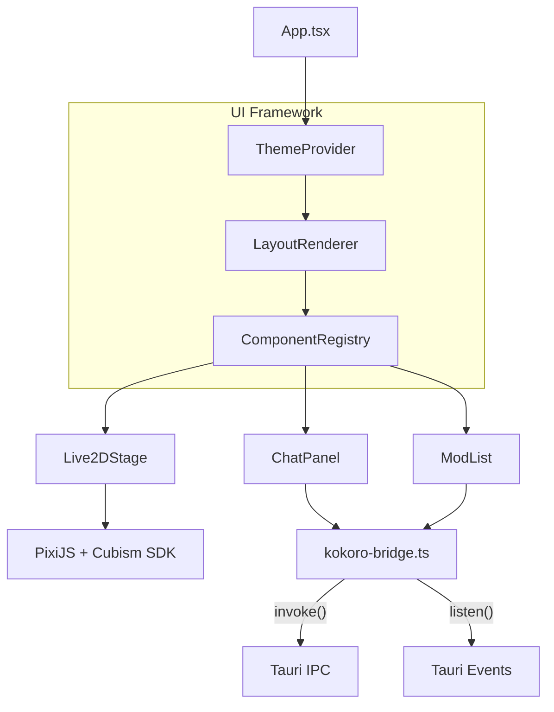
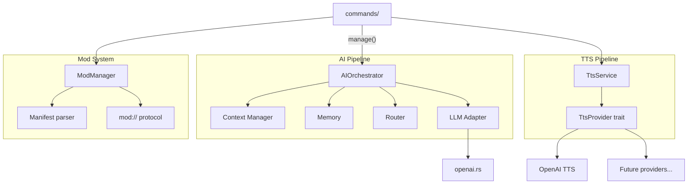
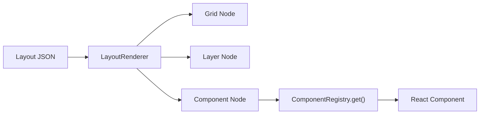
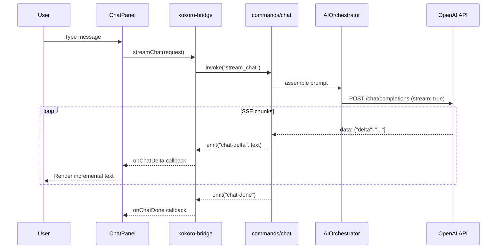
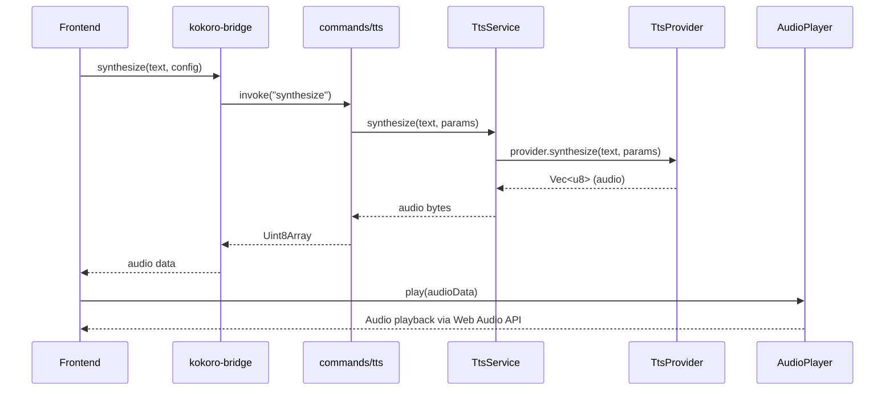

# Kokoro Engine — Architecture

> **Version:** 1.0  
> **Last Updated:** 2026-02-11  
> **Companion Document:** [PRD.md](file:///d:/Program/Kokoro%20Engine/docs/PRD.md)

---

## 1. High-Level Overview

Kokoro Engine is a **Tauri-based desktop application** split into two isolated layers communicating over a typed IPC bridge.

```
┌────────────────────────────────────────────────────────────────┐
│                        Tauri Window                            │
│  ┌──────────────────────────────────────────────────────────┐  │
│  │              Frontend  (React + TypeScript)              │  │
│  │                                                          │  │
│  │  ┌─────────┐  ┌──────────┐  ┌────────┐  ┌───────────┐  │  │
│  │  │ Live2D  │  │  Chat UI │  │  Mods  │  │  Theming  │  │  │
│  │  │ Viewer  │  │  Panel   │  │  List  │  │  Engine   │  │  │
│  │  └────┬────┘  └────┬─────┘  └───┬────┘  └───────────┘  │  │
│  │       │            │            │                        │  │
│  │  ─────┴────────────┴────────────┴──────                  │  │
│  │           kokoro-bridge.ts  (Typed IPC)                  │  │
│  └──────────────────────┬───────────────────────────────────┘  │
│                         │  Tauri invoke / events                │
│  ┌──────────────────────┴───────────────────────────────────┐  │
│  │               Backend  (Rust / Tauri)                    │  │
│  │                                                          │  │
│  │  ┌──────────┐  ┌──────┐  ┌──────┐  ┌──────┐  ┌──────┐  │  │
│  │  │    AI    │  │ LLM  │  │ TTS  │  │ Mods │  │  DB  │  │  │
│  │  │Orchestr. │  │Adaptr│  │ Svc  │  │ Mgr  │  │SQLite│  │  │
│  │  └──────────┘  └──────┘  └──────┘  └──────┘  └──────┘  │  │
│  └──────────────────────────────────────────────────────────┘  │
└────────────────────────────────────────────────────────────────┘
```

---

## 2. Project Structure

```
Kokoro Engine/
├── src/                          # Frontend (React + TS)
│   ├── App.tsx                   # Root — layout config + providers
│   ├── main.tsx                  # Entry point
│   ├── core/                     # Core services & init
│   │   ├── init.tsx              # Component registration bootstrap
│   │   ├── services.ts           # Singleton service instances
│   │   ├── services/             # Service implementations
│   │   └── types/                # Shared TypeScript types
│   ├── features/
│   │   └── live2d/               # Live2D rendering & interaction
│   │       ├── Live2DViewer.tsx   # PixiJS + Cubism renderer
│   │       ├── Live2DController.ts
│   │       └── ...
│   ├── ui/                       # UI framework
│   │   ├── layout/               # Declarative layout engine
│   │   ├── theme/                # Theme system & defaults
│   │   ├── registry/             # Component registry
│   │   ├── mods/                 # Mod UI components
│   │   └── widgets/              # Reusable UI widgets
│   └── lib/                      # Shared utilities
│       ├── kokoro-bridge.ts      # Typed IPC bridge
│       ├── audio-player.ts       # Web Audio playback
│       └── utils.ts
│
├── src-tauri/                    # Backend (Rust)
│   └── src/
│       ├── main.rs               # Tauri entry point
│       ├── lib.rs                # App builder & module wiring
│       ├── commands/             # IPC command handlers
│       │   ├── system.rs         # Engine info, status
│       │   ├── character.rs      # Character state, expressions
│       │   ├── chat.rs           # Streaming chat
│       │   ├── context.rs        # Persona & history management
│       │   ├── database.rs       # DB init & vector store
│       │   ├── tts.rs            # Speech synthesis
│       │   └── mods.rs           # Mod listing & loading
│       ├── ai/                   # AI Orchestrator
│       │   ├── context.rs        # Prompt assembly & context mgmt
│       │   ├── memory.rs         # Conversation memory
│       │   └── router.rs         # Intent routing
│       ├── llm/                  # LLM Adapters
│       │   ├── openai.rs         # OpenAI-compatible adapter
│       │   └── context.rs        # LLM context/config
│       ├── tts/                  # TTS Service
│       │   ├── interface.rs      # TtsProvider trait
│       │   ├── manager.rs        # Provider registry + dispatch
│       │   └── openai.rs         # OpenAI TTS provider
│       └── mods/                 # Mod System
│           ├── manager.rs        # Mod discovery & lifecycle
│           ├── manifest.rs       # Mod metadata schema
│           ├── protocol.rs       # mod:// URI scheme handler
│           └── api.rs            # Mod API surface
│
└── mods/                         # User-installed mods
    ├── default/                  # Built-in default mod
    └── example-mod/              # Example community mod
```

---

## 3. Layer Architecture

### 3.1 Frontend Layer



**Key patterns:**

| Pattern | Implementation |
|---|---|
| **Declarative layout** | JSON config → `LayoutRenderer` → grid/layer/component tree |
| **Component registry** | `ComponentRegistry` — register-by-name, resolve at render time |
| **Theming** | `ThemeProvider` context with replaceable `defaultTheme` |
| **Typed IPC** | `kokoro-bridge.ts` wraps every `invoke()` with TypeScript types |
| **Event streaming** | `onChatDelta` / `onChatDone` / `onChatError` via Tauri events |

---

### 3.2 Backend Layer



**Key patterns:**

| Pattern | Implementation |
|---|---|
| **Pluggable LLM** | `llm::openai` implements OpenAI-compatible streaming; new adapters added by module |
| **Pluggable TTS** | `TtsProvider` trait — providers register with `TtsService` at startup |
| **Managed state** | Tauri `app.manage()` — `AIOrchestrator`, `TtsService`, `ModManager` |
| **Async-first** | All I/O uses `tokio` async runtime; SSE streaming for chat |
| **Mod isolation** | `ModManager` runs mod JS via QuickJS in a separate thread |

---

## 4. IPC Contract

All frontend ↔ backend communication flows through **`kokoro-bridge.ts`** (frontend) and **`commands/`** (backend).

### Commands (invoke-based)

| Command | Direction | Purpose |
|---|---|---|
| `get_engine_info` | FE → BE | Engine name, version, platform |
| `get_system_status` | FE → BE | Running state, active modules, memory |
| `get_character_state` | FE → BE | Character name, expression, mood |
| `set_expression` | FE → BE | Update character expression |
| `send_message` | FE → BE | Non-streaming chat message |
| `stream_chat` | FE → BE | Start streaming chat session |
| `set_persona` | FE → BE | Set character system prompt |
| `clear_history` | FE → BE | Reset conversation history |
| `init_db` | FE → BE | Initialize SQLite database |
| `test_vector_store` | FE → BE | Verify vector store functionality |
| `synthesize` | FE → BE | TTS synthesis → raw audio bytes |
| `list_mods` | FE → BE | Enumerate installed mods |
| `load_mod` | FE → BE | Activate and load a mod |

### Events (streaming)

| Event | Direction | Payload |
|---|---|---|
| `chat-delta` | BE → FE | `string` — incremental text chunk |
| `chat-error` | BE → FE | `string` — error message |
| `chat-done` | BE → FE | `void` — stream complete signal |

---

## 5. Module Deep Dives

### 5.1 AI Pipeline

```
User message
    │
    ▼
┌──────────────┐     ┌───────────────┐     ┌──────────────┐
│   Context    │────▶│   Prompt      │────▶│  LLM Adapter │
│   Manager    │     │   Assembly    │     │  (OpenAI)    │
└──────────────┘     └───────────────┘     └──────┬───────┘
                                                   │
                                                   ▼ SSE stream
                                           ┌──────────────┐
                                           │  chat-delta  │──▶ Frontend
                                           │  events      │
                                           └──────────────┘
```

- **Context Manager** (`ai/context.rs`) — Maintains conversation history (rolling window), assembles the full prompt from persona + lorebook + history + dynamic state.
- **Memory** (`ai/memory.rs`) — Persistent conversation storage in SQLite.
- **Router** (`ai/router.rs`) — Intent classification and routing (e.g., action vs. dialogue).
- **LLM Adapter** (`llm/openai.rs`) — Sends requests to OpenAI-compatible APIs, parses SSE `data:` chunks, emits Tauri events.

---

### 5.2 TTS Pipeline

```
Text ──▶ TtsService ──▶ TtsProvider::synthesize() ──▶ Audio bytes
              │
              ├─▶ OpenAI TTS provider
              └─▶ (future) Local / Azure / etc.
```

- **`TtsProvider` trait** — `id() → String`, `synthesize(text, params) → Vec<u8>`
- **`TtsService`** — Registry of providers; dispatches to the active provider
- **`TtsParams`** — Voice, speed, pitch, emotion
- **Frontend `audio-player.ts`** — Decodes audio bytes, plays via Web Audio API

---

### 5.3 Mod System

```
mods/
├── example-mod/
│   ├── manifest.json      ← Mod metadata
│   └── index.js           ← Entry point (QuickJS sandbox)
```

- **`ModManager`** — Discovers mods from the `mods/` directory, parses manifests, loads entry points.
- **`mod://` protocol** — Custom Tauri URI scheme serving mod assets with directory traversal protection.
- **Mod sandboxing** — JavaScript mods run in a QuickJS runtime on a dedicated thread, isolated from the main Rust process.

---

### 5.4 UI Framework



- **Declarative layout** — The UI is described as a JSON tree of `layer`, `grid`, and `component` nodes.
- **Component registry** — Components are registered by name (`Live2DStage`, `ChatPanel`, `ModList`) at app init; the layout engine resolves them at render time.
- **Theming** — `ThemeProvider` wraps the tree; themes define colors, fonts, and spacing tokens.
- **Mod UI injection** — Mods can register new components into the registry, which can then be referenced in layout configs.

---

## 6. Data Flow Diagrams

### 6.1 Chat Message Flow



### 6.2 TTS Flow



---

## 7. Key Design Decisions

| Decision | Rationale |
|---|---|
| **Tauri over Electron** | Smaller binary, native Rust backend, lower memory footprint |
| **Typed IPC bridge** | Single source of truth for FE↔BE contract; catches mismatches at compile time |
| **Trait-based plugins** | `TtsProvider` and future `LlmProvider` traits enable swapping implementations without changing consumers |
| **Declarative layout** | Enables mod-driven UI composition; layouts can be loaded from JSON config files |
| **Component registry** | Decouples layout definition from component implementation; mods can inject new components |
| **Offline-first startup** | AI orchestrator failure is non-fatal; app launches without network |
| **QuickJS for mods** | Sandboxed JS runtime prevents mods from accessing host filesystem or network directly |
| **SQLite for storage** | Zero-config, embedded, resilient to crashes — ideal for local-first desktop apps |
| **SSE streaming for chat** | Token-by-token delivery for real-time character responses |

---

## 8. Cross-Cutting Concerns

### Error Handling

- **Backend** — All commands return `Result<T, String>` to the frontend; panics are caught.
- **AI fallback** — If `AIOrchestrator` init fails, the app continues running without AI capabilities.
- **Mod isolation** — Mod execution errors are contained within the QuickJS sandbox.

### Security

- **`mod://` protocol** — Blocks `..` path traversal; serves only from the `mods/` directory.
- **API keys** — Read from environment variables, not hardcoded. Config-driven loading planned.

### Performance

- **Lazy initialization** — AI infrastructure is lazy-loaded (not at startup).
- **Async I/O** — All network and database operations use `tokio` async runtime.
- **PixiJS rendering** — GPU-accelerated Live2D rendering at 60fps.

---

## 9. Future Architecture Extensions

| Extension | Architectural Impact |
|---|---|
| **Vector DB / RAG** | New `memory/` module behind the `AIOrchestrator`; lazy-loaded |
| **Story engine** | New `narrative/` module with event scripting; hooks into `Router` |
| **Mobile companion** | Shared Rust core via Tauri Mobile; reduced frontend feature set |
| **Mod marketplace** | New `marketplace/` service; extends `ModManager` with remote registry |
| **Custom LLM adapters** | New implementations of a future `LlmProvider` trait |
