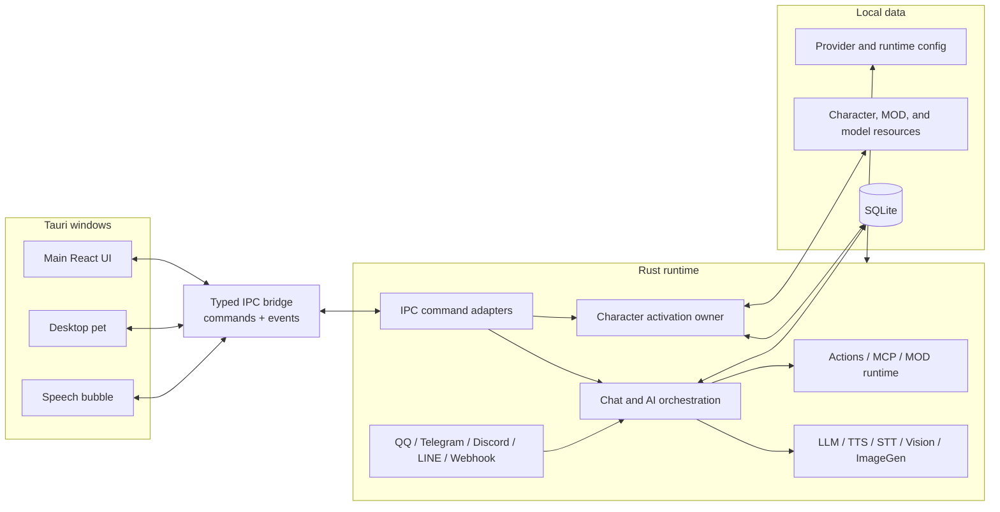

# Kokoro Engine — Architecture

> **Version:** 3.0
> **Last Updated:** 2026-09-13
> **Companion Documents:** [PRD](PRD.md) · [API Specification](API%20specification.md) · [MOD System Design](MOD_system_design.md) · [Storage Guide](developer-storage-guide.md)
> **Code sources of truth:** `src-tauri/src/lib.rs` for registered IPC commands and managed services; `src/lib/kokoro-bridge.ts` for frontend bridge types and wrappers.

---

## 1. System overview

Kokoro Engine 0.4.0 is a local-first Tauri v2 desktop character runtime. React 19 and TypeScript implement the user interface; Rust owns orchestration, persistence, provider integrations, resource safety, and long-running services.


```mermaid
flowchart LR
  subgraph Windows["Tauri windows"]
    Main["Main React UI"]
    Pet["Desktop pet"]
    Bubble["Speech bubble"]
  end
  Bridge["Typed IPC bridge<br/>commands + events"]
  subgraph Runtime["Rust runtime"]
    Commands["IPC command adapters"]
    AI["Chat and AI orchestration"]
    Character["Character activation owner"]
    Media["LLM / TTS / STT / Vision / ImageGen"]
    Tools["Actions / MCP / MOD runtime"]
    Bots["QQ / Telegram / Discord / LINE / Webhook"]
  end
  subgraph Data["Local data"]
    SQLite[("SQLite")]
    Config["Provider and runtime config"]
    Packages["Character, MOD, and model resources"]
  end
  Main <--> Bridge
  Pet <--> Bridge
  Bubble <--> Bridge
  Bridge <--> Commands
  Commands --> AI
  Commands --> Character
  AI --> Media
  AI --> Tools
  Bots --> AI
  Character <--> SQLite
  AI <--> SQLite
  Runtime <--> Config
  Character <--> Packages
```

Durable core domain state is backend-owned. The frontend renders state, sequences user interactions, and calls the typed bridge; browser storage still persists UI preferences, background assets, onboarding state, and legacy data. The Rust backend is authoritative for conversations, memories, character instances, activation, provider configuration, package installation, and service lifecycles.

---

## 2. Repository structure

These lists identify current responsibility boundaries rather than attempting to enumerate every file.

### Frontend (`src/`)

```text
src/
├── main.tsx                    React entry point
├── App.tsx                     Application composition and cross-feature orchestration
├── core/
│   ├── services/               Interaction, MOD, TTS, and interruption services
│   ├── mod-actions/            Host-side MOD action dispatch
│   └── types/                  Shared frontend contracts
├── features/
│   ├── camera/                 Camera watcher lifecycle
│   ├── characters/             Character catalog and activation UI
│   ├── live2d/                 PixiJS/Cubism rendering, cues, hit testing, lip sync
│   ├── onboarding/             First-run experience
│   └── pet/                    Desktop-pet chat and presentation
├── lib/
│   ├── kokoro-bridge.ts        Typed Tauri command/event boundary
│   ├── db.ts                   Legacy/browser-local IndexedDB helpers
│   ├── audio-player.ts         Ordered playback and cancellation
│   └── character-card-parser.ts Character-card import
├── ui/
│   ├── layout/                 Declarative layout renderer
│   ├── registry/               Host component registry
│   ├── mods/                   Sandboxed iframe integration and message bus
│   ├── theme/                  Theme context and defaults
│   ├── hooks/                  Voice, wake-word, typing, and background lifecycles
│   ├── widgets/                Chat, settings, memory, content, and character UI
│   └── locales/                zh, zh-TW, en, ja, ko, ru
└── windows/                     Pet and bubble window entry points
```

`App.tsx` is a composition root, but reusable sequencing and persistence rules belong in feature, service, hook, or reducer modules. Frontend runtime settings may use `localStorage`; durable character and conversation data must go through IPC.

### Backend (`src-tauri/src/`)

```text
src-tauri/src/
├── lib.rs                       Tauri setup, managed services, command registry
├── commands/                    Thin IPC adapters
├── ai/                          Prompt assembly, memory, routing, initiative, heartbeat
├── characters/                  Catalog, instances, merging, serialized activation
├── chat/                        Stream tag and chat-domain helpers
├── llm/                         Provider-neutral service and provider adapters
├── tts/                         Provider registry, routing, queue, cache, synthesis
├── stt/                         Transcription, streaming, microphone, VAD/wake word
├── vision/                      Capture, watcher, context, and HTTP ingress
├── imagegen/                    OpenAI, Stable Diffusion, and Google adapters
├── actions/                     Built-ins, permissions, execution, and audit
├── mcp/                         Client, transports, connection manager, action bridge
├── mods/                        Package manager, QuickJS runtime, theme and URI protocol
├── registry/                    Content index, trust, download, and installation
├── qqbot/                       QQ gateway, protocol, configuration, authorization
├── telegram/                    Telegram long-polling service
├── hooks/                       Runtime hook dispatch and audit handler
├── config.rs                    Shared persisted configuration
└── utils/                       HTTP, download, and logging helpers
```

Database schema changes live in `src-tauri/migrations/`. Tauri capabilities for the main, pet, and bubble windows live in `src-tauri/capabilities/`.

### Content and integrations

```text
characters/                      kokoro, pico, seren, and authoring template packages
mods/genshin-theme/              Bundled demonstration MOD
registry/                        Deterministic registry index and package artifacts
integrations/astrbot-kokoro/     AstrBot adapter and tests
scripts/                         IPC, registry, and storage-sentinel tooling
```

---

## 3. Stable domain boundaries

### Character templates and instances

A template is versioned source content. A character instance is the user's editable copy and owns its conversations, memories, greeting state, and per-character runtime overrides. Removing or updating a source package must not erase user instances or their data.

Character switching is serialized by the activation coordinator. Changes follow a prepare/apply/commit flow so the UI, persisted state, Live2D resources, and backend runtime do not observe partially activated characters. Provider credentials remain app-wide and are never copied into character packages.

### Chat turns

`stream_chat` starts a turn identified by a turn ID. The backend emits start, delta, cue/tool/translation, and finish events. Cancellation and late events are scoped to the owning turn and conversation. The frontend must not apply results from a stale generation after a conversation or character switch.

### Memory

Memories and conversations are character-scoped in SQLite. Retrieval combines keyword search with optional local embeddings and ranking fusion. Embedding availability is an enhancement, not a prerequisite: failures return a typed unavailable state and fall back to keyword retrieval so ordinary chat remains usable.

Dreaming performs memory consolidation through background jobs and reviewable proposals. Proposal approval validates character ownership, pending status, and source-memory revision snapshots before transactional mutation.

### Providers and media

- LLM: OpenAI-compatible Chat Completions, OpenAI Responses, Anthropic, Ollama, llama.cpp, and experimental Codex Runtime.
- TTS: Browser, OpenAI, Azure, ElevenLabs, Edge TTS, GPT-SoVITS, VITS, and OmniVoice.
- STT: OpenAI/faster-whisper-compatible services, whisper.cpp, SenseVoice remote/local, native microphone streaming, VAD, and wake word.
- Vision: uploaded images, screen capture, change watcher, and bounded authenticated ingress.
- Image generation: OpenAI, Stable Diffusion WebUI, and Google providers.

Provider selection and credentials are stored in local app configuration. Codex Runtime delegates to `codex app-server` and does not read or persist Codex credentials.

### Tools, MCP, and MODs

Built-in actions and MCP tools share the action registry and permission system. MCP supports stdio, SSE compatibility, and Streamable HTTP transports. Connections use generation ownership so stale readers or pending responses cannot mutate a replacement connection.

MOD scripts run in QuickJS and MOD UI runs in sandboxed iframes. Host actions require manifest-declared, host-approved permissions; unknown high-impact actions fail closed. `mod://` resources are containment checked and MOD unload removes listeners and runtime state.

### Bot bridges

The product exposes QQ, Telegram, Discord, LINE, and an authenticated generic Webhook. Incoming traffic is bounded, authenticated or allowlisted as appropriate, and mapped to character-scoped conversations. Text, image, and audio have explicit contracts; AstrBot audio produced through `Record.convert_to_base64()` is WAV.

---

## 4. Persistence and resource safety

The platform-specific app-data directory contains `kokoro.db`, provider/runtime JSON configuration, installed packages, models, caches, and backups. SQLite is authoritative for character instances, conversations, summaries, memories, and memory-management jobs.

Registry, backup, and package writes use staging followed by promotion. Before promotion, the backend enforces canonical containment, entry and aggregate size limits, and reparse-point/symlink protections. Registry trust is source-bound: only the canonical official endpoint together with the official identity can produce an official label. Custom-registry and direct-URL installs remain community/untrusted; direct URL installs require confirmation, while executable MODs additionally require explicit permission confirmation.

Secrets must not be committed or included in exported configuration. Backup export recursively redacts sensitive configuration, and import validates relationships before applying data.

---

## 5. IPC and protocol boundaries

All supported frontend calls should be represented in `src/lib/kokoro-bridge.ts`. Every invoked command must be registered in the `tauri::generate_handler![]` list in `src-tauri/src/lib.rs`. Run `npm run check:ipc` whenever either side changes.

The application also exposes narrowly scoped custom schemes:

- `live2d://` for validated Live2D resources.
- `character-instance-resource://` for validated instance-owned resources.
- `mod://` for installed MOD resources.

Event payloads, commands, and bridge types are documented in the [API specification](API%20specification.md).

---

## 6. Verification

Use checks proportional to the affected boundary:

```bash
npm test
npm run build
npm run check:ipc
cargo test --manifest-path src-tauri/Cargo.toml
cargo clippy --manifest-path src-tauri/Cargo.toml --lib -- -D warnings
cd integrations/astrbot-kokoro && pytest -q
```

Registry changes additionally require `node scripts/build-content-registry.mjs` and its focused tests. Vision concurrency work should include the `stress` feature suite. User-visible changes should be verified in the Tauri app, including the relevant auxiliary window.

---

## 7. Current implementation summary

| Area | Current state |
|---|---|
| Application | Kokoro Engine 0.4.0, Tauri v2, React 19, Rust 2021 |
| Locales | 6: zh, zh-TW, en, ja, ko, ru |
| Durable storage | SQLite plus platform-local configuration and resources |
| Character content | kokoro, pico, seren, and template packages |
| LLM | OpenAI-compatible, Responses, Anthropic, Ollama, llama.cpp, experimental Codex Runtime |
| MCP | stdio, SSE compatibility, Streamable HTTP |
| Remote access | QQ, Telegram, Discord, LINE, authenticated Webhook |
| Extra windows | Desktop pet and synchronized speech bubble |

This document describes architecture and ownership. Exact commands, fields, and emitted events remain code-defined and should be checked against the two sources of truth named at the top.
