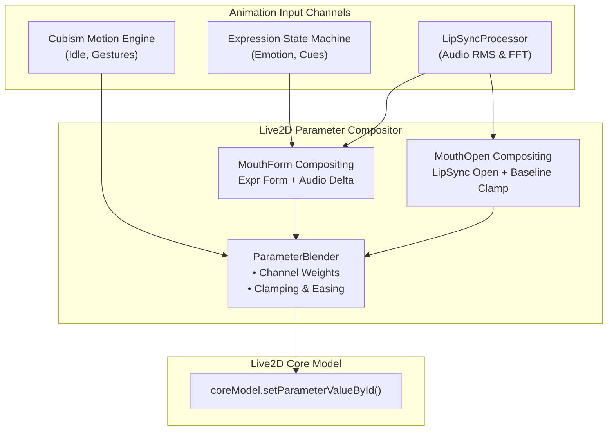

# Live2D Expression and Emotion Parameter Integration Design

## Summary

This design establishes a coherent parameter blending and priority management architecture for Live2D expressions and audio-driven lip-sync in Kokoro Engine. It resolves a verified parameter collision in the rendering loop where audio lip-sync calculation unconditionally clobbers facial expression parameters (notably `ParamMouthForm`), and introduces an expression state machine with smooth transition curves, priority arbitration, and tiered emotion fallback.

The proposal consolidates prior exploratory research into a single, disciplined technical specification. All performance expectations are stated as measurable engineering targets rather than established facts, and unverified speculative claims have been replaced with a concrete validation and micro-benchmarking protocol.

## Definition of Done

- **Parameter Compositor**: Expression parameters and audio lip-sync parameters are composited through a typed parameter blender rather than direct per-frame overwrites.
- **Lip-Sync & Expression Coexistence**: When an emotional expression sets `ParamMouthForm` (e.g., smile or frown) while speech is active, the mouth opening (`ParamMouthOpenY`) is animated by lip-sync while the mouth curvature (`ParamMouthForm`) preserves the emotional baseline modulated by phoneme dynamics.
- **Priority & Transitions**: Expressions support priority levels (e.g., Idle/Default, Emotional Cue, Interaction Trigger) with configurable blend-in and blend-out easing curves, preventing abrupt visual popping.
- **Graceful Fallback**: If a character model lacks specific named expressions (e.g., `.exp3.json`), the system falls back gracefully through semantic cue mapping, motion-embedded expressions, or neutral defaults without runtime errors.
- **Measurable Verification**: Unit tests verify the mathematical correctness of parameter compositing, and a micro-benchmark fixture profiles frame execution cost under controlled workloads.
- **Non-Destructive Integration**: Existing character profiles, motion group playback, audio player listeners, and IPC contracts remain fully backward compatible.

## Glossary

- **`Live2DController`**: The frontend controller in `src/features/live2d/Live2DController.ts` managing model lifecycle, cues, motions, expressions, and the per-frame update loop.
- **`LipSyncProcessor`**: The audio-to-mouth mapping utility in `src/features/live2d/LipSyncProcessor.ts` that calculates `mouthOpenY` and `mouthForm` from audio amplitude and frequency bands.
- **`ParamMouthOpenY`**: Standard Cubism 4 parameter controlling jaw displacement (0.0 = closed, 1.0 = fully open).
- **`ParamMouthForm`**: Standard Cubism 4 parameter controlling mouth corner curvature (-1.0 = frown/wide, 0.0 = neutral, +1.0 = smile/round).
- **Parameter Clobbering**: The defect where subsequent parameter updates overwrite values set by prior subsystems without compositing or blending.
- **`ExpressionManager`**: The internal Cubism / `pixi-live2d-display` module responsible for evaluating `.exp3.json` parameter deltas.
- **Semantic Cue**: A high-level trigger (e.g., `happy`, `thinking`, `interaction:tap_head`) resolved to model-specific expression or motion names via `modelProfile.cue_map`.
- **FACS AU (Action Units)**: Facial Action Coding System taxonomy occasionally referenced for cross-model expression normalization (e.g., AU12 for lip corner puller).

## Scope Convergence

### Goal and Boundary

The primary goal is to provide reliable, visually natural Live2D facial expression and lip-sync coordination in the desktop frontend.

**In Scope**:
- Parameter-level compositing between audio-driven lip-sync and active expressions.
- Transition easing (fade-in, hold, fade-out) for expressions.
- Expression priority queue to handle concurrent triggers (e.g., background emotion vs. interactive touch reaction).
- Graceful degradation when models lack formal `.exp3.json` files.
- Automated unit tests and a micro-benchmark suite for parameter calculations.

**Out of Scope**:
- Re-architecting the desktop app into separate runtime processes.
- Introducing heavy local deep-learning vision/generative models.
- Rewriting the underlying `pixi-live2d-display` or Cubism Core WebAssembly runtime.
- Guaranteeing fixed frame rates across arbitrary third-party user hardware without empirical profiling.

### Complexity Check

Prior exploratory notes proposed an extensive multi-tier neural emotion pipeline with speculative sub-millisecond guarantees. That scope introduced significant architectural risk without validating whether the desktop rendering pipeline could even composite mouth parameters correctly.

The minimum viable design isolates the fix to a modular `ParameterBlender` within `src/features/live2d/`, introducing clean compositing mathematics and an expression state tracker. Existing backend emotion classifiers (such as `src-tauri/src/ai/emotion_onnx.rs`) continue to emit semantic cues through the existing bridge without requiring new IPC protocols.

---

## Verified Facts (Current Codebase Audit)

A rigorous audit of the current Kokoro Engine codebase reveals the following operational realities:

### 1. Hard Parameter Overwriting in the Render Loop
In [`src/features/live2d/Live2DController.ts`](file:///D:/Kokoro-Engine/src/features/live2d/Live2DController.ts#L304-L320):
```typescript
public update(dt: number) {
    if (!this.model) return;

    const dtSecs = dt / 60;
    const mouth = this.lipSync.getValues(dtSecs);
    const internalModel = this.model.internalModel as unknown as {
        coreModel?: {
            setParameterValueById: (id: string, val: number) => void;
        };
    };

    const coreModel = internalModel.coreModel;
    if (coreModel) {
        coreModel.setParameterValueById("ParamMouthOpenY", mouth.mouthOpenY);
        coreModel.setParameterValueById("ParamMouthForm", mouth.mouthForm);
    }
}
```
- **Finding**: In [`Live2DViewer.tsx:L737-743`](file:///D:/Kokoro-Engine/src/features/live2d/Live2DViewer.tsx#L737-L743), the PIXI ticker executes `ctrl.update(delta)`.
- **Finding**: `pixi-live2d-display` evaluates model physics, motions, and expressions during `model.update()`. Immediately thereafter, `Live2DController.update` unconditionally invokes `coreModel.setParameterValueById` with the values from `LipSyncProcessor`.
- **Finding**: When an expression defines a smile (`ParamMouthForm = 1.0`), this value is completely overwritten every frame. During silence, `LipSyncProcessor` decays `mouthForm` toward `0.0` ([`LipSyncProcessor.ts:L69-71`](file:///D:/Kokoro-Engine/src/features/live2d/LipSyncProcessor.ts#L69-L71)), resetting the mouth to neutral even if a smiling expression is active. During speech, it is overwritten with the audio frequency ratio ([`LipSyncProcessor.ts:L65-68`](file:///D:/Kokoro-Engine/src/features/live2d/LipSyncProcessor.ts#L65-L68)).

### 2. Expression Invocation Without Lifecycle Management
In [`src/features/live2d/Live2DController.ts:L149-188`](file:///D:/Kokoro-Engine/src/features/live2d/Live2DController.ts#L149-L188):
- Expressions are triggered via `this.model.expression(nameOrIndex)`.
- There is no expression priority stack, no tracking of expression duration or decay, and no event hook indicating when an expression has completed its transition.
- Calling `playCue` with an expression immediately overrides any previous expression without cross-fading or conflict resolution.

### 3. Discrepancy in Model Packaging
In [`src/features/live2d/Live2DController.ts:L111-120`](file:///D:/Kokoro-Engine/src/features/live2d/Live2DController.ts#L111-L120) and `modelProfile`:
- Many community Live2D models do not package discrete `.exp3.json` expression files under `FileReferences.Expressions`. Instead, some models embed facial expressions into motion files (`.motion3.json`) or rely exclusively on parameter curves inside idle animations.
- Models may use non-standard parameter IDs (e.g., `PARAM_MOUTH_FORM` in Cubism 2 vs `ParamMouthForm` in Cubism 4).

### 4. Emotion Classification Pipeline
In [`src-tauri/src/ai/emotion_onnx.rs`](file:///D:/Kokoro-Engine/src-tauri/src/ai/emotion_onnx.rs) and [`src-tauri/src/commands/chat.rs`](file:///D:/Kokoro-Engine/src-tauri/src/commands/chat.rs):
- An optional local ONNX model classifies assistant responses into discrete emotion classes.
- The resulting emotion string is sent to the frontend via IPC (`LlmStreamEvent::Emotion` or chat message metadata) and resolved through `Live2DController.resolveSemanticCue`.

---

## Identified Root Causes

1. **Monolithic Mouth Assignment**: The rendering tick treats `ParamMouthOpenY` and `ParamMouthForm` as private properties of the audio analyzer, ignoring that `ParamMouthForm` is fundamentally an emotional expression property that should only be subtly modulated by speech vowels.
2. **Missing Compositing Layer**: There is no intermediate abstraction between raw animation inputs (motions, expressions, audio lip-sync) and the underlying `coreModel.setParameterValueById` calls.
3. **Absence of Priority Arbitration**: When a user interaction cue (e.g. head tap) fires while an LLM emotion cue (e.g. happy) is playing, the system has no concept of priority or layered blending.

---

## Proposed Architecture & Engineering Targets

> [!NOTE]
> The architectural components and performance figures below represent **proposed designs and target benchmarks**, not validated production guarantees. They will be verified through targeted tests and benchmarks during implementation.



### 1. Parameter Compositing Formulation

To resolve the mouth conflict without losing emotional expressiveness:

#### A. Mouth Opening (`ParamMouthOpenY`)
Mouth opening is primarily driven by audio speech amplitude, but respects an expression's minimum open baseline (e.g., a wide-open shocked expression):
$$\text{ParamMouthOpenY} = \text{clamp}\left(\max(\text{Open}_{\text{expr}}, \text{Open}_{\text{lipsync}}), 0.0, 1.0\right)$$

#### B. Mouth Form / Curvature (`ParamMouthForm`)
Emotional expression establishes the baseline mouth curvature $\text{Form}_{\text{expr}} \in [-1.0, 1.0]$. The audio lip-sync signal contributes a dynamic perturbation $\Delta \text{Form}_{\text{audio}} \in [-0.3, 0.3]$ scaled by speech activity:
$$\text{ParamMouthForm} = \text{clamp}\left(\text{Form}_{\text{expr}} + w_{\text{speech}} \cdot \Delta \text{Form}_{\text{audio}}, -1.0, 1.0\right)$$
where $w_{\text{speech}} = \min(1.0, \frac{\text{Open}_{\text{lipsync}}}{\text{Threshold}_{\text{speech}}})$.
- **When Silent** ($w_{\text{speech}} \to 0$): $\text{ParamMouthForm} = \text{Form}_{\text{expr}}$. A smiling character remains smiling; a frowning character remains frowning.
- **When Speaking**: The mouth curvature vibrates naturally around the emotional baseline, avoiding visual rigidity while preserving emotion.

### 2. Layered Expression Priority Queue

Expressions are managed via an explicit priority stack:
1. **Priority 0 (Default/Idle)**: Neutral or baseline expression from character profile.
2. **Priority 1 (Dialogue/Emotion)**: Sustained emotion inferred from conversation context (e.g., happy, sad, thoughtful).
3. **Priority 2 (Transient Cue)**: Short-duration animation (e.g., wink, surprised gasp, duration: 1.5s–3.0s).
4. **Priority 3 (User Interaction)**: Direct reaction to touch or click events (e.g., embarrassed, tickled, duration: 1.0s–2.0s).

Higher-priority expressions preempt lower-priority ones. When a transient expression expires, the system smoothly interpolates back to the underlying dialogue emotion.

### 3. Target Performance Budgets (Hypotheses)

The following metrics are design targets to be benchmarked:
- **Parameter Calculation Overhead**: $< 0.1\,\text{ms}$ per frame on modern desktop CPUs (pure JS arithmetic).
- **Frame Rate Impact**: $\le 1\%$ frame time difference compared to the existing unblended loop.
- **Memory Allocation**: Zero per-frame heap allocations inside the hot ticker callback (reusing parameter state buffers).

---

## Open Design Questions & Unresolved Trade-offs

The following items are explicit design trade-offs requiring empirical validation during implementation:

1. **Expression Mouth Form Extraction**:
   - *Question*: How should `Live2DController` determine $\text{Form}_{\text{expr}}$ if the model's `.exp3.json` is evaluated internally by Cubism's closed WebAssembly / `pixi-live2d-display` routines?
   - *Options*:
     - **Option A**: Read `coreModel.getParameterValueById("ParamMouthForm")` immediately after Cubism's internal motion/expression update, treat that as $\text{Form}_{\text{expr}}$, apply the lip-sync delta, and write it back.
     - **Option B**: Pre-parse the `.exp3.json` files in TypeScript and track expression targets manually.
   - *Preliminary Assessment*: Option A is significantly simpler, less prone to parsing bugs, and works automatically with any model that Cubism loads successfully.

2. **Parameter ID Standardization**:
   - *Question*: How do we handle Cubism 2 vs Cubism 4 parameter naming conventions?
   - *Approach*: Implement a parameter alias map (`PARAM_MOUTH_FORM` $\leftrightarrow$ `ParamMouthForm`, `PARAM_MOUTH_OPEN_Y` $\leftrightarrow$ `ParamMouthOpenY`) checked at model initialization.

3. **Phoneme vs Amplitude-Only Lip-Sync**:
   - *Question*: Is the current 2-band frequency analysis sufficient for speech vowels, or should we evaluate phoneme-based / viseme alignment?
   - *Trade-off*: Advanced viseme models require higher CPU overhead and language-specific phoneme tables. The current 2-band FFT approach is lightweight and language-agnostic. We will retain the 2-band FFT approach initially and benchmark its visual quality against the composited mouth form.

---

## Validation & Benchmarking Plan

To avoid speculative claims, the implementation will be validated using the following test matrix:

### 1. Automated Unit Tests (`Vitest`)
- Location: `src/features/live2d/ParameterBlender.test.ts`
- **Test Cases**:
  - `ParameterBlender` preserves `Form_expr` when audio amplitude is zero.
  - `ParameterBlender` clamps output strictly within $[-1.0, 1.0]$ for extreme parameter combinations.
  - Mouth opening correctly respects expression minimum clamp when speech is quiet.
  - Priority preemption correctly transitions from Priority 1 to Priority 2 and back.

### 2. Micro-Benchmark Harness
- Location: `src/features/live2d/ParameterBlender.bench.ts`
- **Benchmark Suite**:
  - Execute 10,000 compositing iterations with varied audio and expression inputs.
  - Measure mean execution time per iteration and check for heap allocations.
  - Validate that per-tick overhead meets the $< 0.1\,\text{ms}$ budget target.

### 3. Visual Interactive Fixture
- Add interactive debugging controls to `src/features/live2d/Live2DViewerLoader.tsx` (in development mode only):
  - Sliders for Expression Mouth Form, Audio Amplitude, and Frequency Ratio.
  - Real-time display of computed parameter values.

---

## Phased Implementation Roadmap

### Phase 1: Parameter Compositor Proof of Concept
- Create `src/features/live2d/ParameterBlender.ts` with pure mathematical compositing logic.
- Integrate Option A (read-modify-write) in `Live2DController.ts:update`.
- Implement `ParameterBlender.test.ts`.

### Phase 2: Expression State & Priority Management
- Implement expression priority stack and fade-in/fade-out interpolation.
- Add parameter aliasing for Cubism 2/4 compatibility.

### Phase 3: Benchmark & Profiling Validation
- Add micro-benchmark suite with Vitest benchmark runner.
- Document observed frame times across test hardware configurations.
