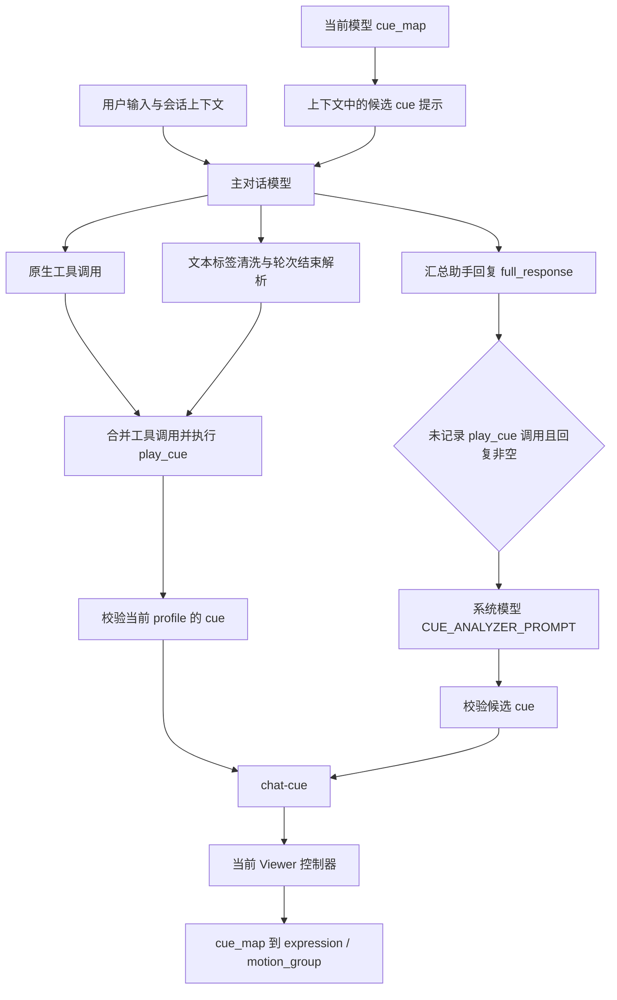

# 情感到 Live2D 面部表情：当前实现与证据边界

> 状态：2026-09-14 静态源码审查。本文描述当前实现；没有执行视觉、帧率、识别准确率或端到端延迟测量。拟议架构以 [03 架构决策](03-facial-expression-technical-selection-and-architecture-design.md) 为准，本文不表示相关功能已经实现。

## 1. 当前链路

这里的三种来源不是三个完全独立、互斥的实时表情通道。文本标签会被转换成工具调用，与原生调用合并后进入工具执行链；后置分析取决于工具标记与回复内容。

### 1.1 上下文与工具

[src-tauri/src/ai/context.rs](../../src-tauri/src/ai/context.rs) 的上下文组装代码（审查时 1723–1743 行）读取活动 profile，排除 `exclude_from_prompt` 项，并提示主模型按当前回复选择已存在的 cue。它没有引入通用情绪向量，也没有要求整个回合只能调用一次工具。

[src-tauri/src/actions/builtin.rs](../../src-tauri/src/actions/builtin.rs) 的 `PlayCueAction`（138–204 行）校验 cue 是否属于活动 profile，成功后广播 `{ cue, source: "builtin-play-cue" }`。这只能证明事件已尝试发出，不能证明前端已加载资源并成功呈现。

主模型接收用户输入和上下文，因此不能说“工具调用完全不分析用户输入”。准确的缺口是：此链路没有独立、结构化、低延迟的用户情绪证据输出与倾听反馈策略。

### 1.2 文本标签与后置分析

[src-tauri/src/chat/tags.rs](../../src-tauri/src/chat/tags.rs) 的 `parse_tool_call_tags` 使用字符串搜索、切片和拆分处理 `[TOOL_CALL:play_cue|cue=happy]`、`[play_cue|cue=happy]`、`[play_cue:happy]` 等格式，不应统称为正则解析器。

[src-tauri/src/commands/chat.rs](../../src-tauri/src/commands/chat.rs) 在流式输出中清洗标签，并在轮次结束后解析 `round_response`、合并原生与文本工具调用（审查时 3071–3092 行）。因此不能把“标签清洗”画成“标签到达即直接发出表情事件”。

后置分析的准确条件是 `!cue_set_by_tool && !full_response.is_empty()`（3738 行），提示词符号是 `CUE_ANALYZER_PROMPT`，输入为助手的 `full_response`。它具有取消和超时处理，并校验返回 cue 属于 profile 后才发送 `{ cue, source: "fallback-cue" }`（3737–3819 行）。后置翻译处理可能位于它之前；不存在经测量确认的固定 2–5 秒延迟。

`cue_set_by_tool` 在工具 outcome 的 ID 为 `play_cue` 时设为真（3247–3248 行），不能等同于表情播放成功。因此本报告不把现有兜底描述成“任何表情失败都会恢复”。

### 1.3 事件与资源映射

[src/lib/kokoro-bridge.ts](../../src/lib/kokoro-bridge.ts) 的 `CueEvent`（551–559 行）当前仅包含 `cue: string`、`source?: string`；没有角色、会话、回合或模型代次字段。[Live2DViewer.tsx](../../src/features/live2d/Live2DViewer.tsx)（234–237 行）把事件转给当前控制器，没有基于这些身份字段过滤。

[Live2DController.ts](../../src/features/live2d/Live2DController.ts) 的 `playCue`（208–259 行）先按 `cue_map` 播放 expression 和 motion group；映射未成功时还有同名资源兼容路径。`Unmapped cue` 是开发模式警告，不是可证明的生产环境“疯狂报错”。Profile 是可持久化的数据配置，不能称为写死在程序里的唯一字典。

同一控制器还有 `semantic_cue_map` 解析路径（`resolveSemanticCue` 附近），后端 profile 也保存该字段。因此新方案应复用既有模型配置边界，而不是声称项目完全没有语义与资产之间的间接映射。现有 cue 可同时绑定全身 motion；面部新路径不能无条件复用这些 motion。

## 2. 逐帧更新：已确认的写入与尚未证明的冲突

控制器 `update`（304–320 行）把 PIXI delta 按 `dt / 60` 转换给 `LipSyncProcessor.getValues`，随后写入 `ParamMouthOpenY` 和 `ParamMouthForm`。调用没有以“音频正在播放”为条件。Viewer 通过 `app.ticker.add` 驱动该方法（736–743 行），加载模型时仅明确关闭 `autoInteract`（352–354 行）。这些证据支持“存在独立的口型参数写入方”，不能单独证明它是最终可见值的最后写入方。

仓库锁定的 `pixi-live2d-display` 为 0.4.0，PIXI 为 6.5.10，见 [package-lock.json](../../package-lock.json)。对对应上游版本的静态追踪表明，Cubism 内部还会执行 motion、保存参数、expression、眨眼、注视、自然动作、physics、pose，随后触发 `beforeModelUpdate`、更新模型并恢复保存参数。[v0.4.0 InternalModel 源码](https://github.com/guansss/pixi-live2d-display/blob/v0.4.0/src/cubism4/Cubism4InternalModel.ts)

expression 通过 Cubism 的表达式 motion 与队列更新，不能把 `model.expression(...)` 描述成“只支持 0/1 硬切”。资产本身的混合操作、fade 配置与实际视觉结果应分别核验。[v0.4.0 ExpressionManager 源码](https://github.com/guansss/pixi-live2d-display/blob/v0.4.0/src/cubism4/Cubism4ExpressionManager.ts)

因此，UPB 的接入不能只是向外层 ticker 再加一组写入。应先验证实际调度与参数快照，再在明确的最终提交位置协调已接管的面部通道；具体职责见 [03](03-facial-expression-technical-selection-and-architecture-design.md)。高频闪烁、微笑被拉平、音画失配均为待复现实例，不能当作本次动态测试结论。

## 3. 审查裁决

| 原判断 | 当前裁决 | 对设计的影响 |
| --- | --- | --- |
| 系统完全不理解用户输入 | 过度推断；缺少独立输入侧结构化感知与反馈链路 | 增加可弃权的感知输出，不复制主对话服务 |
| 标签即时直接发出 cue | 与轮次级工具执行不符 | 区分清洗、决议、事件和实际播放时刻 |
| 后置分析固定耗时数秒 | 未测量，且存在取消、超时与前置处理 | 度量真实等待，兼容迁移期间保留降级 |
| 所有表情只能硬切 | 缺乏依据，运行时存在表达式 motion 机制 | 尊重既有混合和资产作者设定 |
| 第三方模型几乎零容灾 | 忽略可配置映射和兼容路径 | 能力探测与人工校准；不承诺任意资产可驱动 |
| 口型必然是最后写入方并产生闪烁 | 仅确认独立写入，完整帧顺序需验证 | 锁定版本，验证 hook、save/load 与提交时序 |
| 当前事件足以隔离多角色回合 | 缺少身份信息 | 新事件必须显式隔离，旧 cue 不伪造身份 |

## 4. 验证边界与后续门槛

本轮只做源码与依赖版本追踪，没有启动桌面端观察，也没有新增运行时代码。后续原型应记录同一帧各写入方的参数值和次序，在有/无 expression、motion、physics、语音以及窗口隐藏恢复场景下验证最终值；同时覆盖模型切换、取消、迟到事件、旧 cue 兼容和无可用面部能力的安全降级。

产品需求及反例见 [02](02-facial-expression-requirements-and-adversarial-review.md)，最终模块边界、事件契约与迁移原则见 [03](03-facial-expression-technical-selection-and-architecture-design.md)。
