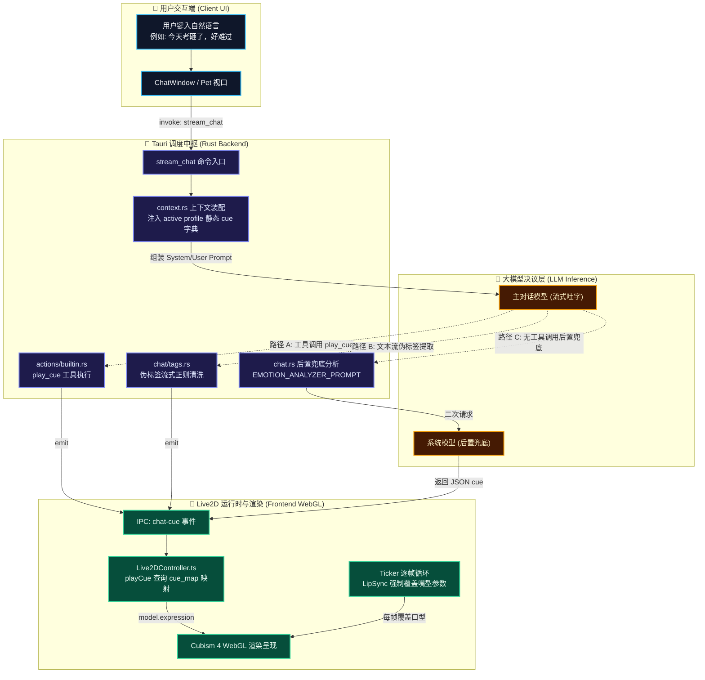
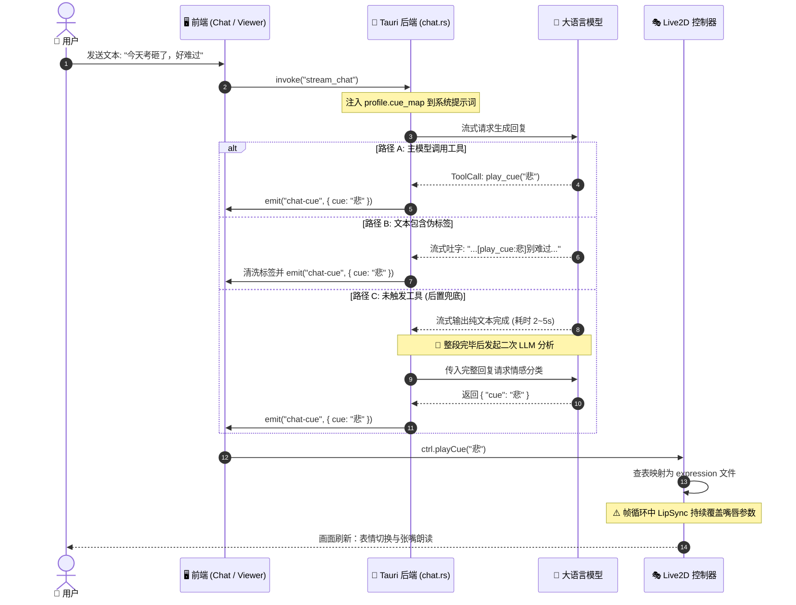

# Kokoro-Engine 情感驱动与 2D 面部表情响应链路：现状全景剖析与技术审查报告

> **文档定位**：系统剖析 Kokoro-Engine 当前从“用户输入自然语言”到“情感词汇解析”再到“2D 模型面部表情呈现”的完整链路现状、技术盲区与底层瓶颈。  
> **生成机制**：基于项目活跃源码（Rust 后端 + React/TypeScript 前端 + Live2D Cubism 4 运行时）的逐行静态追踪与动态执行流逆向分析，并结合 MCP / SKILLS 架构规范沉淀。  
> **关联模块**：[src-tauri/src/ai/context.rs](file:///d:/Kokoro-Engine/src-tauri/src/ai/context.rs)、[src-tauri/src/commands/chat.rs](file:///d:/Kokoro-Engine/src-tauri/src/commands/chat.rs)、[src-tauri/src/actions/builtin.rs](file:///d:/Kokoro-Engine/src-tauri/src/actions/builtin.rs)、[src-tauri/src/chat/tags.rs](file:///d:/Kokoro-Engine/src-tauri/src/chat/tags.rs)、[src/features/live2d/Live2DController.ts](file:///d:/Kokoro-Engine/src/features/live2d/Live2DController.ts)、[src/features/live2d/Live2DViewer.tsx](file:///d:/Kokoro-Engine/src/features/live2d/Live2DViewer.tsx)。

---

## 一、 当前链路全景执行流程图 (End-to-End Pipeline)

### 1.1 系统架构分层拓扑图

---

### 1.2 运行时交互时序图 (Runtime Sequence)

---

## 二、 核心源码级模块逐行剖析

### 2.1 上下文装配与提示词注入：[src-tauri/src/ai/context.rs](file:///d:/Kokoro-Engine/src-tauri/src/ai/context.rs)

在构建发送给大模型的 System Prompt 时，系统读取当前激活的 Live2D 模型的 Profile 配置，动态注入可用 Cue 列表：

* **注入机制**（见 [src-tauri/src/ai/context.rs: L1643-1665](file:///d:/Kokoro-Engine/src-tauri/src/ai/context.rs#L1643-L1665)）：
  - 调用 `load_active_live2d_profile()` 获取当前模型的 `cue_map`；
  - 过滤排除标记了 `exclude_from_prompt` 的项，将剩余 Cue 名称用逗号连接；
  - 在 `<live2d>` 标签内动态声明可用 Cues，明确指示大模型若回复符合列表中的 Cue，必须且仅能通过 `play_cue` 工具触发；严禁自创表情词汇，且不可仅在正文文本中进行表情描述。
* **技术本质**：系统并没有向大模型提供通用的人类情感分类（如 Ekman 6 情绪或 PAD 三维情感空间），而是直接暴露了一组**与当前模型资产硬绑定的离散字符串**（例如 `"惊讶", "害羞", "笑", "微笑", "平静", "悲", "疑惑"`）。
* **严格限制**：提示词明文禁止模型自创情绪词汇，强迫大模型在有限的枚举字面量中单选。

---

### 2.2 LLM 识别与动作决议三轨机制：[src-tauri/src/commands/chat.rs](file:///d:/Kokoro-Engine/src-tauri/src/commands/chat.rs)

大模型在接收到用户输入后，系统设计了三条路径来确定最终表情：

#### 路径 1：主对话模型原生 Function Calling
* 工具在 [src-tauri/src/actions/builtin.rs: L136-205](file:///d:/Kokoro-Engine/src-tauri/src/actions/builtin.rs#L136-L205) 中注册为 `play_cue`，要求参数 `cue: String`。
* 当 LLM 在流式输出过程中发出工具调用请求时，执行器校验该 `cue` 是否在 `profile.cue_map` 中注册；校验通过后由 Tauri 发送 `"chat-cue"` 事件至前端（载荷含 `cue` 与 `source: "builtin-play-cue"`）。

#### 路径 2：内嵌文本伪标签正则拦截 ([src-tauri/src/chat/tags.rs](file:///d:/Kokoro-Engine/src-tauri/src/chat/tags.rs))
* 为兼容不支持原生工具调用或本地小型量化模型，系统在 `tags.rs` 中支持解析形如 `[play_cue:happy]`、`[play_cue|cue=happy]`、`[TOOL_CALL:play_cue|cue=happy]` 的伪标签。
* 解析后，后端将标签从回复文本中剔除，避免泄漏给用户，并合成内部 `ToolCall` 分发。

#### 路径 3：后置兜底情绪分析器（Fallback Emotion Analyzer）
如果上述两种路径都未触发（大模型既未调用工具，也未输出标签），系统在**整段流式文本完全结束之后**，启动二次 LLM 调用（见 [src-tauri/src/commands/chat.rs: L3739-3765](file:///d:/Kokoro-Engine/src-tauri/src/commands/chat.rs#L3739-L3765)）：
* 系统装配包含 `EMOTION_ANALYZER_PROMPT` 与当前模型可用 Cues 列表的系统消息；
* **注意**：传入的是 `full_response`（助手的完整回复内容），而非用户输入；
* 向系统大模型发起独立的二次补算请求，提取符合候选列表的单一表情，并通过 `"chat-cue"` 事件下发前端（标记 `source: "fallback-cue"`）。

---

### 2.3 前端事件订阅与模型控制调度：[src/features/live2d/Live2DController.ts](file:///d:/Kokoro-Engine/src/features/live2d/Live2DController.ts)

前端接收到 Tauri 发出的 `"chat-cue"` 事件后，交由 `Live2DController.playCue(cue)` 执行（见 [Live2DController.ts: L208-250](file:///d:/Kokoro-Engine/src/features/live2d/Live2DController.ts#L208-L250)）：

1. **查询映射**：读取当前模型 Profile 的 `cue_map[cue]` 绑定配置；
2. **优先播放表情**：若绑定了 `expression`，优先调用 `playExpressionByName`；
3. **伴随播放动作组**：若绑定了 `motion_group`，调用 `playMotionGroupByName`；
4. **兜底直连**：若未在配置中找到映射，但同名的表情预设或动作组在资产中实际存在，执行直连兜底匹配。

---

### 2.4 逐帧参数更新与口型争夺现状：[Live2DController.ts: L304-320](file:///d:/Kokoro-Engine/src/features/live2d/Live2DController.ts#L304-L320)

在 PIXI 应用的主循环 Ticker 中，`Live2DController.update(dt)` 每一帧被调用：

* 从 `lipSync` 获取当前帧的口型状态（`mouthOpenY` 与 `mouthForm`）；
* 直接调用 `coreModel.setParameterValueById` 强行覆盖参数；
* **现状痛点**：当前每帧仅无条件覆盖了 `ParamMouthOpenY` 与 `ParamMouthForm`，既未融合情绪基底微弧度，也缺少对眉毛、眼睛、腮红等通道的动力学混合控制。

---

## 三、 当前架构的五大致命技术盲区与暗礁剖析

> [!CAUTION]
> ### 🔴 缺陷 1：输入侧情感感知盲区（Input Perception Blindspot）
> * **现实现象**：用户在输入框输入 *“我今天好难过、好委屈啊……”* 并回车后，角色在网络响应的 1~3 秒内完全处于呆滞待机态。
> * **根本诱因**：当前系统**完全不分析用户的输入**！无论是工具调用还是兜底分析器，分析目标**全都是 AI 自己生成的回复文本（`full_response`）**。
> * **体验裂痕**：缺乏**“即时倾听反馈态”（Active Listening State）**，用户情感输入被直接吞没，交互冰冷无生命感。

> [!WARNING]
> ### 🟡 缺陷 2：后置兜底链路的高延迟陷阱（Post-hoc Latency Trap）
> * **现实现象**：角色说话全过程全程“面瘫”，说话结束文字完全打完后，表情才突然生硬地“瞬移”成悲伤或高兴。
> * **根本诱因**：轻量或本地模型经常不调用 `play_cue` 工具，触发路径 C 兜底。但路径 C **必须等主模型把整段回复完全流式输出完毕**后，才发起第二个请求调用 `EMOTION_ANALYZER_PROMPT`。
> * **体验裂痕**：表情音画严重脱节，延迟高达 2~5 秒。

> [!CAUTION]
> ### 🔴 缺陷 3：资产强绑定的离散字符串脆断（Asset-Coupled Discrete Fragility）
> * **现实现象**：用户导入第三方 Live2D 模型后，模型完全不换表情，后台疯狂报错 `Unmapped cue 'xxx'`。
> * **根本诱因**：系统依赖离散 Cue 映射字典 `profile.cue_map`。第三方模型表情资产命名各异（如 `F01.exp3.json`、`exp_smile.exp3.json`）甚至没有表情文件，硬编码查表瞬间失效。
> * **体验裂痕**：对外部二次元模型资产几乎零容灾能力。

> [!WARNING]
> ### 🟡 缺陷 4：缺乏连续情感维度与微表情合成能力（Absence of Continuous Blending）
> * **现实现象**：表情切换生硬如“翻页连环画”，只能 0/1 硬切，无法表现“微喜”、“破涕为笑”等细微神态。
> * **根本诱因**：直接调用 `model.expression(idx)` 整体切换静态表情包，不支持连续参数过渡，也无法将“悲伤的眉毛”与“坚强的微笑嘴唇”进行多通道混合。
> * **体验裂痕**：角色表情死板单一，缺乏人性的灵动。

> [!CAUTION]
> ### 🔴 缺陷 5：口型同步（Lip-sync）对表情参数的暴力覆盖（Parameter Clashing）
> * **现实现象**：角色在微笑时一旦开口说话，微笑的嘴角瞬间被拉平，说话时表情频繁抽搐闪烁。
> * **根本诱因**：音频分析器在每一帧以 60FPS 暴力覆盖 `ParamMouthForm` 与 `ParamMouthOpenY`，彻底冲垮了表情文件原本设置好的嘴角弧度。
> * **体验裂痕**：音画参数互殴，角色张嘴说话瞬间“表情破功”。

---

## 四、 现状技术全景评估矩阵

| 评估维度 | 现状评级 | 现有技术机制 | 核心缺陷与工程阻碍 |
| :--- | :--- | :--- | :--- |
| **用户端情感解析** | 🔴 1 / 5 (完全缺失) | 无任何处理，输入文本直接转交 LLM 生成 | 用户得不到即时反馈，等待期陷入死寂面瘫 |
| **助手端情感提取** | 🟡 3 / 5 (勉强可用) | System Prompt 约束 + 工具调用 + 后置兜底 LLM | 兜底链路存在 2~4 秒严重延迟；小型模型极易幻觉 |
| **表情映射灵活性** | 🔴 2 / 5 (极度脆弱) | 静态硬编码 `cue_map` 映射字典 | 对第三方模型适应力极差，无表情文件的模型完全无法驱动 |
| **面部渲染细腻度** | 🟡 2 / 5 (生硬离散) | 依赖 `.exp3.json` 预制文件单向覆盖 | 无法实现微表情渐变；缺乏多情感强度连续插值 |
| **多通道协同渲染** | 🔴 2 / 5 (参数冲突) | 裸调 `coreModel.setParameterValueById` | 眨眼、注视、口型同步与面部表情在同一参数上发生无序覆盖争夺 |

---

## 五、 结论与重构导向

当前系统的实现仅属于**“基于静态配置的离散动作触发器”**，远未达到用户所期望的**“自然语言精准情感解析 -> 2D 拟真生动面部响应”**的智能拟人标准。

必须在以下三个层面实施系统级重塑：
1. **感知重塑**：引入**双轨情感感知管线**（用户输入意图快速识别轨 + 角色对话生成伴随轨）；
2. **抽象重塑**：从“基于字符串的离散 Cue”升维到“基于标准情感向量（Ekman/PAD）+ 统一面部参数矩阵（FACS/Live2D Standard Parameters）”的双层自适应抽象；
3. **渲染重塑**：在前端建立**统一参数混合器（Unified Parameter Blender）**，彻底终结口型、表情与微动作的参数打架乱象。

> 接下来请见第二篇深度研究报告：[02-facial-expression-requirements-and-adversarial-review.md](file:///d:/Kokoro-Engine/learn-research/Facial-expression-research/02-facial-expression-requirements-and-adversarial-review.md)。
