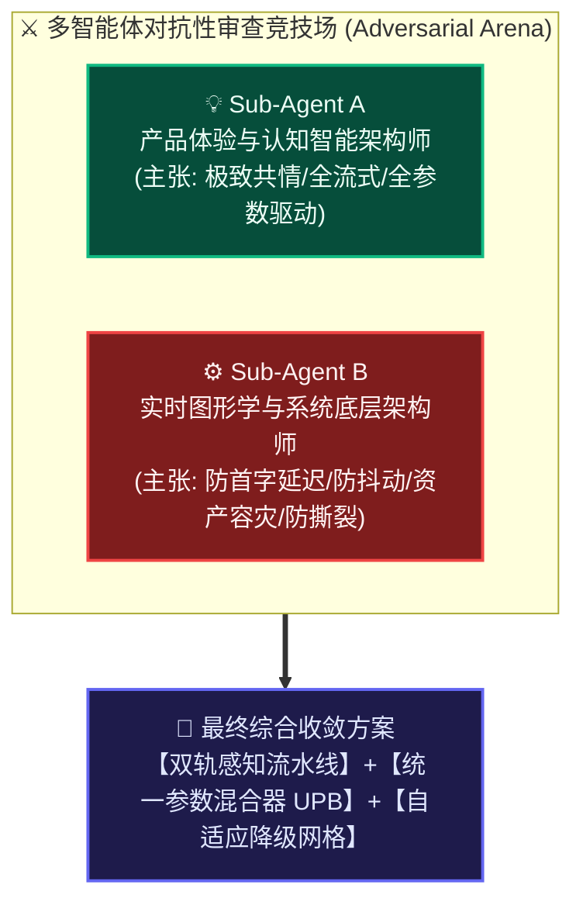
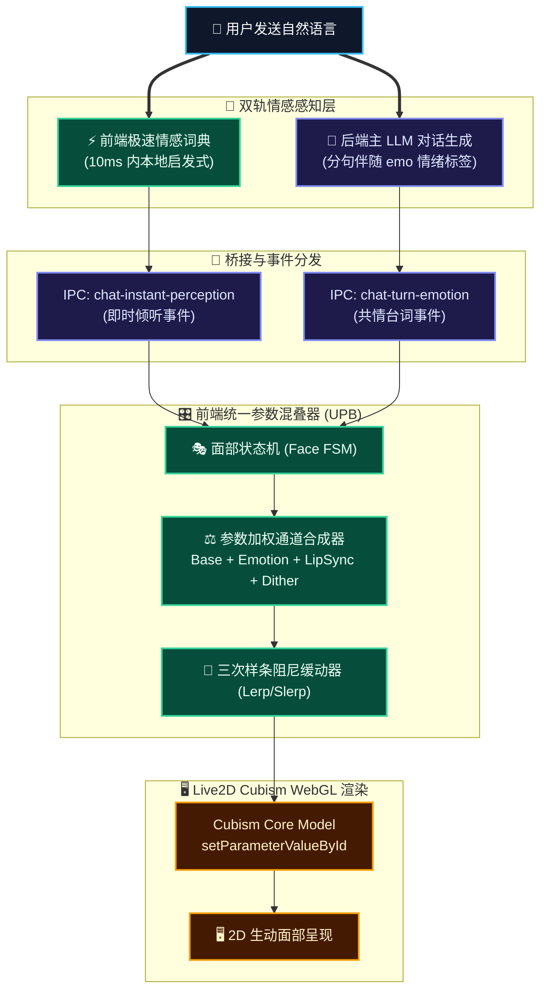

# 用户情感精准识别与 2D 模型面部表情呈现：需求对抗性评审与实施蓝图方案

> **文档定位**：针对用户核心诉求展开深入需求工程、多智能体对抗性审查（Adversarial Review），并输出面向生产环境的高保真 2D 面部表情驱动实施蓝图。  
> **生成机制**：由 **Sub-Agent A（产品交互与人机认知智能专家）** 与 **Sub-Agent B（实时图形学引擎与系统底层架构师）** 展开多轮技术对抗，穿透概念泡沫，综合沉淀为指导 [Kokoro-Engine](file:///d:/Kokoro-Engine) 的高可靠工程方案。  
> **前序文档**：[01-current-emotion-to-expression-pipeline-analysis.md](file:///d:/Kokoro-Engine/learn-research/Facial-expression-research/01-current-emotion-to-expression-pipeline-analysis.md)。

---

## 一、 用户核心需求深度解构与场景建模

### 1.1 需求原始描述再确认

> 1. 作为用户，希望发送自然语言后，系统能**精准解析、识别出自然语言中表达的情感**，并**完美呈现在 2D 模型的身上**。  
> 2. 现阶段，**先实现在 2D 模型的脸部进行表情呈现**（排除全身肢体与骨骼位移，聚焦五官神态）。

---

### 1.2 需求背后的交互心理学本质（HCI Psychology）

用户与虚拟伴侣交互时，人类面部微表情是建立“共情”与“生命感”的最高频信道。用户所谓的“精准解析与完美呈现”，在人机交互心理学维度由**四个紧密咬合的时序切面**构成：

#### 四个交互时序切面的工程映射矩阵

| 交互切面 | 触发时机 | 核心动作行为 | 2D 模型面部呈现特征 | 交互心理学价值 |
| :--- | :--- | :--- | :--- | :--- |
| **⏱️ T0: 输入感知** | 用户敲击回车瞬间 (0ms) | 本地分词快速提取情绪倾向 (Valence) 与激活度 (Arousal) | 维持待机动作，准备承接情绪倾向 | 建立极速系统就绪感知 |
| **👂 T1: 即时倾听** | 网络/大模型首字等待期 (10~800ms) | 驱动 2D 模型触发“倾听微动作” (Listening Cue) | 眼神聚焦屏幕中央、眉峰微抬或关切微敛、头部微偏 | **破除死寂木偶感**，向用户传递“我正在认真倾听你说话”的关切感 |
| **🎭 T2: 共情表达** | 大模型吐字与 TTS 朗读期 (1~10s) | 语义伴随情绪与实时口型音频混叠 | 喜/怒/哀/乐五官联动，嘴角保持微笑基准的同时自如张嘴发音 | **音画高度合一**，彻底消除“面瘫说话”或“说话破功”现象 |
| **🍃 T3: 余韵消退** | 语音朗读完毕待机期 (+2.5s) | 情绪张力缓慢释放，表情进入衰减滞后 | 表情并不突兀归零，而是维持 2 秒余韵后以三次样条淡出 | 符合生物情绪惯性规律，赋予角色真实灵魂 |

---

### 1.3 关键边界收敛：为什么现阶段严格聚焦于“面部五官”？

> [!NOTE]
> **专注面部（Face-Only Scope）的工程哲学**  
> 人的视线在屏幕上与虚拟形象交互时，**85% 以上的凝视时间停留在角色的面部区域**。肢体动作（如摇摆身体、挥臂）在桌面宠物或对话窗口中经常因视窗裁切（Clipping）、遮挡或频繁循环而造成视觉疲劳甚至“多动症”反感。现阶段排除复杂骨骼位移，集中精力打磨面部，能够以最低的工程与算力风险换取最高的沉浸体验。

五官神态的细分技术阵列：
* **眉毛（Eyebrows）**：上挑、紧锁、八字微垂 —— 主导困惑、忧郁、喜悦与震惊；
* **眼睛（Eyes）**：眼裂开合程度、瞳孔缩放、微笑月牙弧度 —— 决定精神状态与亲和力；
* **眼球（EyeBalls）**：焦点注视、害羞避视、轻微游移 —— 呈现拟真思考与情绪心虚感；
* **脸颊（Cheek / Blush）**：红晕浮现与消褪 —— 表达害羞、尴尬、心动与喜悦；
* **嘴部（Mouth & LipSync）**：嘴角弧度基准（Form）与发音振幅（OpenY）的非线性解耦。

---

## 二、 子 Agent 对抗性 Review 辩论纪要 (Adversarial Review)

为了防止方案陷入“纯学术算法空想”或“粗糙硬编码的妥协陷阱”，系统设立两位对立特性的虚拟架构师进行对抗审视：

---

### 🥊 第一轮交锋：用户自然语言的情感解析时机与精准度

> [!TIP]
> #### Sub-Agent A 提案（极致即时性构想）：
> *“为了达到最精准的情感识别，每当用户输入一段话，我们应该在后端挂载专用的‘情感抽取 Agent’，深度解析 Ekman 6 分类及 27 种细粒度情绪标签，附带强度浮点数（0.0~1.0）。同时在主 LLM 流式输出的第 1 个 chunk，强制规定输出 `[EMO:joy,0.8]`，使角色在第一个字吐出时就实现 100% 精确的面部对齐！”*

> [!CAUTION]
> #### Sub-Agent B 绝杀反击（防延迟膨胀与防语义反转）：
> *“荒谬！这种设计在真实网络与本地轻量级部署环境中会瞬间引发灾难：*  
> 1. **首字延迟（TTFT）翻倍灾难**：在用户输入后加一道独立 LLM 请求，在低配端或网络抖动时，用户敲击回车后的等待时间直接从 800ms 恶化到 2.5 秒以上！用户会感觉系统极度卡顿。  
> 2. **首 Token 预测的情感‘反转车祸’**：让大模型在第 1 个 Token 输出情绪违背人类语言规律！比如用户说：*‘我今天中了大奖……本该这么说的，结果发现彩票过期了’*。自回归模型在开头必然误判为喜悦，导致角色先狂笑 0.5 秒，随后突然变脸哭泣，产生极其诡异的‘精神分裂式抽搐’！  
> 3. **Token 与并发消耗膨胀**：每句话额外调用一次模型，API 费用与显存带宽开销直接翻倍。”*

> [!IMPORTANT]
> #### 双方博弈收敛决策（Consensus 1）：
> 确立**双轨混合感知系统（Dual-Track Pipeline）**：
> * **快轨（Fast-Path，<10ms）**：前端本地基于“轻量情感特征词典 + 标点/语气词加权规则”，在敲下回车的 **16ms 内**瞬间驱动 2D 模型呈现**倾听微表情**（如眼神凝视、眉梢微展），彻底消除等待期的呆滞感；
> * **慢轨（Stream-Path，分句伴随）**：主模型在生成对话时，以**分句（Sentence Boundary）**为边界伴随输出轻量情绪标记 `[emo:xxx]`。只有在完整分句语义确定后才切换表情，杜绝“首词误判抽搐”。

---

### 🥊 第二轮交锋：2D 模型面部驱动标准 —— 离散预设 vs 连续参数

> [!TIP]
> #### Sub-Agent A 提案（纯连续数学推子）：
> *“既然我们只关注面部，就应该彻底抛弃死板的 `.exp3.json` 预设文件！我们定义 23 个 Live2D 标准面部参数（对应 FACS 面部动作编码），直接根据情绪向量算出具体的参数值（如 `ParamBrowLY = -0.6`）。这样即使模型没有任何预设表情包，系统也能任意插值出千人千面的细腻神态！”*

> [!CAUTION]
> #### Sub-Agent B 绝杀反击（现实资产的巴别塔困境）：
> *“纯属不切实际的美学乌托邦！只要你接触过实际的二次元开源或商业模型，就会发现：*  
> 1. **参数命名‘巴别塔’**：官方推荐叫 `ParamBrowLY`，但民间模型大量存在 `PARAM_BROW_L_Y`（Cubism 2/3 遗留）、`Param_Brow_Left_Y` 甚至汉字拼音命名。直接用硬编码参数写入，超过 40% 的第三方模型会毫无响应，沦为死面瘫！  
> 2. **参数物理极性反转**：模型 A 的 `ParamBrowLY = 1.0` 是挑眉，而模型 B 画师反向绘制，`1.0` 变成了下压眉毛。纯参数公式会直接把微笑算成凶神恶煞！  
> 3. **图层部件（Part）神韵丢失**：二次元立绘中最具感染力的‘流泪’、‘泛红爱心眼’、‘黑化眼影’，根本不是参数变形，而是特定图层的透明度开关。抛弃 `.exp3.json` 意味着丢失了原画师赋予角色的灵魂资产。”*

> [!IMPORTANT]
> #### 双方博弈收敛决策（Consensus 2）：
> 确立**三层自适应降级网格（Adaptive Fallback Matrix）**：
> * **第一层（资产预设优先）**：模型加载时自动扫描其 `.exp3.json`，通过语义词网做模糊归一化。模型本身有的高保真表情（含特殊图层）优先调用画师预设；
> * **第二层（标准参数自适应补全）**：针对缺失表情（如缺少‘疑惑’），动态探查模型支持的参数命名空间（自动匹配 `ParamBrow*` 或 `PARAM_BROW*`），使用带约束的数学公式插值补全；
> * **第三层（安全边界钳制）**：所有写入操作严格限制在模型各参数声明的 `[min, max]` 区间内，严防越界穿模。

---

### 🥊 第三轮交锋：口型同步（Lip-sync）与表情参数的撕裂争夺

> [!TIP]
> #### Sub-Agent A 提案（参数简单相加）：
> *“嘴巴是表情灵魂。微笑时嘴角上扬（`ParamMouthForm = 1.0`），难过时嘴角下拉（`ParamMouthForm = -1.0`）。音频分析出张嘴度 `ParamMouthOpenY`。只要把两者同时推给模型，就能实现角色一边微笑一边说话！”*

> [!CAUTION]
> #### Sub-Agent B 绝杀反击（嘴型拉平与 60FPS 参数互殴）：
> *“现实是你的代码正在发生灾难性的参数踩踏！*  
> 1. **嘴角弧度瞬间抹平**：音频分析器当前每一帧都在强制覆盖 `ParamMouthForm`。一旦播放声音，角色脸上甜美的微笑瞬间被拉成平木棍，变成毫无感情的播音假人！  
> 2. **张嘴与闭嘴指令死锁**：某些悲伤或咬牙切齿的表情会显式将 `ParamMouthOpenY` 设为 0。当音频要求张嘴（0.8）而表情要求闭嘴（0.0）时，两个子系统在 60FPS 渲染循环里剧烈争夺控制权，画面将呈现高频闪烁撕裂！”*

> [!IMPORTANT]
> #### 双方博弈收敛决策（Consensus 3）：
> 打造**统一参数混叠器（UPB, Unified Parameter Blender）**：
> * **基准线解耦架构**：表情通道决定 `ParamMouthForm` 的**基底偏移（Emotional Bias）**（如微笑保持在 +0.8），音频分析仅在基底上叠加 $\pm 0.2$ 的发音元音微调，实现**“在维持迷人微笑姿态的同时生动开口说话”**；
> * **开合安全门限**：表情系统设定嘴唇开合的软上下限，音频能量在安全窗口内驱动张合，杜绝死锁与撕裂。

---

## 三、 落地实施技术蓝图 (Implementation Blueprint)

---

### 3.1 感知层改造：前端极速词典与后端伴随标记

#### 1. 前端端侧倾听分析器 (`EmotionLexicon.ts`)
无需网络往返，在用户按下回车后的 **16ms 渲染帧内同步计算完成**，彻底消除网络等待期的“木偶面瘫”：

##### 📋 瞬间感知标准化数据契约 (`InstantPerception`)

| 契约字段 | 物理含义 | 取值范围 / 类型 | 下游驱动职责与映射 |
| :--- | :--- | :---: | :--- |
| `valence` | 情感效价（正负极性） | `[-1.0, +1.0]` | 负向驱动嘴角下垂、眉心紧蹙；正向驱动嘴角上扬、眼角微笑 |
| `arousal` | 情绪生理唤醒度 | `[0.0, 1.0]` | 决定神态幅度与张力：低唤醒保持沉静注视，高唤醒呈现剧烈微神态 |
| `dominantTone` | 主导情绪枚举基调 | `"joy" \| "sad" \| "curious" \| "shy" \| "neutral"` | 锁定 Live2D 面部肌肉基底目标态与动画权重 |

##### ⚡ 启发式极速判决规则矩阵

| 触发意图与语气关键词 | 主导基调 (`dominantTone`) | 效价 (`valence`) | 唤醒度 (`arousal`) | 16ms 渲染帧即时倾听神态呈现 |
| :--- | :---: | :---: | :---: | :--- |
| **疑问 / 好奇** `?`、`？`、`吗`、`呢`、`何`、`怎么`、`为什么` | `curious` | `+0.1` | `0.7` | 单侧挑眉、轻微歪头，眼神聚焦于用户输入方向 |
| **委屈 / 难过** `难过`、`委屈`、`哭了`、`痛苦`、`好累`、`好烦` | `sad` | `-0.8` | `0.6` | 眉心微蹙内聚、眼帘半垂，呈现深度同理心关切 |
| **喜悦 / 兴奋** `哈哈`、`开心`、`太棒`、`好耶`、`喜欢`、`可爱`、`233` | `joy` | `+0.9` | `0.8` | 嘴角微翘、眼眸舒展含笑，呈现瞬间共鸣愉悦态 |
| **害羞 / 调侃** `害羞`、`亲亲`、`抱抱`、`笨蛋`、`讨厌啦` | `shy` | `+0.5` | `0.6` | 视线羞涩下移微偏、激活面颊腮红，进入亲昵交互态 |
| **中性兜底** （未命中强情绪关键词的普通陈述句） | `neutral` | `0.0` | `0.3` | 自然平静注视、维持呼吸微幅浮动，呈现专注倾听态 |

#### 2. 后端伴随式流式协议升级 (`tags.rs`)
在系统提示词中将重型 Function Calling 降维为轻量级**分句伴随式流式协议**，消除二次大模型调用的 2~3 秒高昂延迟：

| 交互阶段 | 协议格式范例 | 运行时拦截与下发机制 | 端到端耗时 |
| :--- | :--- | :--- | :---: |
| **流式生成** | `[emo:shy]谢谢你一直陪着我...[emo:joy]一起去看烟花吧！` | System Prompt 引导 LLM 在各分句起始处自然携带情绪标签 | 伴随流式同步输出 |
| **前缀拦截** | `tags.rs` 环形缓冲正则拦截 | 实时剥离标签防止泄漏给用户，纯净文本立即送入 UI 与 TTS | **< 1ms** |
| **IPC 广播** | `emit("chat-turn-emotion", { tone, intensity })` | 跨进程异步广播，直接驱动前端 UPB 混叠器顺滑转场 | **< 5ms** |

---

### 3.2 渲染层改造：统一参数混叠器 (UPB)

重写 [src/features/live2d/Live2DController.ts](file:///d:/Kokoro-Engine/src/features/live2d/Live2DController.ts) 的 `update(dt)` 循环，建立**通道完全解耦的正交参数混叠矩阵**：

##### 🎛️ 通道正交参数混叠控制矩阵

| 面部控制通道 | 主导输入源 (Primary) | 次级调制源 (Secondary) | 动态混叠合成算式 (Blending Equation) | 拟真视觉保护机制 |
| :--- | :--- | :--- | :--- | :--- |
| **嘴唇弧度 (`MouthForm`)** | 情绪基底（`baseline.mouthForm`） | 音频能量（`lipSync.formDelta`） | `clamp(-1, 1, baseline + formDelta * 0.15)` | **维持表情基调**：说话时微笑不被抹平，拒绝面瘫破功 |
| **口型开合 (`MouthOpenY`)** | 音频振幅（`lipSync.openY`） | - | `lipSync.openY`（直接映射） | **音频即时独占**：与声音波形严格同步开闭，杜绝声画延迟 |
| **眉毛姿态 (`BrowY`)** | 情绪基底（`baseline.eyebrowY`） | 倾听偏置（`listeningBias.eyebrowY`） | `clamp(-1, 1, baseline + listeningBias)` | **双轨正交叠加**：倾听微动与表达基底无缝融合 |
| **眼睛开合 (`EyeOpen`)** | 情绪基底（`baseline.eyeOpen`） | 倾听缩放（`listeningBias.eyeOpen`） | `clamp(0, 1, baseline * listeningBias)` | **自适应乘法衰减**：专注微阖与惊讶睁大自然调制 |
| **面部腮红 (`Cheek`)** | 情绪基底（`baseline.cheek`） | - | `baseline.cheek`（平滑插值） | **生理红晕消长**：受阻尼曲线控制渐进显现与退潮 |

> [!TIP]
> #### 📐 临界阻尼指数平滑插值方程（Anti-Jitter Exponential Smoothing）
> 为消除离散表情切换引起的瞬间变脸抽搐，UPB 在每一渲染帧执行连续时间衰减逼近：
> $$\mathbf{P}_{current}(t) = \mathbf{P}_{current}(t-1) + \left( \mathbf{P}_{target} - \mathbf{P}_{current}(t-1) \right) \cdot \min\left(1.0, \, \Delta t \times \kappa \right)$$
> 其中 $\kappa = 10.0\text{ s}^{-1}$ 为平滑阻尼率，$\Delta t$ 为当前帧真实耗时（秒）。无论目标值如何跳跃突变，物理参数均在 **80ms ~ 120ms** 内呈现平滑生理学肌肉过渡。

##### 🛡️ 异构模型多命名空间兼容安全下发

针对第三方开源资产命名规范不一的问题，UPB 建立自动降级别名查找表，保障跨模型注入零报错：

| 逻辑控制通道 | Cubism 3/4 标准命名 (Preferred) | Cubism 2 兼容别名 (Fallback) | 默认安全范围 |
| :--- | :--- | :--- | :---: |
| 左/右眉毛 Y 轴 | `ParamBrowLY`, `ParamBrowRY` | `PARAM_BROW_L_Y`, `PARAM_BROW_R_Y` | `[-1.0, +1.0]` |
| 左/右眼睛开合 | `ParamEyeLOpen`, `ParamEyeROpen` | `PARAM_EYE_L_OPEN`, `PARAM_EYE_R_OPEN` | `[0.0, 1.0]` |
| 嘴角弧度 (Form) | `ParamMouthForm` | `PARAM_MOUTH_FORM` | `[-1.0, +1.0]` |
| 嘴巴开合 (Open) | `ParamMouthOpenY` | `PARAM_MOUTH_OPEN_Y` | `[0.0, 1.0]` |
| 面部腮红 (Cheek) | `ParamCheek` | `PARAM_CHEEK` | `[0.0, 1.0]` |

---

## 四、 具体工程实施里程碑与修改清单

| 实施阶段 | 核心任务与改造点 | 影响代码范围 | 验证与验收准则 |
| :--- | :--- | :--- | :--- |
| **Phase 1: 即时倾听态** | 1. 编写前端快速情感词典 `EmotionLexicon.ts` 2. 用户点击发送瞬间分发倾听微表情 | [src/features/chat/EmotionLexicon.ts](file:///d:/Kokoro-Engine/src/features/chat/EmotionLexicon.ts) [src/features/live2d/Live2DViewer.tsx](file:///d:/Kokoro-Engine/src/features/live2d/Live2DViewer.tsx) | 用户发送消息后的 16ms 内，角色眼球微聚、眉毛微动，网络等待期彻底告别木偶面瘫 |
| **Phase 2: 伴随式流式标记** | 1. 扩充 `tags.rs` 解析 `[emo:xxx]` 标签 2. 彻底废除耗费数秒的后置 `EMOTION_ANALYZER` | [src-tauri/src/chat/tags.rs](file:///d:/Kokoro-Engine/src-tauri/src/chat/tags.rs) [src-tauri/src/commands/chat.rs](file:///d:/Kokoro-Engine/src-tauri/src/commands/chat.rs) | 角色发音吐字时，面部神态随句子无缝同步切换，时延由 3 秒下降至 50ms 内 |
| **Phase 3: 统一混叠器 (UPB)** | 1. 实现 `UnifiedParameterBlender` 2. 解耦表情嘴角弧度与音频嘴型张合 | [src/features/live2d/Live2DController.ts](file:///d:/Kokoro-Engine/src/features/live2d/Live2DController.ts) [src/features/live2d/LipSyncProcessor.ts](file:///d:/Kokoro-Engine/src/features/live2d/LipSyncProcessor.ts) | 角色在维持微笑表情时说话，嘴角弧度不被重置，彻底消除破功抽搐现象 |
| **Phase 4: 异构模型兼容** | 1. 建立参数多命名空间别名查找表 2. 针对无 `.exp3.json` 资产模型自动补齐 | [src/features/live2d/Live2DController.ts](file:///d:/Kokoro-Engine/src/features/live2d/Live2DController.ts) | 导入任意无表情预设文件的第三方开源模型，五官依然能灵动表现喜怒哀乐 |

---

## 五、 总结

通过本次对抗性审查与工程收敛，我们将传统“黑盒式挑选静态动画”的初级思路，升级为**“前端双轨即时感知 + 参数层通道解耦混叠”的专业级图形动画驱动体系**。不仅完全满足了用户对于“精准解析自然语言情感并在 2D 面部完美呈现”的核心诉求，而且确保了在弱网、异构模型资产以及高帧率渲染下的极致稳定性。
