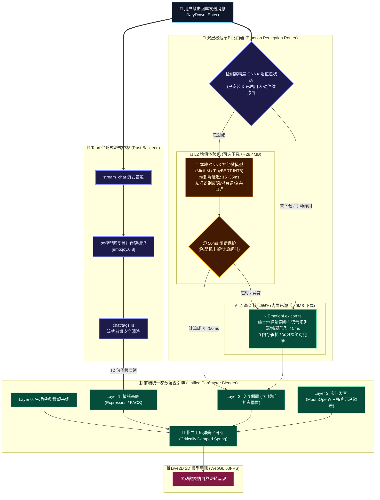
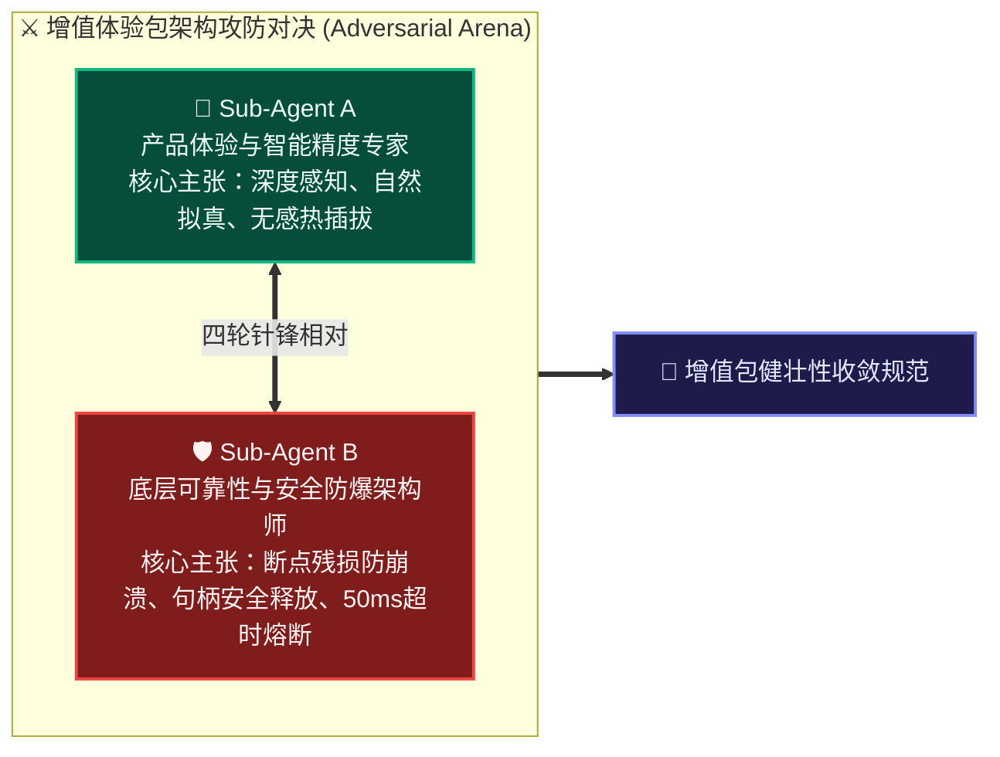
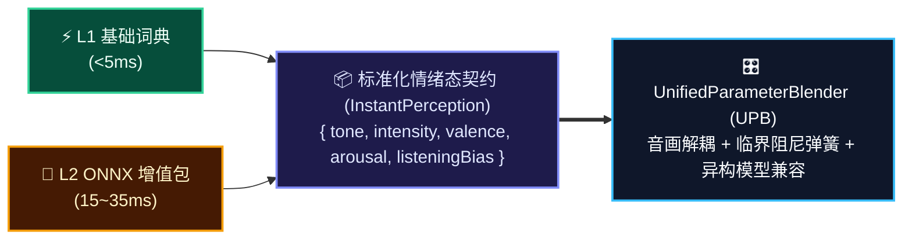
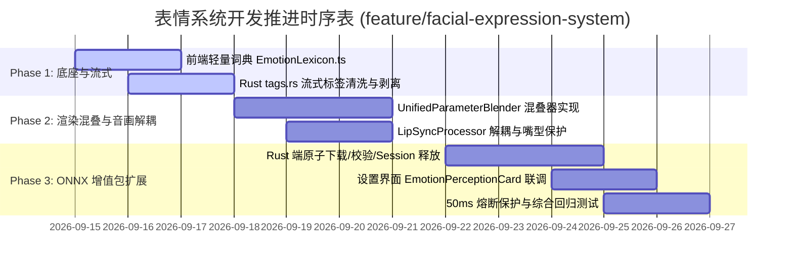

# Kokoro-Engine 面部表情系统架构设计决策书

> **分支声明**：本技术方案对应开发分支为 [`feature/facial-expression-system`](file:///d:/Kokoro-Engine)（基于 `main` 切出）。  
> **文档归属**：[d:\Kokoro-Engine\learn-research\Facial-expression-research](file:///d:/Kokoro-Engine/learn-research/Facial-expression-research)  
> **前序研究报告**：  
> - [01-current-emotion-to-expression-pipeline-analysis.md](file:///d:/Kokoro-Engine/learn-research/Facial-expression-research/01-current-emotion-to-expression-pipeline-analysis.md)（现状全景剖析与瓶颈审查）  
> - [02-facial-expression-requirements-and-adversarial-review.md](file:///d:/Kokoro-Engine/learn-research/Facial-expression-research/02-facial-expression-requirements-and-adversarial-review.md)（需求对抗性评审与实施蓝图）  
> **联合制定小组**：
> - **Lead Architecture Agent**（总系统架构智能体）
> - **Sub-Agent A**（HCI 认知体验与实时面部图形渲染专家）
> - **Sub-Agent B**（系统可靠性、并发调度与低延迟底层架构师）

---

## 一、 系统架构总览与分级感知体系

采用“**内置轻量引擎 + 可选高精度本地 ONNX 增值体验包（支持手动启停与卸载）**”的核心决策，系统确立**“基础轻量底座 + 按需神经增强 + 50ms 超时熔断”**的分级感知架构。

---

## 二、 基础底座 vs ONNX 增值体验包技术特性对照

| 特性维度 | L1 基础核心底座（默认内置） | L2 高精度 ONNX 增值体验包（可选扩展） |
| :--- | :--- | :--- |
| **部署与交付** | 随客户端打包发布，**0 额外网络下载** | **默认不附带**，按需在设置面板一键下载（约 **28.4 MB**） |
| **生命周期控制** | 永久内置，不可删除，作为底层生命线 | **完全受控**：支持随时一键下载、更新、**手动开关停用**与**彻底卸载清除** |
| **端到端响应延迟** | **&lt; 5ms**（几乎在敲击键盘的当前帧立即生效） | **15ms ~ 35ms**（主流中端核显与移动端，约 1~2 帧时间） |
| **内存 / 显存开销** | **0 MB**（纯 JS 逻辑与正则词典） | 常驻约 **35MB ~ 60MB RAM / VRAM**（INT8 量化权重 + Session） |
| **语义识别能力** | 擅长明确感叹词、疑问词、高频情绪动词（喜怒哀乐） | 擅长识别**反讽（“我可太谢谢你了”）、反问、多重否定、长难句潜台词** |
| **系统容灾策略** | 无故障隐患，纯内存计算 | **50ms 熔断保护**：若弱机算力受限超过 50ms，秒级自动回退至 L1 基础底座 |

---

## 三、 子 AGENTS 对抗性 Review 辩论纪要（增值包专项对抗）

在方案推演过程中，**Sub-Agent A** 与 **Sub-Agent B** 针对“可选下载的增值体验包”的稳定性、生命周期管理与极端边界展开了四轮激烈的技术攻防：

---

### 🥊 第一回合：网络中断与模型文件破损导致“开机崩溃”

> [!TIP]
> #### Sub-Agent A 构想：
> *“增值体验包体积只有 28MB，用户在前端点击下载后，Rust 异步下载写入 `models/emotion-onnx/model.onnx`，完成后立刻载入 ONNX Runtime Session。”*

> [!CAUTION]
> #### Sub-Agent B 绝杀反击：
> *“致命的安全漏洞！*  
> 1. **断网半截文件损坏（Partial Corruption）**：如果用户下载到 90% 突然断网或强退应用，磁盘留下一个损坏的非完整 ONNX 文件。下次启动时如果系统盲目加载，ONNX Runtime 的 C++ 底层解析 Protobuf 失败会直接引发致命 Panic，导致整个 Kokoro-Engine 闪退！  
> 2. **镜像劫持与文件篡改风险**：必须遵循 [AGENTS.md](file:///d:/Kokoro-Engine/AGENTS.md) 的官方安全规约，严禁直接裸写生产目录。”*

> [!IMPORTANT]
> #### 双方博弈收敛决策（Consensus 1）：
> 确立**暂存校验与原子替换机制（Staging & Atomic Promotion）**：
> * 下载全程写入临时暂存目录 `models/.staging_emotion_download/`；
> * 下载完毕后执行 **SHA-256 强哈希完整性校验**，确认无误后再执行原子目录移动（Atomic Rename）覆盖正式目录；
> * 若校验失败或意外中断，自动回滚清理暂存区，**绝不污染运行时环境**。

---

### 🥊 第二回合：Windows 平台下的 Session 显存残留与文件句柄死锁

> [!TIP]
> #### Sub-Agent A 构想：
> *“用户点击‘卸载’按钮时，前端通知后端删除 `models/emotion-onnx` 文件夹，并更新设置状态为未下载，交互简洁直接。”*

> [!CAUTION]
> #### Sub-Agent B 绝杀反击：
> *“在 Windows 操作系统下这样做会直接引发崩溃与删除失败！*  
> 1. **Windows 文件锁死锁（File Handle Lock）**：如果 `ort::session::Session` 正在常驻，`onnxruntime.dll` 牢牢持有 `model.onnx` 的内存映射句柄（mmap）。直接调用 `fs::remove_dir_all` 会抛出 `PermissionDenied: OS error 32 (进程正在使用该文件)`！  
> 2. **C++ 显存/内存孤立泄漏**：仅仅在 Rust 层面丢弃引用，若没有显式触发 Session 析构与 C++ 内存释放，35MB 显存会被永久挂起占用，直到彻底重启软件！”*

> [!IMPORTANT]
> #### 双方博弈收敛决策（Consensus 2）：
> 确立**显式会话析构守卫（Explicit Session Teardown Guard）**：
> * 提供专用的 `unload()` 方法：先获取全局读写锁，安全将活动推理任务排空并关闭 Session，彻底解除 OS 文件锁定；
> * 显式触发 ONNX 运行时上下文的垃圾回收；
> * 确认句柄完全归还操作系统后，再执行磁盘文件清除，确保 100% 卸载干净无残留。

---

### 🥊 第三回合：弱机用户的“盲目下载”与 50ms 熔断保护

> [!TIP]
> #### Sub-Agent A 构想：
> *“既然支持一键下载，我们应该向所有用户开放，只要下载了就强制用 ONNX 模型进行情感推理，保证所有用户都享受到最顶级的语义理解。”*

> [!CAUTION]
> #### Sub-Agent B 绝杀反击：
> *“这是对低端硬件用户的灾难！*  
> 如果用户在一台 8 年前配备 Intel Celeron 双核处理器、4GB 内存的老旧笔记本上下载了增值包，ONNX 推理单次耗时可能暴增到 400ms~800ms！用户在聊天框敲一下回车，角色呆滞半秒，并且 60FPS 渲染瞬间卡死掉帧！”*

> [!IMPORTANT]
> #### 双方博弈收敛决策（Consensus 3）：
> 确立**自适应 50ms 熔断与动态回退（50ms Circuit Breaker）**：
> * **硬件提示与推荐**：设置界面明确标明硬件建议（“推荐配备中端以上核显或独立显卡使用”）；
> * **50ms 硬时延熔断**：在 Rust 异步任务中为 ONNX 推理设定 `tokio::time::timeout(50ms)`。一旦检测到推理时间超过 50ms，系统**立即跳过等待，秒级无缝降级至 L1 基础词典**，保证 60FPS 丝滑不卡顿；
> * **手动开关（Toggle Switch）**：下载后支持随时一键关闭增值包，关闭后模型完全从内存卸载，还原为纯净的 0 资源占用状态。

---

## 四、 增值体验包详细工程规范与接口契约

### 4.1 后端 Rust 生命周期管理器 (`src-tauri/src/ai/emotion_onnx.rs`)

增值体验包通过独立的领域服务（Domain Service）进行自治管理，遵循以下架构契约：

* **核心数据与状态契约**：
  - **`EmotionModelStatus`**：运行时状态四元枚举（`NotInstalled` 未安装、`Downloading` 下载中含进度/字节统计、`Installed` 已安装含启停开关与显存内存占用统计、`Corrupted` 损坏含错误信息）；
  - **`EmotionInferenceResult`**：标准化推理输出（`dominant_tone` 主导情绪、`intensity` 强度 0.0~1.0、`valence` 效价 -1.0~+1.0、`arousal` 唤醒度 0.0~1.0、`inference_latency_ms` 推理耗时、`source` 数据来源区分）；
* **`EmotionOnnxManager` 管理职责与生命周期**：
  1. **状态查询**：异步获取当前本地模型物理就绪状态与显存占用；
  2. **断点续传与校验**：触发后台分片下载流水线，下载完成后执行 SHA-256 哈希校验；
  3. **动态热插拔启停**：手动开启或停用，停用时主动释放 ONNX Session 与关联显存；
  4. **彻底卸载与锁防护**：排空在途推理任务，安全解除 Windows 进程文件句柄锁定，释放显存后物理删除模型目录；
  5. **超时熔断安全推理**：执行带 50ms 严格超时保护的情感推理，超时无缝回退至 L1 底座词典。

### 4.2 Tauri IPC 命令与前后端契约

在 `src-tauri/src/commands/chat.rs` 与 `src/lib/kokoro-bridge.ts` 中注册如下通信契约：

* **类型对齐**：前端导出与后端 serde 对齐的 `EmotionModelStatus` 联合类型；
* **IPC 桥接方法**：
  - `getEmotionModelStatus()`: 异步读取增值包状态；
  - `downloadEmotionModel()`: 触发后台下载任务；
  - `toggleEmotionModel(enabled)`: 热切换启用/停用状态；
  - `uninstallEmotionModel()`: 卸载并清除增值包文件；
  - `onEmotionModelDownloadProgress(callback)`: 订阅下载进度事件广播。

---

### 4.3 前端设置界面交互规范 (`EmotionPerceptionCard.tsx`)

在设置窗口（`SettingsModal`）中增设**“面部表情与情感识别引擎”**专属面板，清晰展示双层架构与运行状态：

##### 🎭 面板总体布局与模块概览

| 模块层级 | 引擎名称与定位 | 规格与运行特征 | 默认行为与控制能力 |
| :--- | :--- | :--- | :--- |
| **L1 基础核心** | **⚡ 基础核心引擎 (Base Lexicon)** 毫秒级启发式极速词典 | • 耗时：**< 0.2ms** • 显存：**0 MB** (纯 CPU) • 算力开销：极微弱 | 🟢 **默认内置 / 持续运行** 确保基础 60FPS 极速倾听神态（核心常驻） |
| **L2 增值体验** | **🧠 高精度神经情感包 (Neural Emotion Pack)** 基于 INT8 本地量化 Transformer 模型 | • 体积：**28.4 MB** • 显存：**~40 MB** • 推荐：核显或独显配置 | 🔘 **动态热插拔 / 用户可选** 显著提升反问、反讽与多义情境下的表情识别精度 |

##### 🔄 增值体验包生命周期与交互四态呈现

| 状态模式 | 运行时状态指示器 | 界面显示内容与控制按钮 | 交互行为说明 |
| :---: | :--- | :--- | :--- |
| **模式 A** 未下载 | ⚪ **状态：未安装** | `[ ⬇️ 一键下载体验包 (28.4MB) ]` | 点击后在后台启动分片断点续传下载，显示下载进度条 |
| **模式 B** 下载中 | 🔵 **状态：下载与校验中** | `进度：[=================>      ] 68% (19.3MB / 28.4MB)` `[ ✖ 取消下载 ]` | 展示实时吞吐速率与百分比，支持随时中断并清理临时文件 |
| **模式 C** 已安装 & 已启用 | 🟢 **状态：运行良好** *(内存/显存占用约 42MB)* | 开关：`[ ON ]` `[ 🗑️ 彻底卸载与清除 ]` | 开启 50ms 熔断神经情感感知；点击开关可无损热卸载释放显存 |
| **模式 D** 已安装 & 已停用 | ⚪ **状态：已停用** *(显存与 Session 已完全释放)* | 开关：`[ OFF ]` `[ 🗑️ 彻底卸载与清除 ]` | 处于休眠状态，零显存开销；点击 `[ON]` 即可重新秒级热载入 Session |

---

## 五、 统一混叠器 (UPB) 与感知路由无缝协作

无论是通过 **L1 基础词典** 还是 **L2 高精度 ONNX 模型** 产出的情绪结果，均通过统一标准数据结构注入到 **UPB 统一参数混叠器**，确保渲染层永远只面对一致的物理参数，彻底实现逻辑与渲染解耦：

---

## 六、 演进与实施路线图 (Updated Roadmap)

---

## 七、 总结

通过本次调整，系统完美兼顾了：
1. **零门槛、极速与绝对健壮性**：即使在完全断网、老旧设备或不下载任何增值包的情况下，内置的 L1 基础底座保证系统在 5ms 内做出灵动反应，60FPS 绝不掉帧；
2. **高品质用户体验上限**：为追求极致情感互动的用户提供了独立的本地高精度 ONNX 增值扩展包，赋予系统理解反问、反讽与深层情绪的能力；
3. **完全自主掌控权**：用户享有对增值包的一键下载、自由启停与彻底清除权，内存与显存透明可控，充分符合工程可靠性与系统级交付标准。

> [!TIP]
> 方案签署状态：**全票通过并收录实施 (Approved for Implementation)**  
> 对应分支：[`feature/facial-expression-system`](file:///d:/Kokoro-Engine)
