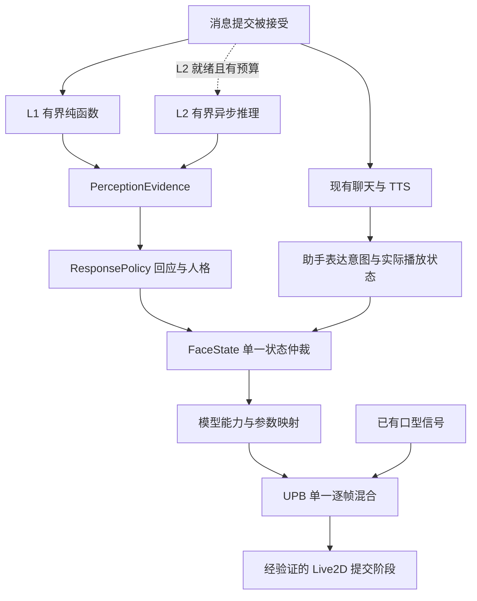

# 面部表情系统：最终架构决策与契约基线

> 修订：2026-09-14。源码基线：`05e1dcaeae6d6d6b37e4d8cf110f5848ae3a3dc3`。
> 状态：经多轮文档审查收敛的**待实现设计**，不代表功能已集成、性能达标或生产发布获批。本文是本组文档的所有权、命名、调度和验收基线；[01](01-current-emotion-to-expression-pipeline-analysis.md)记录现状，[02](02-facial-expression-requirements-and-adversarial-review.md)定义需求，[04](04-lightweight-local-onnx-emotion-models-and-integration-design.md)细化 L2，[05](05-l1-algorithm-driven-core-foundation-architecture-and-moat.md)细化 L1。[06](06-multi-round-adversarial-review-and-final-decisions.md)记录本次实际审查。

## 1. 最终选择与边界

采用“L1 立即反馈 + L2 可选限期修正 + 助手表达独立仲裁”。L1 是随应用发布的有界规则分析器；L2 默认未安装，具体生产模型尚未选定。二者都只生成文本情绪证据，不直接决定角色应作何表情。无证据或冲突时弃权，由回应策略选择低强度倾听或基线，不能把未知等同于中性判断。

本期只设计面部眉、眼睛开合、嘴及已验证的脸颊参数；眼球注视与瞳孔暂保持 SDK 既有行为，不新增驱动。头部姿态、肢体动作、音频情绪识别、3D 和在线词库更新为独立后续范围。现有 `play_cue` 路径保持兼容；不以设计文档为依据立即删除后置分析器。整体对话仍可能使用远程 LLM/TTS，本地感知不能被宣传为整个应用零网络或零隐私风险。



此图表示依赖方向，不要求每个方框都创建独立服务、线程或进程。

## 2. 责任与所有权

| 边界 | 唯一职责 | 禁止承担的职责 |
| --- | --- | --- |
| L1 / L2 provider | 有界输入到情绪证据；L2 自管 tokenizer/session 实现 | 角色性格、跨回合状态、FACS/Live2D 参数、渲染时钟 |
| ResponsePolicy | 根据证据、角色只读配置和交互阶段生成角色回应目标 | 改写原始用户情绪证据、保存逐帧状态、调用 SDK |
| FaceState | 回合有效性、来源优先级、阶段、目标 TTL、惯性和重置 | 文本扫描、模型下载、第二套逐帧滤波 |
| ModelAdapter | 资产预设、已校准参数、范围和极性映射；输出可用通道 | 猜测任意资产含义、要求所有模型具备全部通道 |
| UPB | 唯一逐帧混合、平滑、范围约束及交给渲染适配器提交 | 情绪分类、下载、重复人格变换 |
| EmotionModelManager | 串行生命周期、启用意图、代次、准入和恢复决策 | 锁内等待推理结束或执行磁盘下载 |
| runtime / package_store | 分别拥有原生执行与文件安装事务，向 manager 回报结果 | 各自修改外部可见生命周期状态 |

低耦合通过稳定数据接口实现；高内聚按变化原因划分，不把下载、推理、UI 和渲染塞入同一个文件。拟议代码路径可放在 `src/lib/emotion/`、`src/features/live2d/` 与 `src-tauri/src/ai/emotion/`；这些并非已存在模块。IPC 薄适配层建议独立 `commands/emotion.rs`，注册仍在 [lib.rs](../../src-tauri/src/lib.rs)，前端边界仍为 [kokoro-bridge.ts](../../src/lib/kokoro-bridge.ts)。

角色配置持久化必须经过现有 [activation owner](../../src-tauri/src/characters/activation.rs) 的 prepare/apply/commit。只有成功提交后才发布新快照；预备或失败的切换不提前改变活动角色。模型包安装属于应用资源域，角色偏好属于角色配置，供应商密钥仍是应用凭据。

## 3. 提议的数据契约 v1

以下为新增协议草案，不是当前 Rust 载荷。统一使用 snake_case JSON 字段，Rust serde 和 TypeScript 同步实现、运行时验证，未知版本拒收。ID 为非空有界字符串（每项最多 128 UTF-8 字节）；计数器为 JavaScript 安全整数范围内非负整数，递增溢出时换新 owner 生命周期并重置订阅。

```ts
type EmotionLabel =
  | "joy" | "sadness" | "anger" | "fear" | "surprise"
  | "disgust" | "curiosity" | "caring" | "neutral";

type Correlation = {
  client_request_id: string;
  turn_id: string | null; // 后端分配前为 null，不能伪造后端 turn_id
  character_id: string;
  conversation_id: string | null;
  activation_epoch: number;
};

type PerceptionEvidence = {
  schema_version: 1;
  correlation: Correlation;
  source: "l1" | "l2";
  provider_revision: string;
  model_generation: number | null; // L1 为 null；L2 由 manager 分配
  sequence: number;
  status: "known" | "unknown" | "ambiguous";
  dominant_tone: EmotionLabel | null;
  valence: number | null;          // 有限值 [-1, 1]
  arousal: number | null;          // 有限值 [0, 1]
  dominance: number | null;        // 没有依据时 null，禁止伪造观测
  confidence: number | null;       // 只有经过校准才填 [0, 1]
  confidence_kind: "calibrated" | "unavailable";
  truncated: boolean;
  processing_ms: number;           // provider 内本地测量，非端到端时延
};

type PerceptionResult =
  | { kind: "ok"; evidence: PerceptionEvidence }
  | { kind: "unavailable"; reason:
      "disabled" | "not_ready" | "busy" | "timeout" |
      "cancelled" | "invalid_input" | "unsupported" | "runtime_error" };
```

`known` 必须有合法标签和有限 V/A；`unknown` 与 `ambiguous` 的标签、V/A/D 和 confidence 都为 null，避免消费者仍拿可疑数值渲染。dominance 范围为 `[-1,1]`；模型离散标签到 V/A 的映射必须带 provider revision，属于工程映射而非测得的心理量。置信度不等于表情强度；回应强度由 ResponsePolicy 另外生成并限制在 `[0,1]`。L1 规则分数与多标签 sigmoid 输出不能直接冒充校准概率。`confidence_kind=unavailable` 时 confidence 必须为 null。

`confidence_kind=calibrated` 要求 confidence 非 null、有限且在 `[0,1]`；processing_ms 必须有限且非负，provider_revision 非空且最多 128 UTF-8 字节。sequence 的计数域为请求 + source + provider_revision + model_generation，不能跨模型代次比较。覆盖、修复、匹配得分等内部诊断不隐式添加到 v1 wire schema；需要传播时另行版本化。无法可靠表达的证据输出 unknown/ambiguous，而不是额外塞入未声明字段。

`PerceptionResult` 是单次请求的返回值，unavailable 由调用闭包绑定原请求，不能直接广播这个裸联合类型。若采用广播，必须外包 `{ correlation, model_generation, sequence, result }`，成功与失败都走同样的身份/代次校验；旧失败不得撤销新请求的结果。

`ResponseTarget` 是内部纯数据对象：关联信息、`phase`（listening/assistant）、语义表情目标、强度、策略版本；FaceState 在本地登记其失效时间。`AssistantExpressionIntent` 是另一种输入：关联信息、`segment_id`、单调序号、来源（tool/tag/fallback）和有限强度，不冒充用户情绪证据。两类对象均不得携带 SDK 引用或最终参数 ID。

### 3.1 请求身份和过期处理

1. 提交入口生成 `client_request_id` 并保存活动角色快照；先显示弱倾听态，同时走原有聊天入口。发送失败、拒绝接单或取消即使尚未收到后端 ack，也立刻使该请求失效。
2. 使用现有 ack/start 关联字段绑定真正的 `turn_id`，且 `client_request_id` 必须匹配。FaceState 保存唯一 request→turn/conversation 映射；ack 到达时将已经接纳的早期 L1 目标绑定到该映射。晚到的 null-ID 证据仅能通过仍有效且唯一的原 request 映射归一化；非 null ID 不匹配、请求已取消或映射已清除一律丢弃。不得借用当前显示回合补齐无关请求。conversation 尚未创建时为 null，绑定后同样校验，不能从已知 ID 降格回 null。
3. `activation_epoch` 是由后端 activation owner 在成功提交时推进的新增共享代次，不假定现有事件已提供。窗口不得自行推进它。viewer 重建采用窗口本地 viewer_epoch，模型重载采用本地 adapter_generation，异步回调捕获并检查这两者；它们只清空本窗口旧目标，不改变其他窗口的共享激活代次。L2 的 model_generation 只由 manager 推进，不能替代前述任何代次。
4. 同一来源按 sequence 丢弃重复和逆序结果；切角色、取消、播放终态或过期请求先检查失效，再检查优先级。L2 只能在本请求仍处于 listening 时替换 L1，不能盖过已经接管的助手表达。
5. 50ms 是**初始候选结果接受预算**，从用户提交计时，包含 IPC、队列、分词和推理；FaceState 用自身单调时钟最终裁决。跨进程不比较两个进程的绝对 monotonic 时间；后端只接受剩余预算并本地限时，前端仍拒收越界结果。`processing_ms` 只作分阶段诊断。

主窗口和宠物窗口各自持有渲染器与 FaceState 实例，但不各自派发重复推理：每个请求由提交入口派发一次，后端 manager 按请求和代次去重。结果通过定向投递或带完整关联的广播送达，非目标角色的窗口丢弃。隐藏窗口不产生额外推理，重建窗口从有效快照恢复或保持基线，不重播历史 cue。

现有 `chat-cue` 只具 cue/source，无法可靠关联回合。迁移时必须给**所有聊天生产者**补齐关联或引入新事件并由适配器转换，不能收到无身份旧事件就补上“当前回合”。兼容模式可继续现有行为；启用新仲裁模式后，未关联的聊天 cue 不进入新状态机。不能同时保留直接 `playCue` 和新 UPB 写入而双重播放。手动 cue 单独作为显式本地操作处理。

生产者清单还包括 [character 命令](../../src-tauri/src/commands/character.rs)、[MOD manager](../../src-tauri/src/mods/manager.rs) 和可能被不同入口调用的 [PlayCueAction](../../src-tauri/src/actions/builtin.rs)。MOD/交互 cue 必须有独立非聊天来源、操作身份、有效期和受控优先级，不能自动提升为最高优先级手动操作。未迁移来源继续旧模式，或显式声明不支持新模式；不得静默丢弃后仍声称完全兼容。启用开关以该模型/窗口全部生产者与消费者完成迁移为 gate。

## 4. 状态、优先级与音画时序

FaceState 顺序为 idle → listening → assistant → releasing → idle。聊天生成完成与音频播放完成是不同事件：有 TTS 时以实际播放开始/结束推进表达；只有文本时以片段展示进度推进。取消、角色切换、模型销毁和手动关闭绕过驻留/淡出限制，立即撤销旧目标及口型会话绑定。普通淡出由 UPB 完成。`chat-turn-finish` 的 completed 只表示聊天生成完成：关闭新增感知计算和语义输入，不撤销已经排队的播放意图。FaceState 延续到对应播放队列耗尽、停止或失败，且受目标 TTL 约束；没有语音时以文本呈现完成释放。取消/错误则明确停止相关播放并撤销目标，不能仅等待 completed 回调。

同一有效片段的优先级为：显式手动操作 > 已关联助手 tool > 合法助手 tag > fallback > listening（合格 L2 > L1）> baseline。所有目标有 TTL，优先级不能让过期目标永久驻留。默认先保持当前 cue 协议；新增 `[emo:...]` 必须在分片、错误标签、普通文本和 TTS 清洗测试通过后启用，不能宣称 LLM 必然遵循标签。

新协议的解析需要有界前缀缓冲、标签长度和频率上限、枚举白名单、有限强度验证、chunk 边界拼接、取消时清理。未闭合前缀超限或流结束时按明确的文本保全规则回退，不能无限扣留正常回复。代码/引用中的标签按产品规则当普通文字，不能执行任意工具。UI 和 TTS 必须消费同一个清洗输出，测试不得误删正常文字。表达目标随 `segment_id` 排队，在实际对应音频开始时生效；乱序/未播放片段丢弃。

当前 [audio-player.ts](../../src/lib/audio-player.ts) 的 onPlayStateChange 回调只有 playing 布尔值，不能凭它推导句级播放身份。G4 必须补齐带 correlation、playback_session_id、segment_id 和序号的结构化播放事件，覆盖 started/ended/cancelled/failed/blocked/queue_drained 终态以及断流恢复。没有这些关联之前只允许已关联回合级固定表情与播放生命周期；无法确认播放会话属于当前回合时保持基线。不能拿生成句序当播放句序，也不能承诺逐音素同步。

FaceState 只维护离散目标、TTL 与跨回合惯性；UPB 是唯一逐帧滤波器。基线 `b`、旧状态 `e` 的惯性可按 `b + (e-b)*2^(-elapsed/half_life)` 在状态求值时计算，半衰期 8s、目标最大寿命 30s 均为待体验验证的初始参数；超期回基线，切换/取消立即清空。不使用问候关键词强行推断话题重置。

## 5. 渲染适配与统一混合

资产策略为：已验证 cue/预设优先 → 校准过的参数通道补充 → 缺失能力跳过并回基线。扫描 ID/min/max/default 只能获得数值能力，不能确定表情语义或极性；别名命中也需校准。`.exp3.json` 的 Add/Multiply/Overwrite 与淡入淡出语义应保留，不能概括成硬切；不保证任意无预设模型都可生成喜怒哀乐。

实现前需用锁定依赖和真实资产确认 motion、expression、blink、focus、physics、pose 的写入顺序。UPB 从**该帧 SDK 基底快照**合成受管通道，在经过验证的最终 hook、Core 更新前提交；不能把上帧已叠加值当基底再相加。SDK 原有口型通道与应用口型不得同时写同一受管参数。hook 是否可用、destroy 是否解除订阅、物理与眼睛通道的顺序均是准入实验，不是已实现保证。

| 通道 | 合成原则 |
| --- | --- |
| MouthForm | 保留预设/回应基底；只叠加已有音频处理器能提供的有限调制，不假定已有元音分类 |
| MouthOpenY | 播放期间音频开合优先，先按模型安全范围映射；非播放期恢复基底 |
| EyeOpen | 在情绪基底上保留眨眼影响，避免两套眨眼驱动 |
| Brow/Cheek | 已验证参数采用有限权重；未知/反向通道不自动驱动 |

平滑统一选择一阶指数滤波 `p_next = p + (target-p)*(1-exp(-dt/tau))`，dt 为秒，tau 为正的版本化配置；它不是二阶临界阻尼弹簧，也不承诺固定 80–120ms 完全到位。只平滑情绪/倾听通道，避免再次低通口型造成延迟。所有输入先验证有限数，所有提交按真实范围 clamp。长帧/挂起恢复先检查目标 TTL，再直接恢复有效基线或目标并清空过渡；不积累巨量子步。

## 6. L2 调度与生命周期

L1 不依赖 L2 是否安装、加载或成功。L2 runtime 是一个 session 的唯一 owner，初始采用全局最多 1 个真实在途任务 + 1 个可替换的最新 pending 请求；超载返回 busy，替换被取消的 pending 必须给旧请求确定结果。尚在 native 调用中的任务不会因等待超时而释放执行槽。后端从入队开始扣减传入的剩余预算，不重新计满 50ms；过期 pending 不执行，取消及 generation 检查同时在入队和交付结果时执行。

Tokio 的 timeout 只限制等待，已启动 `spawn_blocking` 不可通过 abort 强制终止；ORT 的 terminate 是协作取消信号，不能承诺固定时间中断任意算子。当前架构可隔离等待和限制任务数量，不能隔离进程内 native 崩溃或永久挂起。若产品要求可强制回收这类故障，必须先实现并验证独立进程 worker；未经该 gate，L2 只能作为受限实验功能。[Tokio 文档](https://docs.rs/tokio/latest/tokio/task/fn.spawn_blocking.html)、[ORT RunOptions 源码](https://github.com/microsoft/onnxruntime/blob/main/include/onnxruntime/core/session/onnxruntime_c_api.h)。

连续 3 次超时/运行错误触发 open，初始冷却 30s 后允许 1 次 half-open 探测；成功关闭熔断，失败指数退避且设最大间隔。次数和时间是待测配置。仍有未退出 native 任务时不得探测或另建 session；只能报告 stalled 并停用。关闭/卸载优先于恢复探测。

把状态拆成三个正交字段：

| 字段 | 状态及意义 |
| --- | --- |
| desired_enabled | 用户启用意图；安装成功不等于自动启用 |
| artifact | absent / downloading / verifying / installed / corrupted / pending_cleanup；附版本、operation_id、错误码 |
| runtime | disabled / loading / ready / draining / failed / stalled；附 generation、breaker 状态 |

manager 顺序处理命令，耗时工作在外部执行并携带 operation_id/generation 回报。关闭先停止准入并使 generation 失效，再排空、释放 runtime；不得持有状态锁等待 worker 回报。卸载时同样先撤销运行，收到实际退出确认才清理该包目录；等待超限或删除/重命名失败记录 pending_cleanup，可重试，不能伪报 absent。关闭不意味着整个进程 RSS 归零，UI 不展示猜测的显存数据。

package_store 采用唯一 staging 目录、完整 manifest/revision/所有文件摘要与边界校验、不可变版本目录和可恢复活动指针。哈希证明完整性而非来源可信；官方身份规则仍依 [AGENTS.md](../../AGENTS.md)。更新失败保留已验证旧版，重启能恢复事务。包卸载不删除角色、对话、记忆、设置或凭据。详见 [04](04-lightweight-local-onnx-emotion-models-and-integration-design.md)。

拟议 IPC：`get_emotion_model_status`、`download_emotion_model`、`cancel_emotion_model_download`、`set_emotion_model_enabled`、`uninstall_emotion_model`、`infer_instant_emotion`；进度事件为 `emotion-model-download-progress`，含 operation_id、revision、bytes_received、total_bytes（未知时 null），状态查询是重连后的权威来源。操作幂等键防双击重复下载，取消只作用于匹配的 operation_id。返回区分 accepted/completed/failed，不能把后台接单当完成。上述命令**尚未注册**，本次不更改运行时。

## 7. 输入、度量与实施门槛

感知分支只处理副本，不能截断主聊天/TTS文本。初始上限为规范化前最多 2048 UTF-8 字节、NFC 后最多 512 Unicode 标量，选取有界前缀并标记 truncated；L2 再依确切模型策略限制为最多 64 tokens（含特殊 token）。客户端有界扫描取得副本，后端在 tokenizer 前重新验证字节上限，拒绝超限协议输入；不可先 normalize 巨量文本再截断。超出上下文能力、语种不支持或否定/引用范围被截断时弃权。参数为初始实验选择，不表示 64 tokens 对所有候选模型都合法。

| Gate | 必须提交的证据 | 当前状态 |
| --- | --- | --- |
| G0 契约/源码 | 三层载荷追踪、身份生命周期及故障用例 | 本次完成文档审查，尚未实现协议 |
| G1 兼容渲染 | 真实资产逐帧快照；预设/口型/眨眼/物理/切模型；关闭恢复旧路径 | 待实现与实机验证 |
| G2 L1 | 否定/引用/Unicode/重复词/弃权测试；语料分割与每语种误触统计 | 待实现、语料未建立 |
| G3 L2 | 固定模型 revision、许可、准确性、冷/热加载、峰值内存、长任务/卸载故障 | 候选待准入，无生产模型 |
| G4 新标签与播放 | 分片清洗、回合取消、音频延后/乱序/无 TTS、旧 cue 兼容 | 通过后才启用，可独立回滚 |

性能只使用一套**待测初始预算**：目标硬件下 L1 processing P95 ≤5ms、L2 结果接受预算 50ms、UPB CPU 开销 P95 ≤0.5ms/帧。记录 OS/CPU/电源模式、输入长度、构建版本、样本数、冷暖区分及 P50/P95/P99；同时测主聊天 TTFT、音频 underrun 和渲染帧时间相对基线变化。预算失败时缩减范围或停用增强，不把 60FPS、零分配、零崩溃写成保证。

准确性按语种/类别报告 macro-F1、弃权覆盖率、错误强表情触发率及盲测区间；阈值先在开发集选择，再锁定独立测试集，不能沿用无依据的 92.5%/93.5%。是否改善用户体验需要资产录屏与人工对比，不从单元测试推断。

实施按 G0 → G1/G2 → G3 → G4 推进，以门槛替代未经估算的日期承诺。L1、L2、新标签和新混合分别可关闭；关闭路径撤销目标并恢复原有 cue/LipSync owner，防止双写。本文只敲定设计方向，任何 gate 未通过均不得宣称对应能力完成。
