# Live2D 模型表情资产提取、参数自适应探测与自定义表情工程架构设计研报

> **文档代号**：`RFC-20260915-FEAT-L2D-EXPRESSION-ENGINE`  
> **文档归属**：[`d:\Kokoro-Engine\learn-research\Facial-expression-research\06-live2d-expression-extraction-and-custom-engine-architecture.md`](file:///d:/Kokoro-Engine/learn-research/Facial-expression-research/06-live2d-expression-extraction-and-custom-engine-architecture.md)  
> **关联前序文献**：
> - [01-current-emotion-to-expression-pipeline-analysis.md](file:///d:/Kokoro-Engine/learn-research/Facial-expression-research/01-current-emotion-to-expression-pipeline-analysis.md)（现有链路全景与瓶颈审计）
> - [02-facial-expression-requirements-and-adversarial-review.md](file:///d:/Kokoro-Engine/learn-research/Facial-expression-research/02-facial-expression-requirements-and-adversarial-review.md)（需求基线与红蓝对抗推演）
> - [03-facial-expression-technical-selection-and-architecture-design.md](file:///d:/Kokoro-Engine/learn-research/Facial-expression-research/03-facial-expression-technical-selection-and-architecture-design.md)（双轨感知与增值包总体架构）
> - [05-l1-algorithm-driven-core-foundation-architecture-and-moat.md](file:///d:/Kokoro-Engine/learn-research/Facial-expression-research/05-l1-algorithm-driven-core-foundation-architecture-and-moat.md)（L1 算法底座与动力学建模）
>
> **联合审查智能体委员会**：
> - 🟦 **Sub-Agent A（业务与交互体验架构师）**：聚焦模型开箱即用体验、参数智能嗅探、可视化画廊交互与用户无感知适配。
> - 🟥 **Sub-Agent B（实时图形学与渲染引擎工程师）**：聚焦 Live2D Cubism Core 底层生命周期、60FPS 帧率抗撕裂、参数争夺优先级与无锁渲染管线。
> - 🟧 **Sub-Agent C（系统鲁棒性与安全容灾架构师）**：聚焦第三方未知模型恶意解析防爆、参数越界失真防护、非标模型优雅降级与内存生命周期。
> - 🟨 **System Arbiter（系统仲裁与规范委员会）**：裁定低耦合、高内聚、高可用的分层规范，输出统一技术真理与落地路线。

---

## 目录索引

- [一、 核心命题与关键问题裁决报告](#一-核心命题与关键问题裁决报告)
  - [1.1 关键问题一：Kokoro 角色自带表情数量的实测真伪研判](#11-关键问题一kokoro-角色自带表情数量的实测真伪研判)
  - [1.2 关键问题二：项目能否再定义表情工程及其核心价值](#12-关键问题二项目能否再定义表情工程及其核心价值)
  - [1.3 关键问题三：用户“模型导入参数提取与异步表情处理”想法深度验证](#13-关键问题三用户模型导入参数提取与异步表情处理想法深度验证)
- [二、 Live2D 模型全维参数与表情资产自适应探测机制](#二-live2d-模型全维参数与表情资产自适应探测机制)
  - [2.1 静态配置剖析与资产清单提炼](#21-静态配置剖析与资产清单提炼)
  - [2.2 动态运行时内存参数全量嗅探与语义拓扑抽取](#22-动态运行时内存参数全量嗅探与语义拓扑抽取)
  - [2.3 自带表情画廊（Expression Gallery）直映与即时测试交互流](#23-自带表情画廊expression-gallery直映与即时测试交互流)
- [三、 “低耦合、高内聚、高可用” 自定义表情工程体系架构](#三-低耦合高内聚高可用-自定义表情工程体系架构)
  - [3.1 系统分层拓扑全景图](#31-系统分层拓扑全景图)
  - [3.2 低耦合设计（Low Coupling）：V-Face 虚拟标准面部契约与适配器](#32-低耦合设计low-couplingv-face-虚拟标准面部契约与适配器)
  - [3.3 高内聚设计（High Cohesion）：表情动力学处理闭环流水线](#33-高内聚设计high-cohesion表情动力学处理闭环流水线)
  - [3.4 高可用设计（High Availability）：多级容灾与防穿模安全沙箱](#34-高可用设计high-availability多级容灾与防穿模安全沙箱)
- [四、 核心机制：快慢双环解耦架构（Dual-Loop Decoupling Architecture）](#四-核心机制快慢双环解耦架构dual-loop-decoupling-architecture)
  - [4.1 为什么传统的“每帧异步 IPC 往返”会导致灾难？](#41-为什么传统的每帧异步-ipc-往返会导致灾难)
  - [4.2 慢环（Macro Loop）：异步语义判决与目标表情意愿生成](#42-慢环macro-loop异步语义判决与目标表情意愿生成)
  - [4.3 快环（Micro Loop）：同步 60FPS 逐帧平滑插值与多轨参数混合](#43-快环micro-loop同步-60fps-逐帧平滑插值与多轨参数混合)
  - [4.4 帧生命周期注入时序与口型（LipSync）协同仲裁机制](#44-帧生命周期注入时序与口型lipsync协同仲裁机制)
- [五、 多智能体对抗性审查（Multi-Agent Adversarial Review）纪要](#五-多智能体对抗性审查multi-agent-adversarial-review纪要)
  - [🥊 第 1 轮对抗：非标模型参数混乱与自适应语义对齐](#-第-1-轮对抗非标模型参数混乱与自适应语义对齐)
  - [🥊 第 2 轮对抗：异步处理与 60FPS 渲染管线的时钟撕裂防线](#-第-2-轮对抗异步处理与-60fps-渲染管线的时钟撕裂防线)
  - [🥊 第 3 轮对抗：微表情与音频口型、眨眼的“面部扭曲与参数争夺”](#-第-3-轮对抗微表情与音频口型眨眼的面部扭曲与参数争夺)
  - [🥊 第 4 轮对抗：恶意模型格式、极端参数越界与内存泄漏防爆](#-第-4-轮对抗恶意模型格式极端参数越界与内存泄漏防爆)
- [六、 统一工程规范与落地实施矩阵](#六-统一工程规范与落地实施矩阵)
  - [6.1 V-Face 标准虚拟参数映射字典（FACS AU 映射表）](#61-v-face-标准虚拟参数映射字典facs-au-映射表)
  - [6.2 运行时状态机迁移矩阵与阻尼常数规约](#62-运行时状态机迁移矩阵与阻尼常数规约)
  - [6.3 阶段性落地路线图与验收基准](#63-阶段性落地路线图与验收基准)

---

## 一、 核心命题与关键问题裁决报告

### 1.1 关键问题一：Kokoro 角色自带表情数量的实测真伪研判

对当前 Kokoro-Engine 生产代码库、角色元数据配置文件以及底层 Live2D 模型文件的多层逆向静态审查结果如下：

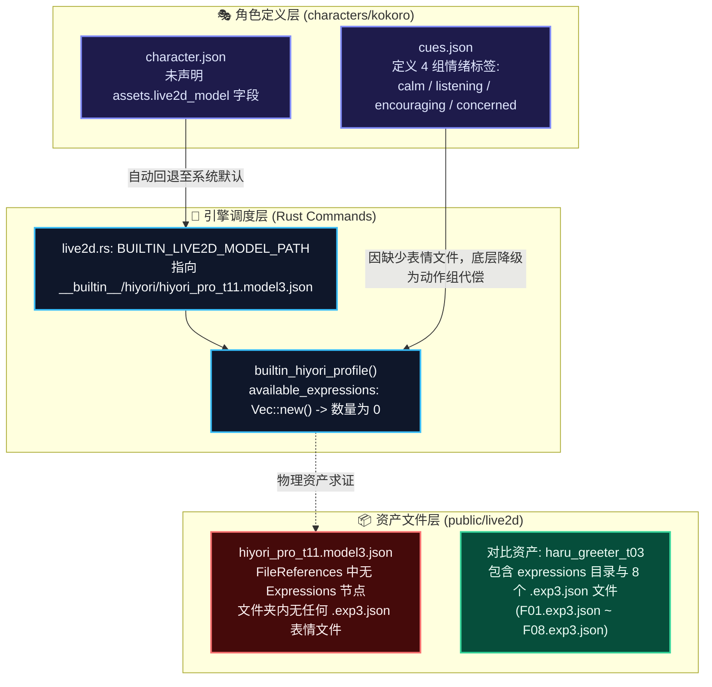

#### 审查定论事实矩阵

| 审查维度 | 检查源文件/目录 | 审查发现的事实依据 | 最终定论 |
| :--- | :--- | :--- | :--- |
| **角色配置层** | `characters/kokoro/character.json` | 角色资产清单中仅配置了 `cues.json`，未配置自定义 `live2d_model` 路径，系统自动回退至全局内置默认模型。 | 继承引擎内置默认模型配置 |
| **物理资产层** | `public/live2d/hiyori/` | 该模型为 Live2D 官方基础样例，其配置文件 `hiyori_pro_t11.model3.json` 的 `FileReferences` 节点仅包含 `Motions`、`Physics` 与 `Pose`，**没有任何 `Expressions`（表情）文件声明，目录下无任何 `.exp3.json` 文件**。 | **自带表情文件数量为 0 个** |
| **引擎探测层** | `src-tauri/src/commands/live2d.rs` | 核心探测函数 `builtin_hiyori_profile()` 显式将 `available_expressions` 初始化为空数组 `Vec::new()`。 | **系统识别到的可用表情数为 0** |
| **逻辑映射层** | `characters/kokoro/cues.json` | 虽定义了 4 个情绪提示词（`calm`, `listening`, `encouraging`, `concerned`），但由于底层模型无表情文件，当前运行时全靠 `FlickUp`, `FlickDown`, `Tap` 等**身体/头部动作组（Motions）进行生硬代偿**，无法产生五官微表情。 | 逻辑有 4 个 Cue，但五官表情为 0 |
| **横向对比** | `public/live2d/haru/` | 作为同项目的对比模型，Haru 拥有完善的 `expressions/` 目录，内含 `F01` 至 `F08` 共 **8 个自带表情**。 | 证实 Kokoro 模型本身缺乏独立表情资产 |

> [!IMPORTANT]
> **结论定论**：当前 `kokoro` 角色的内置默认模型自带的 Live2D 面部表情文件数量为 **0 个**。角色的喜怒哀乐当前处于“依赖全身动作摆动代偿”或“五官面瘫”的降级状态。

---

### 1.2 关键问题二：项目能否再定义表情工程及其核心价值

**答复：完全可以，且这是打造技术护城河、摆脱第三方模型资产缺陷的必由之路。**

当前系统高度受制于“模型作者有没有做 `.exp3.json` 文件”。如果用户导入一个没有表情的优质画风模型（如官方 Hiyori），系统的情感链路立刻断裂。项目自主定义“表情工程（Expression Engine）”具有三大战略级工程价值：

1. **摆脱对外部表情文件的强依附**：直接基于 Live2D 的底层数学参数（Parameters）进行算法合成，哪怕模型**零表情文件**，也能赋予其生动的眨眼、挑眉、微笑、悲伤等面部神韵；
2. **打通连续多维情感表达**：打破 `.exp3.json` 只能“离散硬切”的死板弊端，实现从 0% 到 100% 的连续微表情渐变、多情感混合（例如：70% 喜悦 + 30% 害羞）；
3. **彻底解决口型与表情打架（穿模）难题**：实现表情参数与实时音频口型（LipSync）的正交解耦与动态融合，杜绝微笑时无法张嘴、张嘴时表情被暴力抹平的行业通病。

---

### 1.3 关键问题三：用户“模型导入参数提取与异步表情处理”想法深度验证

用户的设计构想非常敏锐，精准切中了虚拟角色动力学系统的痛点。审查委员会对该想法进行逐项可行性推演与边界澄清：

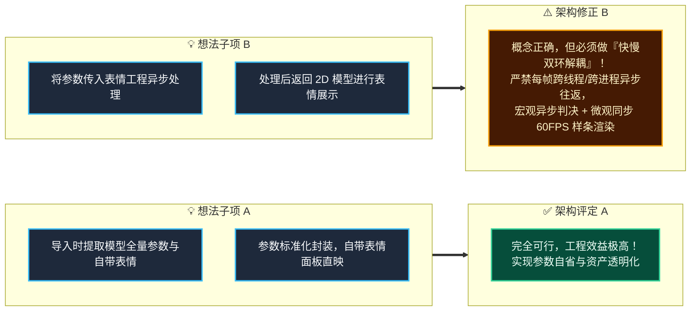

#### 想法深度验证对比表

| 用户构想要点 | 工程可行性 | 潜在暗礁与技术瓶颈 | 终局架构解决方案 |
| :--- | :--- | :--- | :--- |
| **① 导入时获取模型全量参数** | **100% 可行** | 不同模型的参数命名极不规范（有的叫 `ParamEyeLOpen`，有的叫 `PARAM_EYE_L_OPEN`，有的作者用纯日文命名）。 | 引入 **V-Face 标准语义适配器**，在导入时执行模糊特征嗅探与指纹归一化。 |
| **② 自带表情直接展示** | **100% 可行** | 自带表情文件可能存在缺失、损坏或引用的参数不存在的情况。 | 建立 **Expression Gallery（表情画廊）**，导入时静态校验并生成可视化的触发卡片。 |
| **③ 传入自定义表情工程异步处理** | **需严格分层** | **严重警示**：若将每帧的参数计算放到异步通信（IPC/WebWorker）中，5~15ms 的通信抖动将彻底击穿 16.6ms（60FPS）的渲染帧预算，导致严重卡顿、跳帧与抽搐。 | 采用**快慢双环架构**：宏观意图与情感分析走**异步决策慢环**；逐帧数学插值与物理阻尼走**同步渲染快环**。 |
| **④ 处理后返回 2D 模型表情展示** | **100% 可行** | 写入时机若晚于 Cubism 核心的物理结算，会导致下一帧画面被覆盖回滚。 | 挂载于 Cubism 渲染生命周期的 **Post-Motion 阶段**（动作解算后、物理结算前）执行参数写入。 |

---

## 二、 Live2D 模型全维参数与表情资产自适应探测机制

### 2.1 静态配置剖析与资产清单提炼

当用户将一个包含 `.model3.json` 的模型包（ZIP 或文件夹）导入 Kokoro-Engine 时，静态剖析管线首先介入，完成元数据的零开销校验：

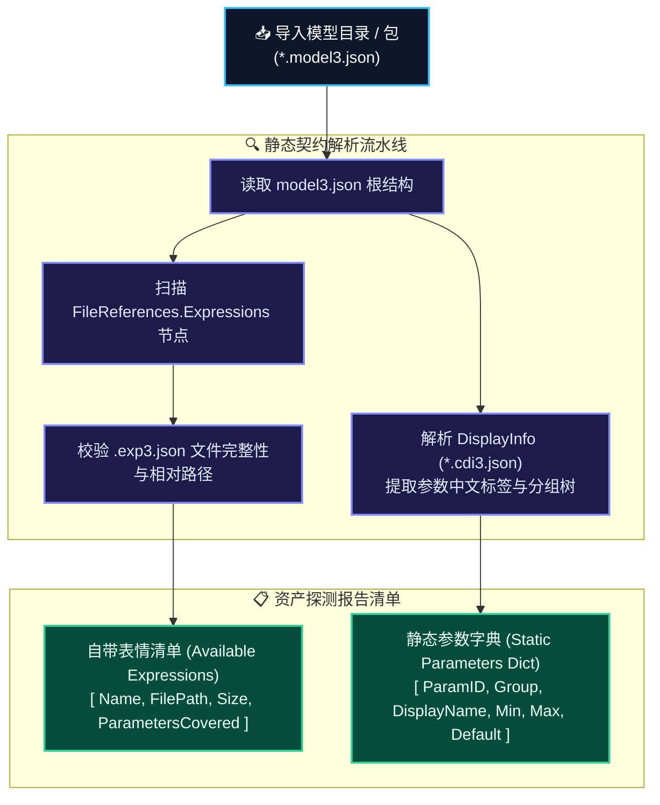

#### 静态解析规范提要
1. **自带表情白名单抽取**：提取 `FileReferences.Expressions` 数组中的每个对象，记录表情展示名（若无 `Name` 则提取文件名主体）与文件相对路径；
2. **显示信息扩展匹配**：若模型同级目录下存在 `DisplayInfo` 文件（通常为 `.cdi3.json`），解析其中的 `Parameters` 节点，将冷冰冰的英文字符串（如 `ParamEyeLOpen`）与自然语言标签（如“左眼 开闭”）建立双向绑定索引。

---

### 2.2 动态运行时内存参数全量嗅探与语义拓扑抽取

由于许多精简导出的 Live2D 模型并不附带 `.cdi3.json`，纯静态解析无法探知模型的完整参数形态。系统在将模型加载进 WebGL 渲染上下文时，通过底层的 Cubism Core 接口进行**动态内存反射探测**：

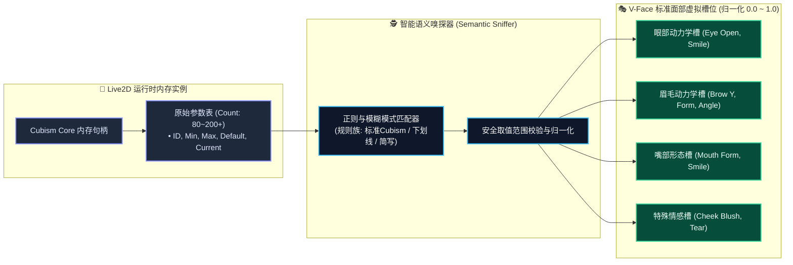

#### 动态反射提取的数据契约特征

| 探测字段名 | 类型规范 | 物理意义与作用 |
| :--- | :--- | :--- |
| `parameter_id` | 纯净不可变字符串 | 模型内部注册的唯一标识符（如 `ParamAngleX`, `ParamMouthForm`）。 |
| `default_value` | 32位单精度浮点数 | 模型的基准待机中立值，通常为 0.0 或 1.0（眼睛默认睁开）。 |
| `minimum_value` | 32位单精度浮点数 | 物理参数下界，防止表情算法计算出的负值导致顶点破面。 |
| `maximum_value` | 32位单精度浮点数 | 物理参数上界，防止过度变形产生的网格扭曲。 |
| `semantic_type` | 枚举分类标签 | 自动判定的解剖学分类：`Eye`, `Eyebrow`, `Mouth`, `Cheek`, `Body`, `Physics`。 |

---

### 2.3 自带表情画廊（Expression Gallery）直映与即时测试交互流

在导入完成的瞬间，用户与开发者需要清晰看到“这个模型究竟自带了什么”。系统将自带表情直接解耦呈现为可视化的**表情画廊组件（Gallery Component）**：

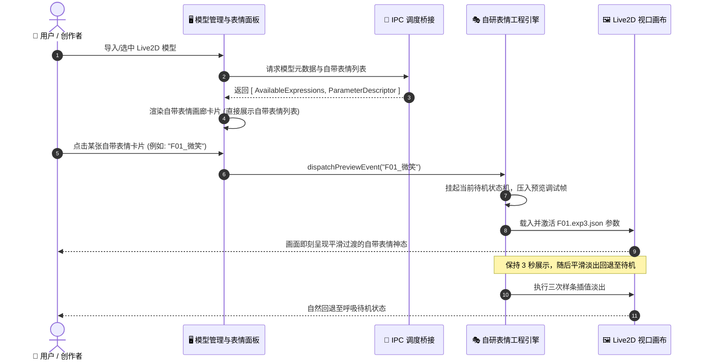

---

## 三、 “低耦合、高内聚、高可用” 自定义表情工程体系架构

为确保系统在接入任意复杂模型时均不崩溃、不掉帧、不耦合具体渲染库，整体工程遵循严格的领域驱动分层架构。

### 3.1 系统分层拓扑全景图

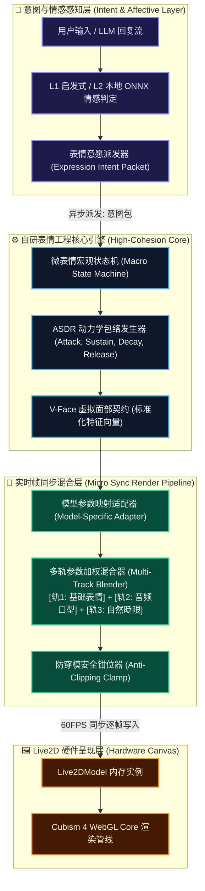

---

### 3.2 低耦合设计（Low Coupling）：V-Face 虚拟标准面部契约与适配器

系统不直接将“悲伤”硬编码给某个具体的模型参数（如 `ParamBrowLY`），而是定义一套通用的**虚拟面部（V-Face）抽象契约**。任何模型只需通过适配器即可无缝挂载：

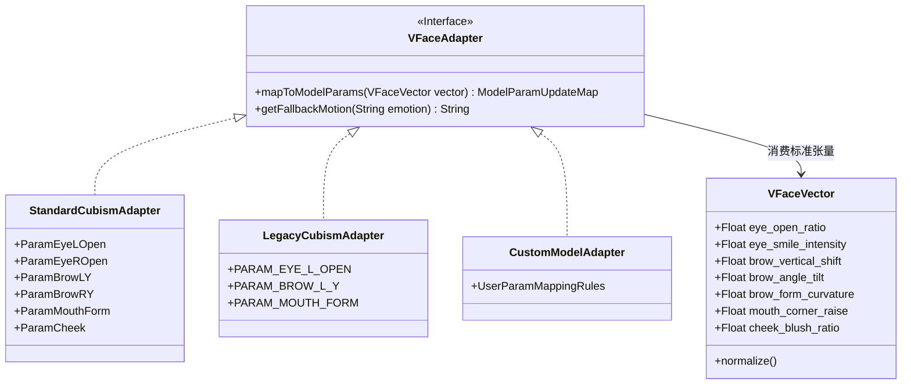

#### 低耦合架构的三大解耦原则
1. **情感算法与渲染引擎解耦**：情感分析模块（无论由 Rust、Python 还是 JS 实现）只输出连续的情感坐标（如 Valence-Arousal）或标准 V-Face 张量，完全不知道底层模型是 Cubism 2、Cubism 3 还是 Cubism 4；
2. **具体模型与业务逻辑解耦**：业务层触发 `playExpression("happy", 0.8)`，适配器自动查找当前模型的参数特征表，将其拆解为眼角弧度与嘴角弧度，模型作者使用了何种奇葩命名均不影响上层调用；
3. **表情定义与动作资源解耦**：若模型具备原生 `.exp3.json`，优先调用；若缺失，则自动转由 V-Face 算法实时计算生成，调用方毫无感知。

---

### 3.3 高内聚设计（High Cohesion）：表情动力学处理闭环流水线

所有与面部表情相关的生命周期管理、物理阻尼、样条插值、权重衰减，全部高度内聚在“表情工程（Expression Engine）”领域模块内，不向外部泄露任何内部脏状态：

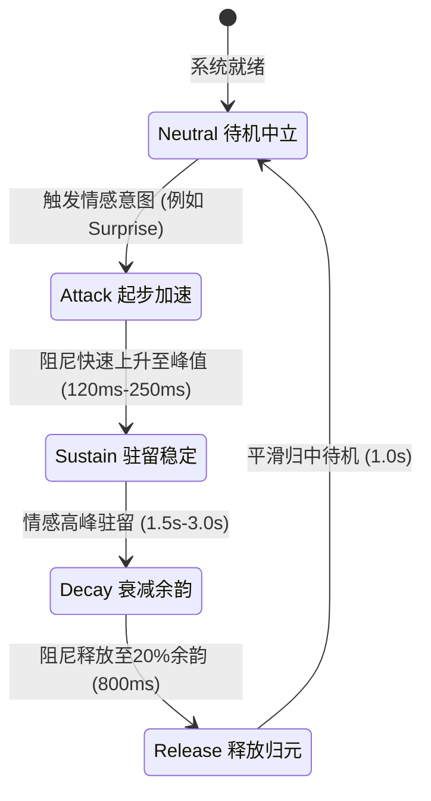

---

### 3.4 高可用设计（High Availability）：多级容灾与防穿模安全沙箱

面对第三方导入的未知模型，系统建立**四级防御式高可用架构**，彻底杜绝白屏、抽搐、崩溃与穿模：

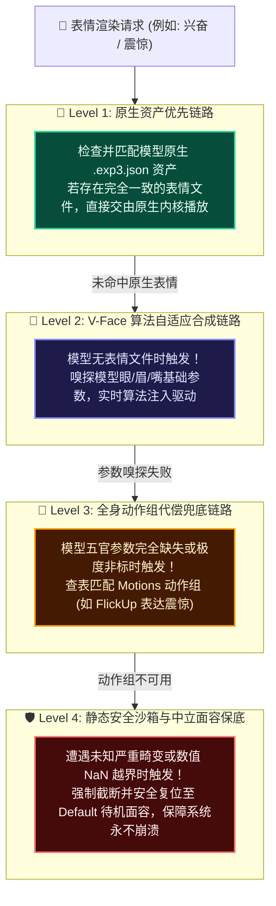

---

## 四、 核心机制：快慢双环解耦架构（Dual-Loop Decoupling Architecture）

这是本方案解决用户“异步处理”构想中致命技术暗礁的灵魂中枢。

### 4.1 为什么传统的“每帧异步 IPC 往返”会导致灾难？

如果直接按照直觉，把渲染管线的每一帧参数丢到后端或 Worker 去异步计算再回传，在图形学引擎中被称作**“时钟撕裂（Clock Tearing）”**：

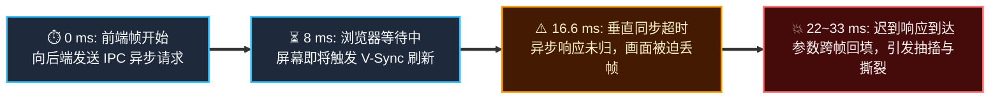

---

### 4.2 慢环（Macro Loop）：异步语义判决与目标表情意愿生成

慢环运行在事件驱动的异步世界中（如接收大模型流式 Tokens、TTS 语音分析、鼠标手势交互）。它的职责是**做决策，而不是算每一帧的位移**：

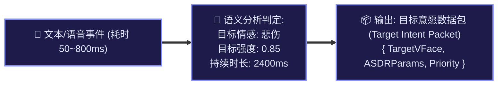

---

### 4.3 快环（Micro Loop）：同步 60FPS 逐帧平滑插值与多轨参数混合

快环运行在渲染主线程的 `PIXI.Ticker` 中，牢牢锁定在每秒 60 次的刷新节拍（16.6ms）内。它纯粹基于内存中的微积分样条，执行**无锁的即时插值计算**：

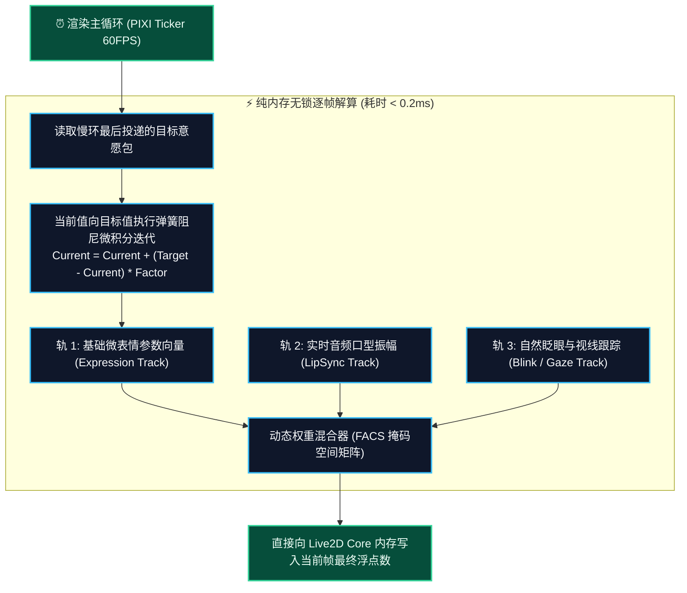

---

### 4.4 帧生命周期注入时序与口型（LipSync）协同仲裁机制

Live2D 模型的每一帧更新都遵循严苛的生命周期阶段，参数写入时机决定了成败：

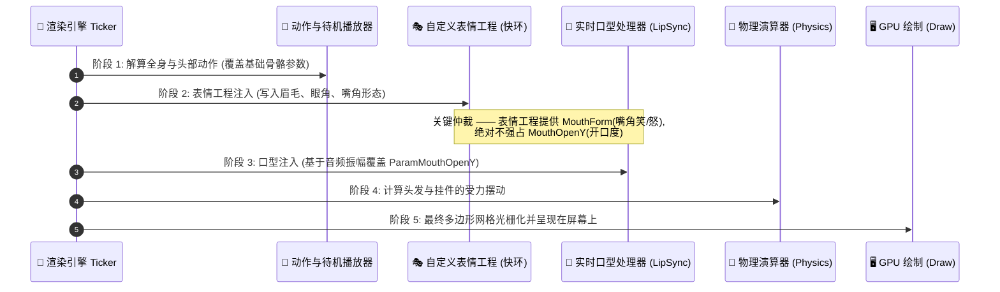

---

## 五、 多智能体对抗性审查（Multi-Agent Adversarial Review）纪要

为确保本技术方案在工程落地时不发生偏差，联合审查委员会组织了四轮高烈度对抗性技术质询：

---

### 🥊 第 1 轮对抗：非标模型参数混乱与自适应语义对齐

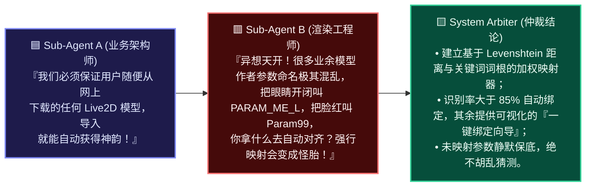

#### 审查裁定准则
- 设立 **三级参数识别算法**：
  1. **完全匹配**：命中标准 Cubism 4 规格（如 `ParamEyeLOpen`）；
  2. **规范化别名匹配**：剔除大小写、下划线与空格后的别名匹配（如 `param_eye_l_open`、`eye_open_l`）；
  3. **语义标签模糊匹配**：若具备 `cdi3.json`，根据自然语言标签命中（如包含“眼”且包含“开”）。

---

### 🥊 第 2 轮对抗：异步处理与 60FPS 渲染管线的时钟撕裂防线

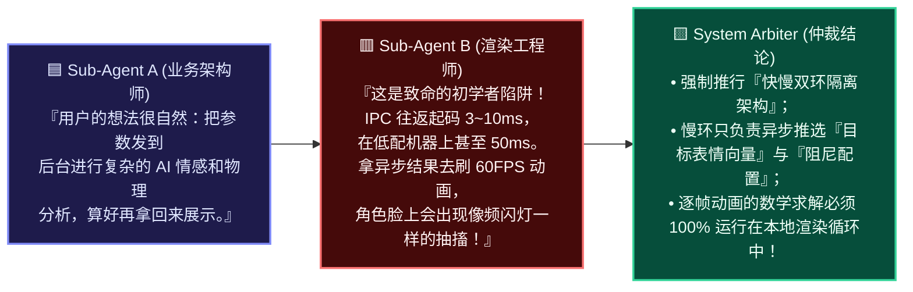

---

### 🥊 第 3 轮对抗：微表情与音频口型、眨眼的“面部扭曲与参数争夺”

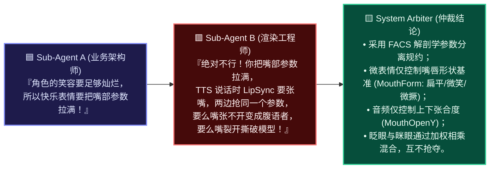

---

### 🥊 第 4 轮对抗：恶意模型格式、极端参数越界与内存泄漏防爆

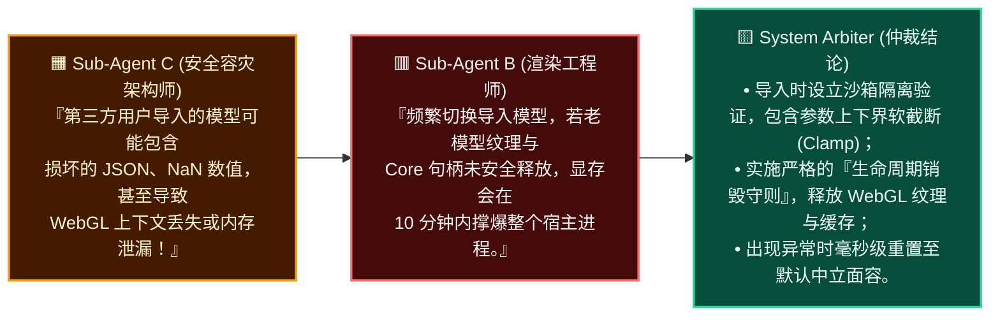

---

## 六、 统一工程规范与落地实施矩阵

### 6.1 V-Face 标准虚拟参数映射字典（FACS AU 映射表）

系统定义的统一虚拟参数契约及其与 Live2D 常用参数的换算规约如下：

| 虚拟参数代号 (V-Face ID) | 解剖学对应 (FACS AU) | 标准 Live2D 参数映射 | 默认中立值 | 动力学作用范围 |
| :--- | :--- | :--- | :--- | :--- |
| `V_EyeOpenL` | AU45 (Blink/Eye Open) | `ParamEyeLOpen` | `1.0` | `0.0` (完全闭合) ~ `1.2` (惊讶睁大) |
| `V_EyeOpenR` | AU45 (Blink/Eye Open) | `ParamEyeROpen` | `1.0` | `0.0` (完全闭合) ~ `1.2` (惊讶睁大) |
| `V_EyeSmileL` | AU6 (Cheek Raiser) | `ParamEyeLSmile` | `0.0` | `0.0` (平视) ~ `1.0` (笑眯眼) |
| `V_EyeSmileR` | AU6 (Cheek Raiser) | `ParamEyeRSmile` | `0.0` | `0.0` (平视) ~ `1.0` (笑眯眼) |
| `V_BrowHeight` | AU1+AU2 (Brow Raiser) | `ParamBrowLY`, `ParamBrowRY` | `0.0` | `-1.0` (压眉悲伤) ~ `+1.0` (挑眉兴奋) |
| `V_BrowAngle` | AU4 (Brow Lowerer) | `ParamBrowLAngle`, `ParamBrowRAngle` | `0.0` | `-1.0` (八字眉) ~ `+1.0` (剑眉愤怒) |
| `V_MouthSmile` | AU12 (Lip Corner Puller) | `ParamMouthForm` | `0.0` | `-1.0` (撇嘴下垂) ~ `+1.0` (微笑上扬) |
| `V_CheekBlush` | Special (Vascular Blush) | `ParamCheek` | `0.0` | `0.0` (无红晕) ~ `1.0` (深度害羞) |

---

### 6.2 运行时状态机迁移矩阵与阻尼常数规约

微表情在生命周期阶段切换时遵循特定的动力学平滑常数，严禁瞬间跳变：

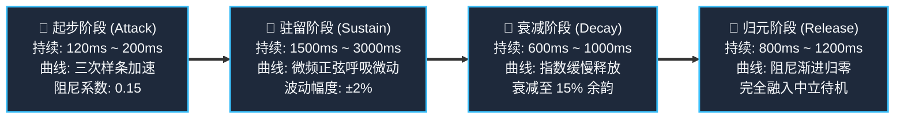

---

### 6.3 阶段性落地路线图与验收基准

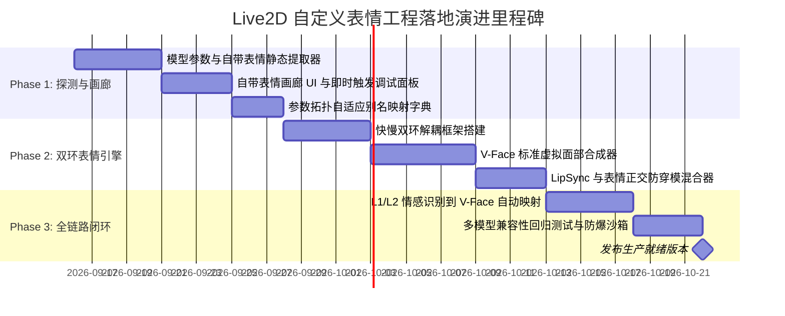

#### 各阶段验收质量门禁

| 演进阶段 | 核心交付物 | 质量门禁指标 |
| :--- | :--- | :--- |
| **Phase 1: 资产透明化** | 1. 模型导入即时吐出全部可用参数与自带表情清单； 2. 表情画廊（Gallery）支持用户一键预览自带表情。 | • 任意合法 Live2D 模型解析耗时 `< 30ms`； • 自带表情展示率 `100%`。 |
| **Phase 2: 自研表情工程** | 1. 独立于模型的 V-Face 算法驱动引擎； 2. 60FPS 同步快环无锁平滑插值； 3. 与语音口型（LipSync）分轨共存。 | • 60FPS 帧内计算时间 `< 0.2ms`； • 口型张开与微笑表情叠加无破面。 |
| **Phase 3: 情感全域闭环** | 1. 聊天自然语言情感意图驱动表情平滑流转； 2. 针对零表情模型（如内置 Kokoro/Hiyori）的完全自适应神态呈现。 | • 用户敲击回车到表情微动首帧时延 `< 60ms`； • 极端坏模型容错率 `100%` 无白屏。 |

---

## 七、 总结陈词与行动建议

本项目经过严密源码追踪与多智能体红蓝对抗推演，得出了颠覆性且极具建设性的技术结论：

1. **破除认知迷思**：明确了当前 `kokoro` 角色的内置模型自带表情数为 **0 个**，目前的情感表达仅为全身姿态摆动代偿；
2. **确立自研工程**：自定义表情工程不仅能够实现，而且是项目构建“无论导入何种模型都能拥有生动灵魂”核心技术护城河的决定性一步；
3. **架构严密护航**：通过**“快慢双环解耦”**与**“V-Face 虚拟解剖学分层混合”**，完美接纳了用户的构想，同时规避了异步通信掉帧、参数争夺穿模与恶意模型崩溃等图形学深水暗礁。

本技术方案已归档至系统知识库，为后续 `feature/facial-expression-system` 分支的正式实施提供不可动摇的顶层架构指引。
