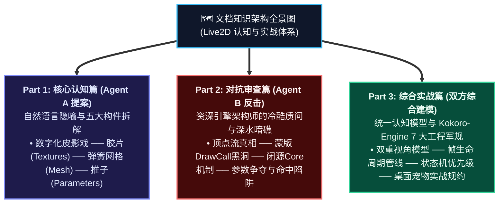
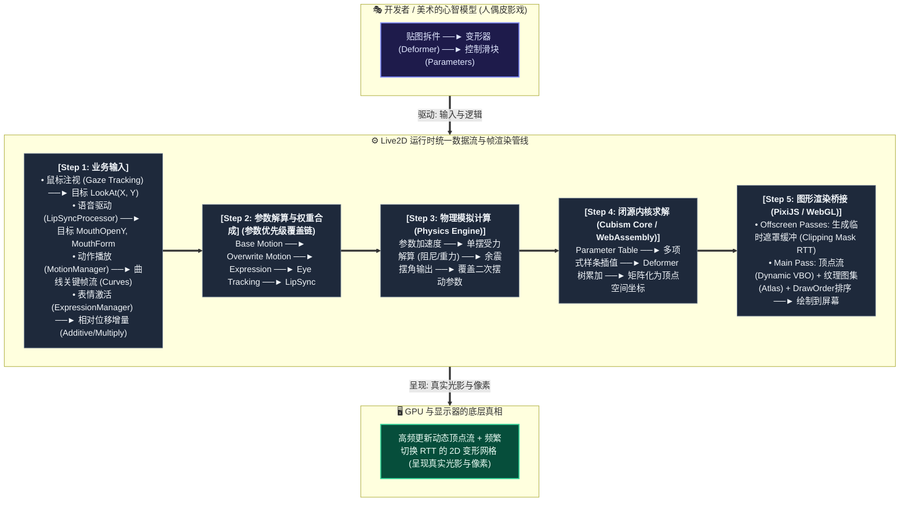
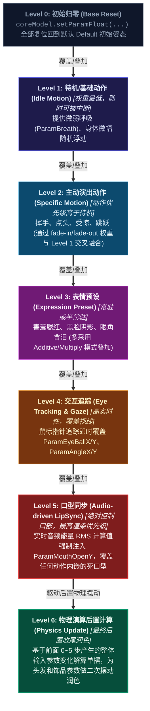

# Live2D 的本质、物理法则与开发实战认知体系

> **文档定位**：面向工程开发者的系统性技术认知指南。  
> **生成机制**：本文档采用「多智能体对抗性审视与综合建模」方法生成。首先由 **Agent A（概念与架构抽象）** 建立自然语言隐喻与结构拆解，随后由 **Agent B（引擎与图形学审查）** 发起冷酷的技术暗礁反击与边界压力测试，最终**综合双方推演结果**，沉淀为指导 [Kokoro-Engine](file:///d:/Kokoro-Engine) 实战开发的工程落地真理。

---

| 篇章阶段 | 智能体视角 | 核心研究主题 | 技术解构与工程沉淀路径 |
| :--- | :--- | :--- | :--- |
| **Part 1** | 🟦 **Agent A** 概念与架构抽象 | **核心认知篇**：用比喻揭开 Live2D 的面纱 | 数字化皮影戏 ── 胶片(Textures) ── 弹簧网格(Mesh) ── 推子(Parameters) |
| **Part 2** | 🟥 **Agent B** 引擎与图形学审查 | **对抗审查篇**：冷酷的深水暗礁与反击 | 顶点流真相 ── 蒙版DrawCall黑洞 ── 闭源Core机制 ── 参数争夺与命中陷阱 |
| **Part 3** | 🟨 **双方综合** 工程落地规范 | **综合实战篇**：统一认知模型与 7 大军规 | 双重视角模型 ── 帧渲染生命周期 ── 状态解算黄金优先级 ── 桌面宠物规约 |

---

# Part 1: 核心认知篇 —— 用比喻揭开 Live2D 的面纱 (Agent A 提案)

如果你第一次接触 Live2D，最致命的误区就是拿 **“3D 建模”** 或 **“2D 逐帧动画”** 的既有经验往上生搬硬套。

要理解它的本质，先建立这样一个视觉隐喻：

> **核心隐喻：Live2D 是一出精密的「数字化橡皮泥皮影戏」。**  
> 画师把一张绝美的二次元立绘，用外科手术刀切成成百上千片透明薄胶片；  
> 工程师在每片胶片上钉满弹簧橡皮筋；  
> 然后在后台安装几百根联动滑块推子；  
> 只要推拉推子，这具由无数弹性胶片拼接的“纸偶”，就能产生宛如拥有骨肉灵魂般的呼吸、顾盼与微笑。

---

## 1.1 三种动画范式的本质对比

为了在开发中不走弯路，必须看清 Live2D 在图形动画技术谱系中的坐标：

| 维度 | 传统 2D 逐帧动画 (Sprite Frame) | 现代 3D 渲染 (Mesh + Bone) | Live2D (Parametric Mesh Deformation) |
| :--- | :--- | :--- | :--- |
| **形象比喻** | **翻页连环画** | **数字泥塑雕像与摄影机** | **多层弹性透明胶片皮影** |
| **资产本质** | 成百上千张离散渲染帧序列图 | 3D 空间顶点坐标、骨骼、着色器、贴图 | 1~2 张切片纹理大图 + 顶点变形网格 + 插值参数规则 |
| **视角能力** | 固定视角，换个视角必须重画 | 360° 无死角任意漫游 | **伪 3D（2.5D）**：通常为 ±30° 极度逼真的立体错觉，转到 90° 就会露馅 |
| **原画还原度** | 100%（因为就是画出来的） | 常常丢失二次元赛博“神韵”（走形、赛博恐怖谷） | **100% 原汁原味保留插画师原本的笔触与赛博灵魂** |
| **运行时操控** | 只能按顺序播放，无法动态微调 | 骨骼驱动，物理与逆运动学（IK）极易交互 | **连续参数化调控**：口型大小、眼球坐标、呼吸幅度全是一维数值滑块 |
| **内存与包体** | 帧数越高内存/显存暴涨 | 纹理与几何体积平衡 | 极小体积（通常模型包仅数兆~十几兆） |

---

## 1.2 Live2D 的五大核心构件（从纸偶到舞台）

### ① 贴图图集与图层切片（Texture Atlas & Parts）
* **比喻**：**“精密拆解的透明胶片堆叠”**。
* **开发本质**：在立绘绘制阶段，画师必须把角色拆成数百个图层（上眼皮、睫毛、眼白、瞳孔、高光、脸颊、上唇、下唇、舌头、口腔阴影、各层发丝……）。导出时，Cubism 会把这些散碎胶片紧密拼贴成 1~2 张正方形的贴图大图（Texture Atlas），并生成每个 Part 的图层深度排序（Draw Order）。

### ② 多边形网格（ArtMesh & Vertices）
* **比喻**：**“在胶片上织出弹性渔网”**。
* **开发本质**：每一片胶片不是死板的矩形，而是由数十到上百个微小三角形构成的多边形网格（ArtMesh）。每个三角形的顶点（Vertex）都有初始的 UV 贴图坐标与 2D 平面坐标 $(x, y)$。一旦顶点移动，贴图就会跟着发生平滑的拉伸、压缩与弯曲。

### ③ 变形器层级树（Deformer Hierarchy）
* **比喻**：**“提线木偶背后的复合牵引连杆”**。
* 如果让开发者或者动画师去手动移动成千上万个顶点，人会发疯。因此 Live2D 发明了“变形器”：
  * **曲面变形器（Warp Deformer）**：像贴在网格背后的一整块柔软果冻网，拉动果冻的控制点，网格内的所有微观顶点整体平滑变形（非常适合眨眼、张嘴、身体扭转）。
  * **旋转变形器（Rotation Deformer）**：像一个固定支点的大头针圆规，定义旋转中心和角度，带动其子节点整体回旋（非常适合脖子倾斜、小臂挥动、发梢摆动）。
  * **层级嵌套（Parent-Child Tree）**：身体带动头部，头部带动脸庞，脸庞带动眼睛，眼睛带动睫毛与眼珠。父级形变会**自动递归累加**到子级上。

### ④ 参数轴与关键形态（Parameters & Keyforms）
* **比喻**：**“调音台推子与关键定格”**。
* **开发本质**：
  * 一个参数（Parameter）就是一个标量浮点数（例如 `ParamAngleX: [-30, 30]`，`ParamEyeOpen: [0, 1]`，`ParamMouthOpenY: [0, 1]`）。
  * 动画师在参数的特定刻度上钉下“关键形态”（Keyform，例如 0 代表完全闭眼，1 代表完全睁眼）。
  * **运行时的魔术**：当你的代码传入 `0.6` 时，引擎根据数学插值算法（多项式/样条插值），实时计算出所有顶点在 `0.6` 位置的精确坐标。

### ⑤ 物理演算系统（Physics & Pendulums）
* **比喻**：**“吊在人偶身上的微型单摆与弹簧”**。
* **开发本质**：头发、耳坠、裙摆的飘动，通常不需要开发者手动写复杂的动画。Cubism 的物理配置文件定义了一组**受重力、空气阻力、质量与恢复力**约束的虚拟单摆（Pendulum）。当角色的头部参数发生加速度变化时，单摆滞后摆动，其摆角自动映射回头发摆动的参数上，产生极其自然的物理惯性余震。

---

# Part 2: 对抗性 Review 篇 —— 资深引擎与图形学架构师的冷酷质问 (Agent B 反击)

> **Agent B 审视陈词**：  
> *“Agent A 的比喻很浪漫、很形象，但充满了‘美术制作端’的心智诱导！如果一个开发人员带着‘橡皮泥皮影戏’的浅薄认知去写 Tauri + WebGL 客户端代码，不出三天，他的程序就会遭遇**帧率暴跌、显存泄漏、表情冲突抽搐、点击事件失准**以及**闭源黑盒调试绝望**。  
> 下面我将以图形学引擎和底层运行时的真实视角，撕开这些糖衣比喻，直击真正的技术暗礁。”*

---

## 质问一：不要迷信“旋转”与“曲面”，GPU 眼里只有海量的顶点流传输！

* **Agent B 戳穿**：
  * 美术在 Live2D Cubism Editor 里看到的是“骨骼旋转”和“曲面扭曲”，但从引擎底层看，**Live2D 根本没有真实的 3D 矩阵，甚至在进入 GPU 之前已经没有了 Deformer 的概念！**
* **技术实情**：
  * Cubism SDK 的运作过程是：**CPU 遍历参数插值 -> CPU 逐层计算 Deformer 变换 -> CPU 算出每一个 Mesh 顶点的最终 $(x, y)$ 坐标 -> CPU 将一整包庞大的 Float32Array 动态顶点流覆盖推送到 GPU 的 VBO (Vertex Buffer Object) 中 -> GPU 执行着色器渲染。**
* **工程代价**：
  * Live2D 是**极度消耗 CPU 单核算力**的！如果模型精细（几万个顶点），每一帧 CPU 都要做海量的矩阵乘法与插值。在低端机器或 Tauri WebView 密集通信时，CPU 顶点计算将成为致命卡顿瓶颈。

---

## 质问二：蒙版（Mask / Clipping）是 Draw Call 和显存的隐形吞噬者！

* **Agent B 戳穿**：
  * Agent A 没提眼球是怎么被眼眶包住的。初学者以为是 CSS `overflow: hidden` 或者 GPU Stencil 模板测试。大错特错！
* **技术实情**：
  * Live2D 采用的是 **Offscreen Render-to-Texture (RTT) 蒙版缓存系统**。
  * 引擎会预先开辟 1 张甚至多张隐藏的色彩缓冲区（Mask Texture Atlas），把所有用于遮罩的网格先单独渲染到这张纹理的某个通道（如 RGBA 单通道）上。
  * 随后的眼球渲染再绑定这张贴图作为采样遮罩。
* **工程暗礁**：
  * **Draw Call 激增**：切换 Render Target 会打断一切 WebGL 合批（Batching）。一个拆件复杂的模型，Draw Call 动辄突破 50~100 次。
  * **通道耗尽与错乱**：Cubism 默认一张 Mask Atlas 最多复用 32~36 个独立蒙版区域。如果画师过度滥用局部遮罩（瞳孔、眼睑、阴影、反光各一个独立蒙版），会导致缓冲区频繁擦除重绘，或者画面出现奇怪的方块撕裂与黑块。

---

## 质问三：闭源黑盒 `Live2DCubismCore` 的掌控权陷阱

* **Agent B 戳穿**：
  * 开发 Live2D 项目最痛苦的是什么？是**底层核心是闭源的**！
* **技术实情**：
  * 无论是 Web 端、C++ 端还是 Unity 端，所有计算核心都封装在 `live2dcubismcore.min.js`（或 C 语言动态库/WebAssembly 二进制）中。
  * 你拿不到源代码，它不开源，许可证极其严格。它内部管理着不透明的 C 内存堆（WebAssembly 线性内存）。
* **工程暗礁**：
  * 一旦模型由于版本不兼容（Cubism 2/3/4/5 格式混杂）、参数越界或内部指针悬挂导致 Crash，控制台只会输出晦涩的 wasm memory 访问越界报错。你无法打断点，只能在外面做防御性校验。
  * 必须确保在 React 组件卸载时显式调用 `model.destroy()`，释放 WebGL 纹理和 Core 内部的句柄，否则在 Tauri 窗口频繁切换模型或热重载时，**显存与内存必定永久泄漏**。

---

## 质问四：参数竞争（Parameter Contention）与动作撕裂

* **Agent B 戳穿**：
  * 现实开发不是单线播放。在桌面宠物中，往往同时存在：
    1. 基础待机呼吸（Idle Motion）
    2. 音频驱动的实时口型（LipSync）
    3. 鼠标注视追踪（LookAt / Eye Tracking）
    4. 情感表情预设（Expression Preset，如生气眯眼）
    5. 物理引擎余震（Physics）
  * **它们全都在试图修改同一组参数（如 `ParamMouthOpenY`、`ParamEyeBallX`）！**
* **工程暗礁**：
  * 如果没有严密的**权重分层管线（Blending & Priority Pipeline）**：
    * 动作文件播放完把参数锁死，鼠标眼动追踪就失效；
    * 口型分析器写入的值被 Idle 呼吸动作的零值瞬间覆盖，导致嘴巴“抽筋”；
    * 表情把眼睛锁成了闭眼，但眨眼动画还在强制跑，产生鬼畜跳帧。

---

## 质问五：命中测试（Hit Testing）的二维几何骗局

* **Agent B 戳穿**：
  * 开发者以为给角色绑定点击事件就像给网页按钮绑定 `onClick` 一样简单。
* **技术实情**：
  * Live2D 模型在屏幕上只占用一个 `<canvas>`。DOM 层面对角色摸头、戳脸、摸胸部一无所知。
  * 角色随时在呼吸、扭头、缩放。画师在模型里配置的 `HitArea`（比如 `HitAreaHead`、`HitAreaBody`）本质上是指向某个具体的 `ArtMesh`。
* **工程暗礁**：
  * 不能用固定的屏幕矩形做碰撞！必须实时取屏幕鼠标像素坐标 $(x, y)$，通过视图变换逆矩阵逆向投影回模型的归一化画布空间，然后再对目标 `ArtMesh` 的**当前变形后顶点所构成的三角形进行逐三角形点在多边形内检测（Point-in-Polygon Testing）**！
  * 这也是为什么 [Kokoro-Engine 的 DrawableHitTest.ts](file:///d:/Kokoro-Engine/src/features/live2d/DrawableHitTest.ts) 写了整整几百行算法的原因。

---

# Part 3: 双方综合篇 —— 终极认知模型与实战工程真理 (Synthesis)

通过 Agent A 的宏观直觉抽象与 Agent B 的微观技术解构，我们跳出了非黑即白的偏颇，为 [Kokoro-Engine](file:///d:/Kokoro-Engine) 的后续开发沉淀出两套**相互锚定、相互印证的工程认知体系**。

---

## 3.1 认知的统一视图：双重视角模型

---

## 3.2 运行时状态解算的「黄金优先级链」

为了解决 Agent B 提出的参数冲突与撕裂，在 Kokoro-Engine 的状态机（如 [Live2DController.ts](file:///d:/Kokoro-Engine/src/features/live2d/Live2DController.ts)）中，**一帧之内参数的更新必须严格遵循自底向上的覆盖顺序**：

| 优先级层级 | 控制阶段与语义 | 调度权重与特性 | 核心参数操作与工程行为 | 为什么在此层级执行？ |
| :---: | :--- | :---: | :--- | :--- |
| **Level 0** | **初始归零** | 绝对底座 | `setParamFloat(...)` 复位回到 Default 姿态 | 消除上一帧遗留的脏数据状态 |
| **Level 1** | **待机/基础动作** | 最低权重 (可打断) | 呼吸 (`ParamBreath`)、待机微幅浮动 | 确保角色活着，有自然生命感 |
| **Level 2** | **主动演出动作** | 中等权重 | 挥手、受惊、点头 (通过淡入淡出权重混叠) | 表达意图与剧情交互驱动 |
| **Level 3** | **表情预设** | 常驻 / 半常驻 | 腮红、眼泪、阴影 (Additive/Multiply 叠加) | 维持神态基调，独立于身体动作 |
| **Level 4** | **交互追踪** | 高实时性 | 鼠标/人脸追踪覆盖 `EyeBallX/Y`, `AngleX/Y` | 视线对齐指针，保证实时跟手感 |
| **Level 5** | **口型同步** | **绝对优先** (口部独占) | 音频 RMS 注入 `ParamMouthOpenY` | **核心保护**：绝不让动画死口型覆盖真实音频发音 |
| **Level 6** | **物理演算后置** | 最终收尾 | 提取加速度解算单摆，二次覆盖头发与飘带参数 | **物理规律**：物理晃动是所有前置骨骼位移的惯性结果 |

---

## 3.3 Kokoro-Engine 开发者必背的 7 条工程军规

在后续为 Kokoro-Engine 扩展新模型、添加宠物互动、集成 TTS/LLM 对话表情时，必须恪守以下 7 条军规：

### 规矩 1：永远把模型看作“带限制的 2.5D”，严禁粗暴旋转
* **原因**：Live2D 没有真正的 Z 轴厚度。模型侧转（Angle X/Y）超过画师预设的极限（通常 ±30°），就会出现五官严重扁平化、穿模或后脑勺消失。
* **原则**：一切交互逻辑（鼠标注视、拖拽视差），必须加 `clamp(val, min, max)`，绝不可将三维四元数直接映射到二维参数。

### 规矩 2：警惕蒙版（Mask）超限与 Draw Call 爆炸
* **原因**：画师随意导入包含 40+ 个剪贴蒙版的极端华丽模型，会导致 WebView 端直接黑屏或掉帧。
* **原则**：在模型导入阶段（如 [ModelTab.tsx](file:///d:/Kokoro-Engine/src/ui/widgets/settings/ModelTab.tsx)），对模型的 `moc3` 结构做元数据检查。若蒙版数量超标或尺寸过大，需在控制台发出显式警告或自动回退降低遮罩分辨率。

### 规矩 3：口型同步（LipSync）必须做低通滤波与平滑衰减
* **原因**：如果直接拿 WebAudio 的原始振幅逐帧塞给 `ParamMouthOpenY`，嘴巴会以 60Hz 的频率极速抽搐，极其反直觉。
* **原则**：参考 [LipSyncProcessor.ts](file:///d:/Kokoro-Engine/src/features/live2d/LipSyncProcessor.ts)，必须加入 **Attack（快速张嘴反应）** 与 **Decay/Release（平滑闭嘴回弹）** 缓动曲线，并配合音素频率分析（低频元音开大口，高频辅音小微张）。

### 规矩 4：组件卸载与模型切换必须执行严密的“资源火葬场流程”
* **原因**：PixiJS 的 WebGL 上下文不会随 React 组件的重渲染自动释放，Core 的 C++ WebAssembly 内存更是不受 JS 垃圾回收（GC）控制。
* **原则**：每次模型切换或窗口隐藏：
  1. 暂停 Ticker 帧循环；
  2. 销毁当前 `Live2DModel` 实例并清理材质贴图；
  3. 解绑所有 Window 级事件监听与 Audio 分析监听器；
  4. 触发 WebGL 上下文纹理垃圾收集。

### 规矩 5：点击命中测试必须依托网格变换矩阵（Drawable Hit Testing）
* **原因**：桌面小宠物的窗口经常需要透明穿透（Click-through），只有点在角色身体上有像素的地方才允许拖拽或触发反应。
* **原则**：严格执行 [DrawableHitTest.ts](file:///d:/Kokoro-Engine/src/features/live2d/DrawableHitTest.ts) 的逻辑：将屏幕点击坐标经过 Canvas 变换逆矩阵求出局部坐标，先进行 AABB 初筛，再对目标 Mesh 顶点进行多边形包含判断，最后结合透明度阈值（Alpha > 0.1）判定是否命中。

### 规矩 6：动作资产加载与表情必须具备“宽容降级机制”
* **原因**：第三方社区制作的 Live2D 模型格式极其混乱，动作组命名千奇百怪（有的叫 `Idle`，有的叫 `idle`，有的叫 `Param_Idle`，甚至缺少动作）。
* **原则**：控制器（Controller）绝不能因为找不到某个 motion 文件而抛出未捕获异常中断主循环。找不到动作时，平滑回退到纯数学参数呼吸振荡器（Sin/Cos 周期函数自主驱动）。

### 规矩 7：Tauri DPI 缩放与物理像素边界校准
* **原因**：在多显示器（如 4K 200% 缩放与 1080P 100% 缩放混用）下，Canvas 的物理缓冲区大小（`renderer.view.width`）与 CSS 显示大小可能不一致，导致画面模糊或眼动追踪偏斜。
* **原则**：监听 Tauri 窗口缩放事件，确保 WebGL Viewport 严格匹配系统设备的 DevicePixelRatio，使角色在 Windows 桌面始终保持矢量级清晰与精准对焦。

---

## 3.4 附录：核心资产文件类型全景速查

当你打开一个 Live2D 模型的文件夹时，这些文件各自扮演着明确角色：

| 文件后缀 | 职责全称 | 内容形式 | 开发者关注点 |
| :--- | :--- | :--- | :--- |
| **`.model3.json`** | **模型总装索引清单** | JSON 文本 | 入口清单！定义了 moc 路径、纹理数组、动作组映射、物理配置文件、命中区域定义。 |
| **`.moc3`** | **模型几何核心数据** | 二进制字节流 | 核心几何网格与变形器结构，只能被 `Live2DCubismCore` 解析，不可篡改。 |
| **`.png`** | **纹理大图 (Atlas)** | 贴图图像 | 通常为 2048x2048 或 4096x4096，包含所有拼合切片。注意检查尺寸与显存占用。 |
| **`.motion3.json`**| **动作关键帧曲线** | JSON 文本 | 记录某一段动作中，各个参数随时间变化的贝塞尔/线性曲线数据。 |
| **`.exp3.json`**   | **表情增量配置文件** | JSON 文本 | 记录某个特定表情触发时，涉及到的参数的目标固定值或叠加增量。 |
| **`.physics3.json`**| **物理单摆配置文件** | JSON 文本 | 记录输入参数（如头角度）如何通过虚拟摆球与弹簧计算出输出参数（如发梢晃动）。 |
| **`.cdi3.json`**   | **显示信息辅助字典** | JSON 文本 | 记录参数名、部件名的多语言友好名称（如 `ParamAngleX` -> "头部左右偏转"），开发时可用于生成调试 UI。 |
