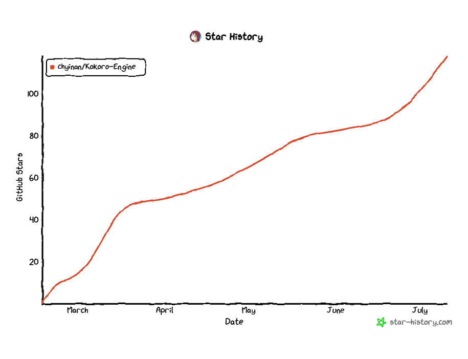

# Bundled fonts

These UI fonts are bundled so Kokoro Engine does not depend on Google Fonts
network availability at runtime.

| Font | Source | License |
|---|---|---|
| Rajdhani | https://github.com/google/fonts/tree/main/ofl/rajdhani | SIL Open Font License 1.1 |
| Quicksand | https://github.com/google/fonts/tree/main/ofl/quicksand | SIL Open Font License 1.1 |
| JetBrains Mono | https://github.com/JetBrains/JetBrainsMono | SIL Open Font License 1.1 |

The license text for each font is stored next to the font files as `OFL.txt`.

## Star History

## Community

Kokoro Engine official QQ group: [810398532](https://qm.qq.com/q/V8ljISeAUM)
